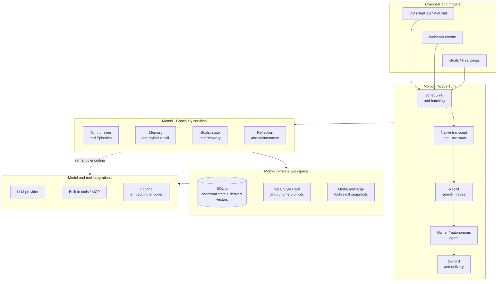
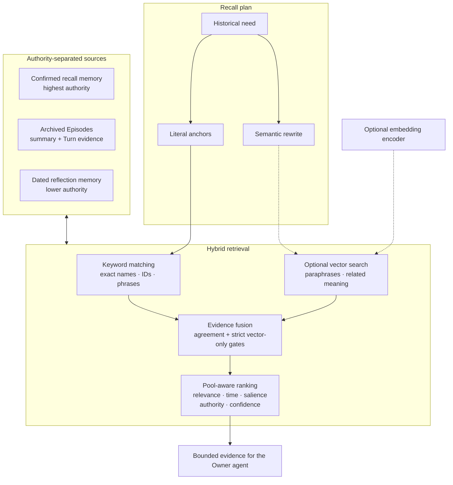

# Momoi

EN | [中文](./README.zh-CN.md)

> A persistent, single-owner personal agent that lives in private chat.

Momoi brings conversation, memory, tools, scheduled work, external events, mood,
and autonomous time into one continuous runtime. It currently connects through
QQ (NapCat) and WeChat, uses Anthropic Messages-compatible or OpenAI
Chat Completions-compatible models, and can extend its abilities through MCP.

Momoi's focus is not merely giving an LLM a character. `SOUL.md` defines who
Momoi is; the runtime makes that identity continuous by preserving the causal
timeline around it: what the owner said, what Momoi did, which results were
confirmed, what remains unfinished, and which parts of the past matter now.

> Momoi is built for trusted personal deployment and one authenticated owner.
> It is not a public or multi-user bot.

## What Momoi is designed to preserve

- **One identity across time and entry points.** Owner messages, Goals,
  Heartbeats, and Webhooks enter the same runtime and share the same history,
  relationship, state, and delivery rules.
- **Context selected by the acting Momoi.** Every Owner Turn opens with a
  mandatory `recall` action. Momoi chooses a new search or reuses an exact prior
  scope, while the runtime retrieves memory and binds the Turn to an Episode.
- **Memory with provenance and authority.** Recent conversation, confirmed
  owner facts, shared Episodes, and lower-confidence reflection learning have
  different lifetimes and are never treated as interchangeable.
- **Agent work with visible delivery.** Momoi can call built-in or MCP tools,
  send multiple chat bubbles, report meaningful progress, verify external
  results, and continue until work finishes, is stopped, or is genuinely blocked.
- **Time as part of the agent.** Goals support one-time, interval, and
  multiple-times-per-day schedules. Heartbeats provide bounded initiative;
  Reflection and Episode maintenance happen quietly in the background.
- **A recoverable private record.** Turns, messages, tool calls, delivery state,
  memories, Episodes, Goals, mood, and thinking records live in the local
  workspace. Uncertain external effects are not silently repeated after restart.

## Architecture

Every trigger becomes a Turn. Active workflows project one shared native
transcript, assemble scoped evidence, run the appropriate agent, then commit
state and delivery. Maintenance work uses the same database but stays outside
the latency-sensitive response path.



The three Momoi layers form the persistent runtime: an active Turn uses
continuity services rather than carrying all history directly in the prompt. The
embedding service is an encoder, not a second memory database:
canonical text and derived vectors remain in Momoi's SQLite database, while an
in-process snapshot performs vector search.

### What happens in an owner Turn

1. Incoming messages are grouped into a coherent batch while preserving their
   timeline.
2. Recent delivered owner and Momoi speech is projected as native `user` and
   `assistant` messages. Runtime state and memory remain explicitly marked data;
   current owner text remains the only current owner authority.
3. The Owner model first calls `recall`. It either searches a new historical
   scope or reuses a displayed prior scope, and independently chooses the
   Episode binding. The runtime performs the same keyword and optional vector
   retrieval and returns bounded evidence.
4. The same model applies Momoi's Soul and Style Card, uses tools when needed,
   and sends owner-visible bubbles through the channel delivery protocol.
5. The Turn commits messages, memory and Goal mutations, mood/activity state,
   tool evidence, delivery state, and any pending follow-up as one recoverable
   record.

Owner, Goal, Heartbeat, and Webhook Turns differ in authority and purpose, but
they all operate on the same timeline. Silence is a valid outcome for an
autonomous or external-event Turn.

## Memory architecture

Momoi does not use one undifferentiated “memory” bucket. The layers below answer
different questions and carry different authority.

| Layer | Source of truth | How it enters context | Lifecycle |
| --- | --- | --- | --- |
| Working context | Native recent user/assistant messages, current input, mood, activity, active Goals, and unresolved work | Included directly by chronology and current relevance | Moves with the live conversation; it is not automatically promoted to long-term fact |
| Confirmed memory | Facts, preferences, relationships, routines, and reusable methods grounded in authenticated owner messages | `always` facts are continuously available; `recent` facts are available for a bounded time; `recall` facts are retrieved by topic | New owner corrections can replace, narrow, expire, or retire older facts |
| Episodes | Concrete shared experiences backed by the original Turns and messages | Recent Episodes are available directly; older Episodes are recalled by their summary or original Turn evidence | Open conversation is grouped by subject, then archived and refreshed as the subject develops |
| Reflection memory | Dated impressions, methods, tool-use lessons, and relationship learning produced by daily reflection | Recalled separately with lower confidence and an explicit stale-information warning | May be revised or become inapplicable; it never outranks current evidence or confirmed memory |

Confirmed-memory activation controls placement, not importance:

| Activation | Use it for | Retrieval behavior |
| --- | --- | --- |
| `always` | Standing interpersonal preferences and constraints that should affect ordinary conversation | Included without a topic query |
| `recent` | Time-bounded situations such as tonight's plan, a current package, or temporary location | Included until its TTL or relevance window expires |
| `recall` | People, device playbooks, game rules, shared methods, and facts useful only when their subject returns | Retrieved only when the current Turn asks for related history |

An Episode is a concrete experience, not a permanent category. It keeps a
compact account for broad continuity and retains the original Turn/message
evidence for exact wording, corrections, decisions, and unfinished promises.
Reflection learning remains a separate, lower-trust layer; it is not silently
promoted into an owner-confirmed fact.

### Recall and optional semantic search

Every Owner Turn starts with `recall`. The acting model submits the smallest
complete historical scope as a semantic query plus literal anchors such as
names, titles, IDs, or exact phrases. It may reuse an earlier scope only when
the displayed queries already cover the current need. The retrieval layer then
evaluates both kinds of evidence.



The two retrieval channels have complementary jobs:

- Keyword evidence protects exact entities, titles, IDs, dates, tool names, and
  parameters.
- Vector evidence finds paraphrases and related experiences expressed with
  different wording.
- Agreement between independent keyword and vector evidence strengthens a
  candidate. Vector-only candidates must cross a stricter, corpus-specific
  threshold.
- Confirmed memory, reflection memory, and Episodes are ranked and limited
  separately. Authority is not erased by semantic similarity.
- If the initial context is still insufficient, the acting agent can call
  `memory_search`, `episode_search`, and `episode_read` during the Turn.

Semantic search is optional and disabled by default. Without it—or while the
embedding service is unavailable or an index is still building—Momoi continues
using keyword recall. Vectors are rebuildable derivatives, never the source of
truth.

Only searchable long-term material is embedded:

- active confirmed memories with `activation: "recall"`;
- reflection memories;
- completed, archived Episode summaries and Episode-linked Turn chunks.

Always-on and recent memories, live recent Turns, Goals, mood/activity, thinking
records, artifacts, and raw tool results are not placed in the semantic index.
Source changes are recorded transactionally, then materialized and encoded in
small background batches. New or changed material becomes searchable
incrementally without blocking owner conversation.

## Capabilities

| Area | Current behavior |
| --- | --- |
| Private chat | One owner across QQ (NapCat) and WeChat; replies return to the originating channel and proactive messages use the configured primary channel |
| Conversation | Message batching, quoted/forwarded content, media handling, natural multi-bubble delivery, optional image reactions, and valid silence |
| Context | Native shared transcript, mandatory Owner search/reuse recall, Episode routing, runtime re-search, and bounded model input |
| Tools | Built-in file/HTTP tools plus dynamically discovered MCP servers and per-server tool allowlists |
| Long-running work | Tool loops, progress messages, interruption, token/time budgets, large-result snapshots, and recovery for uncertain external effects |
| Time and initiative | Persistent Goals, multiple daily trigger times, Heartbeats, quiet hours, cooldowns, and pending-owner delivery protection |
| Memory maintenance | Daily Reflection, confirmed-memory reconciliation, Episode annealing, incremental semantic indexing, and keyword fallback |
| Observability | Local dashboard for conversations, recall decisions and evidence, reflections, memories, Goals, image reactions, token usage, and per-Turn thinking records |
| External events | Authenticated Webhooks with YAML workflows and predefined command executors |

## Quick start

### Docker Compose

The published stack in `docker-compose.yml` runs Momoi, NapCat, and the private
embedding service. The embedding container is available immediately, but
semantic recall remains off until it is enabled in `config.json`.

Set the QQ owner and start the published stack explicitly:

```bash
export MOMOI_OWNER_QQ=your-qq-number
docker compose -f docker-compose.yml up -d
```

On first start, the image creates `$HOME/.momoi` unless `MOMOI_WORKSPACE` is
set, generates dashboard and Webhook tokens, and writes them to the Momoi
container log:

```bash
docker compose -f docker-compose.yml logs momoi
```

For QQ, open `http://127.0.0.1:6099/webui`, get the NapCat login token from
`docker logs napcat`, sign in, and enable its OneBot WebSocket service. The
dashboard is at `http://127.0.0.1:8788`; configure the model connection under
Settings.

For WeChat, authenticate the configured channel once (`weixin` is the internal
channel identifier):

```bash
docker compose -f docker-compose.yml run --rm momoi channel login weixin
```

Set `MOMOI_PRIMARY=weixin` on the next `up` when WeChat should receive proactive
messages. One channel is enough; both may stay enabled.

### Run from source

Requirements:

- Python 3.12 or newer
- [uv](https://docs.astral.sh/uv/)
- one configured private-chat channel
- an Anthropic Messages-compatible or OpenAI Chat Completions-compatible LLM
  endpoint

From the repository root:

```bash
uv tool install .
mkdir -p ~/.momoi
cp -R config.example/. ~/.momoi/
```

Edit `~/.momoi/config.json`, at minimum setting the LLM endpoint, key, model,
enabled channels, primary channel, and local timezone. Then run:

```bash
momoi run
```

To use another workspace, place `--workspace` before the command:

```bash
momoi --workspace /path/to/workspace run
```

The source-oriented `compose.yaml` builds Momoi and the embedding image from the
current checkout. It expects an already configured workspace:

```bash
docker compose -f compose.yaml up -d --build
```

## Enable semantic recall

Semantic recall requires a separately running OpenAI-compatible embedding
endpoint. The published Docker Compose stack already includes the private
`momoi-embedding` service and does not publish its port to the host. For a
non-Docker Momoi process, provide another reachable compatible endpoint.

Enable the matching profile in the workspace:

```json
{
  "embedding": {
    "enabled": true,
    "endpoint": "http://embedding:8002/v1/embeddings",
    "model": "BAAI/bge-small-zh-v1.5",
    "dimensions": 512,
    "calibration_profile": "bge-small-zh-v1.5-momoi-v1",
    "query_timeout_seconds": 5,
    "document_timeout_seconds": 30,
    "document_batch_size": 8
  }
}
```

After Momoi restarts, it reconciles existing sources, builds the index in the
background, and atomically activates it when coverage is complete. Keyword
recall remains available throughout. Inspect health and progress from a source
installation with:

```bash
momoi embedding status
```

For the published Docker Compose stack, run the same CLI inside the container:

```bash
docker compose -f docker-compose.yml exec momoi momoi embedding status
```

For a controlled offline migration, `momoi embedding build --wait` prepares a
building space and `momoi embedding activate` switches to it after validation.
Model, dimension, and calibration profile must remain a supported matching set.
See [Configuration](./docs/CONFIG.md#embedding-recall) for every option.

## Personalize and connect

### Identity and initiative

- Edit `~/.momoi/prompts/SOUL.md` for identity, relationship, values, interests,
  and natural voice.
- Edit `~/.momoi/prompts/HEARTBEAT.md` to shape what Momoi may explore, create,
  continue, share, or leave quiet during autonomous time.
- Add optional image reactions with `momoi emotion add`; descriptions tell the
  agent when each image fits.

### Tools

Place `mcp.json` in the workspace to connect stdio or remote MCP servers.
Momoi discovers their schemas at runtime, can expose selected tools, and treats
configured read-only tools differently from tools with external effects.

### Dashboard

Set `dashboard.token` in `config.json`, then run:

```bash
momoi run --dashboard
```

Open `http://127.0.0.1:8788`. The dashboard can inspect conversations,
per-Turn recall scopes and selected evidence, reflections, memories, Goals,
image reactions, usage, and thinking records; it can also edit memories, Goals,
and reaction assets. Keep it on localhost or a trusted network.

### Webhooks

Enable `webhooks`, set a bearer token, and use the included `event-message`
workflow to turn an external event into a context-aware Momoi Turn:

```bash
curl -X POST http://127.0.0.1:8787/webhooks/event-message \
  -H "Authorization: Bearer $MOMOI_WEBHOOK_TOKEN" \
  -H "Content-Type: application/json" \
  --data '{"event_prompt":"The watched page changed. Explain what is new if it matters."}'
```

Webhook Turns receive the same native shared transcript and memory as Momoi's
other active workflows, but they may finish silently when the event adds
nothing useful.

## Owner controls

| Chat command | Purpose |
| --- | --- |
| `/stop` | Cancel the active task |
| `/heartbeat` | Trigger one Heartbeat immediately |
| `/reflect` | Run Reflection for the current local day |
| `/tidy` | Run confirmed-memory maintenance |
| `/resolve <id> <result>` | Record the verified result of an uncertain external action |
| `/resume <id> <current state>` | Continue uncertain work from a verified current state |

Momoi includes CLI management for Goals, image reactions, channels, and semantic
index status. Run `momoi --help` or a subcommand's `--help` for the current
surface.

## Documentation

- [Configuration reference](./docs/CONFIG.md)
- [Webhook workflow reference](./docs/WORKFLOW.md)

Momoi is licensed under the [MIT License](./LICENSE).
