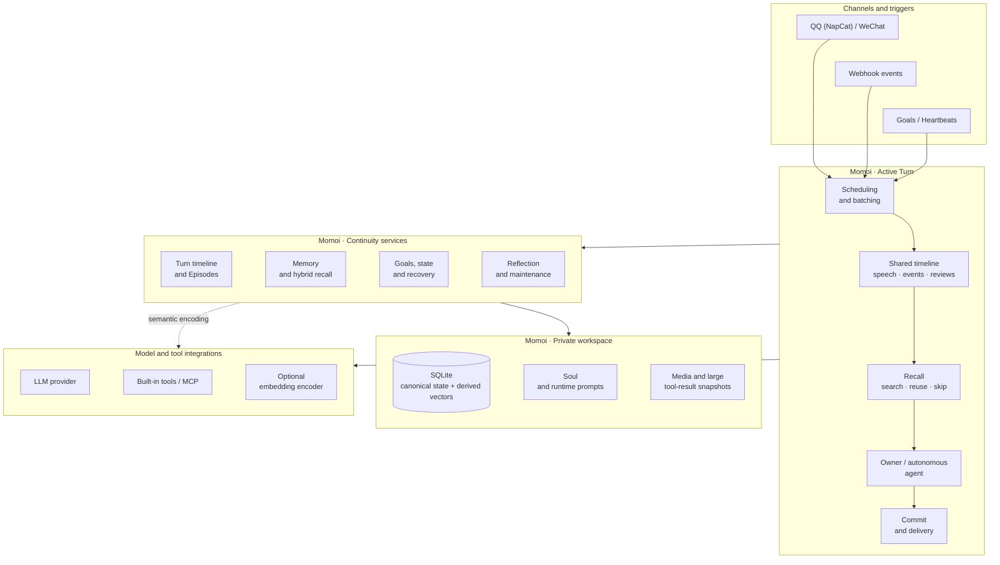
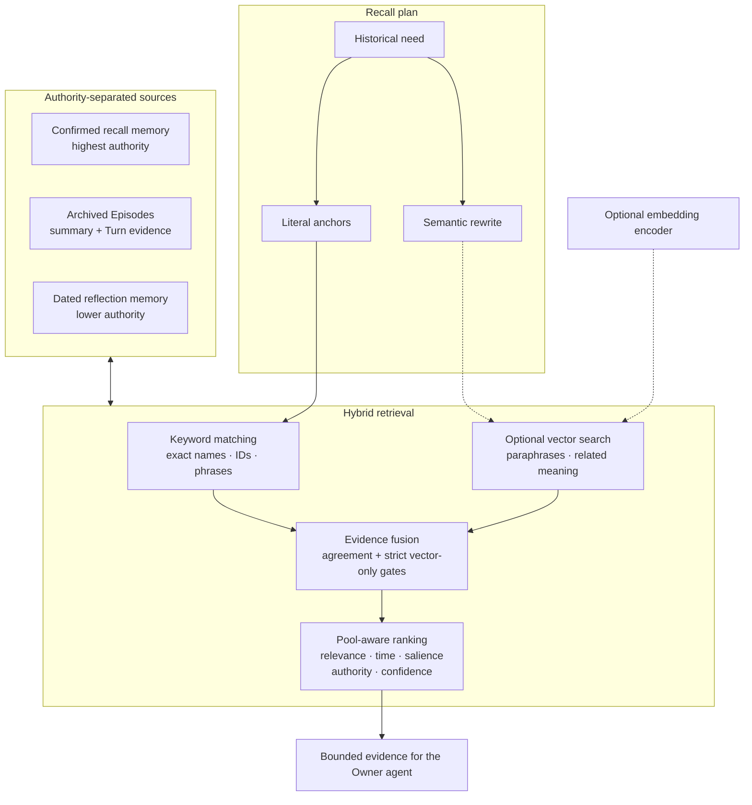

# Momoi

EN | [中文](./README.zh-CN.md)

> A persistent, single-owner personal agent that lives in private chat.

Momoi brings conversation, memory, tools, scheduled work, external events, mood,
and autonomous time into one continuous runtime. It currently connects through
QQ (NapCat) and WeChat, uses Anthropic Messages-compatible or OpenAI
Chat Completions-compatible models, and can extend its abilities through MCP.

Momoi's focus is not merely giving an LLM a character. `SOUL.md` defines who
Momoi is; the runtime makes that identity continuous by preserving the causal
timeline around it: what the owner said, what Momoi did, which results were
confirmed, what remains unfinished, and which parts of the past matter now.

> Momoi is built for trusted personal deployment and one authenticated owner.
> It is not a public or multi-user bot.

## What Momoi is designed to preserve

- **One identity across time and entry points.** Owner messages, Goals,
  Heartbeats, and Webhooks enter the same runtime and share the same history,
  relationship, state, and delivery rules.
- **Context selected by the acting Momoi.** Every Owner Turn opens with a
  mandatory `recall` action. Momoi objectively describes the current input and
  missing historical information, then searches, reuses a prior scope, or skips
  retrieval when supplied context is sufficient. Episode routing is independent.
- **Memory with provenance and authority.** Recent conversation, confirmed
  owner facts, shared Episodes, and lower-confidence reflection learning have
  different lifetimes and are never treated as interchangeable.
- **Agent work with visible delivery.** Momoi can call built-in or MCP tools,
  send multiple chat bubbles, report meaningful progress, verify external
  results, and continue until work finishes, is stopped, or is genuinely blocked.
- **Time as part of the agent.** Goals support one-time, interval, and
  multiple-times-per-day schedules. Heartbeats provide bounded initiative;
  Reflection and Episode maintenance happen quietly in the background.
- **A recoverable private record.** Turns, messages, tool calls, delivery state,
  memories, Episodes, Goals, mood, and thinking records live in the local
  workspace. Uncertain external effects are not silently repeated after restart.

## Architecture

Every trigger becomes a Turn. Active workflows project one shared native
transcript, assemble scoped evidence, run the appropriate agent, then commit
state and delivery. Maintenance work uses the same database but stays outside
the latency-sensitive response path.



The three Momoi layers form the persistent runtime: an active Turn uses
continuity services rather than carrying all history directly in the prompt. The
embedding service is an encoder, not a second memory database:
canonical text and derived vectors remain in Momoi's SQLite database, while an
in-process snapshot performs vector search.

### What happens in an owner Turn

1. Incoming messages are grouped into a coherent batch while preserving their
   timeline.
2. Recent owner and Momoi speech is projected as native `user` and `assistant`
   messages with explicit bubble boundaries and delivery state. Webhook events,
   Goal reviews and Heartbeat records join the same timeline as tagged data;
   current owner text remains the only current owner authority.
3. The Owner model first calls `recall`. It either searches a new historical
   scope or reuses a displayed prior scope, and independently chooses the
   Episode binding. The runtime performs the same keyword and optional vector
   retrieval and returns bounded evidence.
4. The same model applies the configured Soul and system communication rules,
   uses tools when needed, and submits bubbles to the shared outbox. Queued messages are recorded before
   simulated typing delays or network delivery.
5. The Turn finalizes conversation history, memory operation requests and Goal mutations, mood/activity state,
   tool evidence, delivery state, and any pending follow-up as one recoverable
   record.

Owner, Goal, Heartbeat, and Webhook Turns differ in authority and purpose, but
they all operate on the same timeline. Silence is a valid outcome for an
autonomous or external-event Turn.

### Shared timeline

The transcript contains speech and historical runtime records:

| Record | Content and timestamp |
| --- | --- |
| `<bubble>` | One owner or Momoi message, preserving single newlines within it; queued outgoing messages carry `delivery="queued"` |
| `<event id="E…" source="webhook:…" received_at="…">` | A stored external event, ordered by reception time |
| `<goal id="G…" completed_at="…">` | An immutable snapshot of one Goal review, including its result and state |
| `<heartbeat id="H…" completed_at="…">` | One completed Heartbeat's activity and result |

Record IDs derive from stored message IDs. A record describes what happened;
message delivery is tracked separately. Later Goal reviews append new records.
Webhook, Goal and Heartbeat requests use `<recent_events>`, `<recent_goals>` and
`<recent_heartbeats>` respectively to list the IDs present in their transcript,
without repeating historical record bodies in the latest input. Goal and Webhook
Turns do not run automatic pre-retrieval; Heartbeat selects search or skip through
`heartbeat_begin`. Always/recent memory remains in the stable first user message.

Reply-followup requests carry only the current `<followup>` reason and elapsed
silence alongside normal context. Their outgoing bubbles enter conversation
history; no separate historical reply-wait record is added. New owner messages
cancel the pending wait.

## Memory architecture

Momoi does not use one undifferentiated “memory” bucket. The layers below answer
different questions and carry different authority.

| Layer | Source of truth | How it enters context | Lifecycle |
| --- | --- | --- | --- |
| Working context | Shared speech/event/review timeline, current input, mood, activity, active Goals, and unresolved work | Included directly by chronology and current relevance | Moves with the live conversation; it is not automatically promoted to long-term fact |
| Confirmed memory | Facts, preferences, relationships, routines, and reusable methods grounded in authenticated owner messages | `always` facts are continuously available; `recent` facts are available for a bounded time; `recall` facts are retrieved by topic | New owner corrections can replace, narrow, expire, or retire older facts |
| Episodes | Concrete shared experiences backed by the original Turns and messages | Recent Episodes are available directly; older Episodes are recalled by their summary or original Turn evidence | Open conversation is grouped by subject, then archived and refreshed as the subject develops |
| Reflection memory | Dated impressions, methods, tool-use lessons, and relationship learning produced by daily reflection | Recalled separately with lower confidence and an explicit stale-information warning | May be revised or become inapplicable; it never outranks current evidence or confirmed memory |

Confirmed-memory activation controls placement, not importance:

| Activation | Use it for | Retrieval behavior |
| --- | --- | --- |
| `always` | Standing interpersonal preferences and constraints that should affect ordinary conversation | Included without a topic query |
| `recent` | Time-bounded situations such as tonight's plan, a current package, or temporary location | Included until its TTL or relevance window expires |
| `recall` | People, device playbooks, game rules, shared methods, and facts useful only when their subject returns | Retrieved only when the current Turn asks for related history |

An Episode is a concrete experience, not a permanent category. It keeps a
compact account for broad continuity and retains the original Turn/message
evidence for exact wording, corrections, decisions, and unfinished promises.
Reflection learning remains a separate, lower-trust layer; it is not silently
promoted into an owner-confirmed fact.

### Writing and reviewing memory

Foreground tools use `memory_operation(type, content, evidence, target_id?)` with
`add`, `replace`, or `forget`. Evidence must quote an authenticated owner message;
optional `target_id` must identify memory already shown in the Turn. For example:

```json
{"type":"replace","content":"The owner now prefers tea","evidence":"I prefer tea now"}
```

Acceptance records an intent, not an effective memory change. A successful source
Turn commits requests into a durable queue; conversations without requests do not
start this review. The runtime attaches injected and recalled memory snapshots,
`memory_search` results, conversation context, and owner evidence. Foreground tools
make no nested LLM call and require no repeated memory list or extra search.

The dispatcher runs private `memory_operation` Turns on the shared agent worker,
in submission order including retries, without waiting for daily maintenance.
Each Turn uses the standard LLM, budget, journal, and tool loop with a dedicated
system prompt. Only `memory_operation_search` and `memory_operation_finish` are
available. Review decides writes, replacements/merges, forgetting, no change, or
insufficient evidence; optional search can find active memories across activations.
The reviewer assigns kind, activation, and absolute expiry from owner evidence.

`memory_operation_finish` atomically applies the complete decision batch and ends
the Turn. Invalid decisions return tool errors for correction without partial
writes. `defer` completes review without a memory change or automatic retry of the
same evidence. Execution failures retry after five minutes, blocking subsequent
memory requests from overtaking them; each attempt has a separate Turn ID.
Ordinary owner messages wait for an active review to finish. Explicit `/stop`,
shutdown cancellation, and process restart preserve unfinished work for recovery.
Snapshot checks still protect against concurrent Dashboard edits.

`always` and `recent` records are injected individually, sorted by memory ID, in
the first user message for cache stability, without compression or content deduplication.
Business recall scope is unchanged, `memory_search` remains available, and `/tidy`
continues to handle global maintenance.

### Recall and optional semantic search

Every Owner Turn starts with `recall`. The acting model submits the smallest
complete historical scope as a semantic query plus literal anchors such as
names, titles, IDs, or exact phrases. It may reuse an earlier scope only when
the displayed queries already cover the current need. The retrieval layer then
evaluates both kinds of evidence.



The two retrieval channels have complementary jobs:

- Keyword evidence protects exact entities, titles, IDs, dates, tool names, and
  parameters.
- Vector evidence finds paraphrases and related experiences expressed with
  different wording.
- Agreement between independent keyword and vector evidence strengthens a
  candidate. Vector-only candidates must cross a stricter, corpus-specific
  threshold.
- Confirmed memory, reflection memory, and Episodes are ranked and limited
  separately. Authority is not erased by semantic similarity.
- If the initial context is still insufficient, the acting agent can call
  `memory_search`, `episode_search`, and `episode_read` during the Turn.

Semantic search is optional and disabled by default. Without it—or while the
embedding service is unavailable or an index is still building—Momoi continues
using keyword recall. Vectors are rebuildable derivatives, never the source of
truth.

Only searchable long-term material is embedded:

- active confirmed memories with `activation: "recall"`;
- reflection memories;
- completed, archived Episode summaries and Episode-linked Turn chunks.

Always-on and recent memories, live recent Turns, Goals, mood/activity, thinking
records, artifacts, and raw tool results are not placed in the semantic index.
Source changes are recorded transactionally, then materialized and encoded in
small background batches. New or changed material becomes searchable
incrementally without blocking owner conversation.

## Capabilities

| Area | Current behavior |
| --- | --- |
| Private chat | One owner across QQ (NapCat) and WeChat; replies return to the originating channel and proactive messages use the configured primary channel |
| Conversation | Message batching, quoted/forwarded content, media handling, natural multi-bubble delivery, optional image reactions, and valid silence |
| Context | Native shared transcript, mandatory Owner recall with search/reuse/skip, Episode routing, runtime re-search, and bounded model input |
| Tools | Built-in file/HTTP tools plus dynamically discovered MCP servers and per-server tool allowlists |
| Long-running work | Tool loops, progress messages, interruption, token/time budgets, large-result snapshots, and recovery for uncertain external effects |
| Time and initiative | Persistent Goals, multiple daily trigger times, Heartbeats, quiet hours, and interruption by new owner messages |
| Memory maintenance | Daily Reflection, confirmed-memory reconciliation, Episode annealing, incremental semantic indexing, and keyword fallback |
| Observability | Local dashboard for conversations, recall decisions and evidence, reflections, memories, Goals, image reactions, token usage, and per-Turn thinking records |
| External events | Authenticated Webhooks with YAML workflows and predefined command executors |

## Deployment

### Docker Compose

The published `docker-compose.yml` starts Momoi and its private embedding service. No model keys,
channel configuration, or existing workspace files are required. Install Docker
with Compose v2, then start:

```bash
docker compose -f docker-compose.yml up -d
docker compose -f docker-compose.yml logs momoi
```

Open `http://127.0.0.1:8788` and sign in with the Dashboard token from the startup
logs. Use Settings to connect a model, edit prompts, enable message channels,
and sign in to Weixin by scanning its QR code.

For QQ, deploy NapCat separately and enter its reachable OneBot WebSocket URL
and the owner QQ in Momoi's Settings. On first startup, Compose enables semantic
memory with `http://embedding:8002/v1/embeddings`, model `BAAI/bge-small-zh-v1.5`,
512 dimensions, and calibration profile `bge-small-zh-v1.5-momoi-v1`.
Momoi includes these defaults and copies them into a new workspace's
`providers.yaml`. No additional startup arguments or configuration mounts are needed.
These are saved settings: you can change the provider or disable semantic memory
in the Dashboard. Restarting preserves your changes. Existing workspaces are
not migrated; configure or enable embedding in Settings if needed.

The workspace is persisted in `~/.momoi` by default and initialized by `momoi run`;
existing files are preserved. Only dashboard port 8788 is published by default.
Webhook deployment requires an explicit port mapping and webhook configuration.
See
[Configuration](./docs/CONFIG.md) for deployment options.

### Run from source

Requirements:

- Python 3.12 or newer
- [uv](https://docs.astral.sh/uv/)
- an Anthropic Messages-compatible or OpenAI Chat Completions-compatible LLM
  endpoint

From the repository root:

```bash
uv tool install .
momoi run
```

Open `http://127.0.0.1:8788`, sign in with the token printed at startup, and
complete setup in Settings.

To use another workspace, place `--workspace` before the command:

```bash
momoi --workspace /path/to/workspace run
```

To build the current checkout as a container, use the source Compose file:

```bash
docker compose -f compose.yaml up -d --build
```

It shares the published stack's defaults and builds both Momoi and the encoder.
Always specify `-f`: without it, Docker
Compose prefers `compose.yaml` over `docker-compose.yml`.

## Semantic recall

New workspaces have semantic memory configured and enabled by
default. To use another provider, select a compatible embedding endpoint, model,
and vector dimension in Settings. A Momoi process running on the host needs
an endpoint reachable from the host; update the default Docker address in Settings
or disable semantic memory when no encoder is available.

Momoi builds the index in the background and activates it when coverage is complete.
Keyword recall remains available during indexing. See
[Configuration](./docs/CONFIG.md#embedding-recall) for index management and advanced options.

## Personalize and connect

### Identity and initiative

- Edit `~/.momoi/prompts/SOUL.md` for identity, relationship, values, interests,
  and natural voice.
- Edit `~/.momoi/prompts/HEARTBEAT.md` to shape what Momoi may explore, create,
  continue, share, or leave quiet during autonomous time.
- Add optional image reactions with `momoi emotion add`; descriptions tell the
  agent when each image fits.

### External API services

LLM, ASR, TTS, embedding and account balance use capability interfaces, registered
adapters and a shared composition/lifecycle layer. Service endpoints and credentials
live in `providers.yaml`; `config.json` references that file. A service can bind to
multiple supported capabilities. Balance queries are independent of local token
accounting. Add adapters through registered Python plugins.
See [Provider configuration and extension](./docs/PROVIDERS.md).

### Tools

Place `mcp.json` in the workspace to connect stdio or remote MCP servers.
Momoi discovers their schemas at runtime, can expose selected tools, and treats
configured read-only tools differently from tools with external effects.

### Dashboard

Open `http://127.0.0.1:8788`. The dashboard can inspect conversations,
per-Turn recall scopes and selected evidence, reflections, memories, Goals,
image reactions, usage, and thinking records; it can also edit memories, Goals,
reaction assets, and prompt files. Enter the generated token from startup output,
then configure providers and channels in Settings, including Weixin QR login.
Configuration changes reload the business runtime without closing the dashboard.
Use `momoi run --no-dashboard` for headless operation. Existing workspaces need
`dashboard.token` or `MOMOI_DASHBOARD_TOKEN`. Keep the dashboard on localhost or a trusted network.

### Webhooks

Enable `webhooks`, set a bearer token, and use the included `event-message`
workflow to turn an external event into a context-aware Momoi Turn:

```bash
curl -X POST http://127.0.0.1:8787/webhooks/event-message \
  -H "Authorization: Bearer $MOMOI_WEBHOOK_TOKEN" \
  -H "Content-Type: application/json" \
  --data '{"event_prompt":"The watched page changed. Explain what is new if it matters."}'
```

Webhook Turns receive the same native shared transcript and memory as Momoi's
other active workflows, but they may finish silently when the event adds
nothing useful.

### Completing a Goal review

A Goal review uses one sequence: work → optional `send_bubbles` / `send_voice` →
`end_turn`. Its `goal` object records the result, updates the task and ends the
review in one call. `active`, `waiting` and `blocked` keep the Goal; `done` and
`cancelled` close it. The runtime supplies the current Goal ID. For example:

```json
{"goal": {"status": "done", "result": "Downloaded and verified the file"}}
```

Continuing requires `next_action` and a future `next_review_at`; recurring active
Goals may reuse their schedule. Waiting requires `waiting_for` and a future review;
blocked requires `blocked_reason`. `send_bubbles` and `send_voice` use the normal
delivery path immediately, independently of Goal completion. Delivery and
`end_turn` may share one response, with `end_turn` last; failed delivery prevents
completion. Invalid outcomes return tool errors for correction.

Valid `<bubble>...</bubble>` blocks in assistant text become `send_bubbles` before
harness validation. With `end_turn`, nonempty assistant text requires `send_bubbles`
in the same response; empty text is allowed. The harness checks the normalized
tool calls without parsing text, and text outside bubble blocks is not delivered.
Each Turn receives an `end_turn` schema with its own required
fields, including `activity` for Owner and `heartbeat` for Heartbeat.
Other Turns must omit `goal` or pass `null`; the harness rejects cross-workflow
arguments before execution. Normal conversations retain `goal_update`, `goal_finish`
and `goal_cancel` for task management; Goal reviews use the terminal outcome instead.

## Owner controls

| Chat command | Purpose |
| --- | --- |
| `/stop` | Cancel the active task |
| `/compact` | Shrink the transcript window to `transcript_turns_min` for the next context build |
| `/heartbeat` | Trigger one Heartbeat immediately |
| `/reflect` | Run Reflection for the current local day |
| `/tidy` | Run confirmed-memory maintenance |
| `/resolve <id> <result>` | Record the verified result of an uncertain external action |
| `/resume <id> <current state>` | Continue uncertain work from a verified current state |

`/compact` uses the existing transcript window compaction and persists the reduced
window across restarts. It preserves stored history, does not call the model or
interrupt the active Turn, and resumes normal window growth as new Turns complete.

Momoi includes CLI management for Goals, image reactions, channels, and semantic
index status. Run `momoi --help` or a subcommand's `--help` for the current
surface.

## Documentation

- [Configuration reference](./docs/CONFIG.md)
- [Webhook workflow reference](./docs/WORKFLOW.md)

Momoi is licensed under the [MIT License](./LICENSE).
