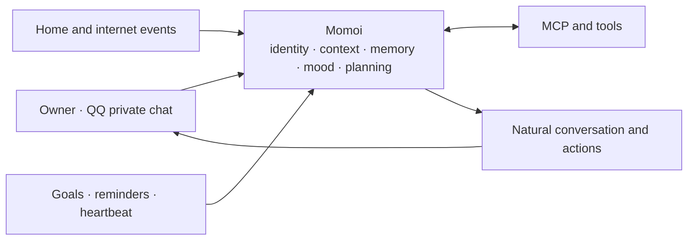

# Momoi

[EN](./README.md) | [中文](./README.zh-CN.md)

> A persistent personal AI companion for QQ — with memory, agency, mood, and a life rhythm of her own.

Momoi is a headless, single-owner AI agent that lives in QQ private chat. She can talk naturally, remember shared context, use tools, manage long-running tasks, react to events from your home and services, and decide when it is genuinely worth starting a conversation.

The goal is not to build another question-and-answer bot. The goal is to create one continuous person who can stay with you, understand what is happening, and get things done.

> Momoi is currently designed for trusted personal deployment and real-world testing. It is not a public or multi-user bot.

## Why Momoi

Most chatbots are stateless request handlers with a personality prompt attached. Momoi is designed differently:

- **One continuous identity.** Personality, relationship, memory, mood, current activity, and unfinished threads carry across conversations and restarts.
- **Context before response.** Momoi recalls what matters to the current moment instead of blindly sending the entire chat history to the model.
- **Agency, not turn-taking.** She can acknowledge a task, use tools, send useful progress, and continue until the work is complete or genuinely blocked.
- **Autonomy with restraint.** Goals, reminders, and heartbeats let her act over time without turning every timer into an unwanted notification.
- **One life across every channel.** QQ messages, home events, webhooks, scheduled work, and proactive thoughts all reach the same Momoi.
- **Honest execution.** She only claims an external action succeeded after receiving a confirming result.

## Product design



Momoi can be reached in four ways:

| Entry | Purpose |
| --- | --- |
| Owner message | Conversation, questions, corrections, and immediate tasks |
| Webhook event | Events from Home Assistant, Jellyfin, cameras, or other services |
| Goal | Work that must continue later or repeat with fresh reasoning and tools |
| Heartbeat | A low-priority chance for Momoi to choose an activity and decide whether to speak |

They share the same identity and relevant context. A webhook notification should sound like the person you were just talking to, not a separate automation bot.

## Core experience

### Natural QQ conversation

Momoi treats consecutive messages as one evolving thought. If you send a correction or an extra detail before she starts, it becomes part of the same request.

Replies are shaped for private chat:

- One message is the natural default.
- Longer replies may become several conversational bubbles.
- The first bubble is sent immediately; later bubbles keep a human rhythm.
- Text, images, replies, forwards, cards, files, video, and voice can retain their message meaning.
- Image-capable models can understand images from the conversation.
- Useful progress can be sent while a longer task is still running.

### Context that survives

Momoi combines several kinds of context instead of relying on a fixed message count:

- Recent conversation in its original form
- The current topic and unresolved threads
- Searchable older conversation episodes
- Durable facts, preferences, routines, and relationship memories
- Active goals and pending reminders
- Current mood and activity

Only relevant older material is recalled. This keeps long-running use from becoming either amnesia or an ever-growing context bomb.

Durable memory is grounded in things the owner actually said. When two values conflict, Momoi asks for confirmation instead of silently rewriting history.

### Agentic task execution

Simple conversation stays simple. Real tasks can use memory search, HTTP, files, MCP servers, and other connected capabilities.

A longer task can naturally unfold like this:

1. Momoi acknowledges what she is going to do.
2. She searches, reads, calls tools, or controls a connected service.
3. She reports meaningful progress when there is something worth saying.
4. She validates the result.
5. She returns the useful outcome and preserves anything that must continue later.

She keeps working until the task is complete, genuinely blocked, or stopped by the owner.

### Mood, activity, and expression

Momoi has persistent mood and activity state. Events can change that state, time can soften it, and the result naturally influences tone and expression without changing facts or task discipline.

Her personality lives in `SOUL.md`, while an emotion catalog gives her optional image reactions with semantic descriptions such as celebration, embarrassment, or mischief. She decides when a reaction adds something to the moment instead of attaching one to every reply.

### Proactive without being needy

Momoi separates different kinds of future behavior:

| Mechanism | Best for | Behavior |
| --- | --- | --- |
| Reminder | “Remind me to stretch in one hour” | Delivers known content at the requested time |
| Goal | “Every morning, check the weather and give me a riding recommendation” | Wakes up, gathers fresh information, reasons, and continues the task |
| Heartbeat | Momoi's own activity and initiative | May start a relevant conversation or remain silent |
| Webhook | An external event happened | Handles the predefined event workflow in Momoi's normal voice |

Goal and Heartbeat notifications respect quiet hours, cooldowns, daily budgets, and pending owner messages. Silence is a valid decision; Heartbeat is not a scheduled “Are you there?” generator.

## What Momoi can do today

- Hold natural private conversations with one trusted owner
- Remember stable preferences, relationships, routines, and shared facts
- Search older memories and conversation episodes when context is vague
- Use general-purpose MCP servers, including Home Assistant integrations
- Fetch web and private-network HTTP resources
- Read, write, and patch files
- Create one-time and recurring reminders
- Create and progressively execute persistent goals
- Receive event workflows from Home Assistant, Jellyfin, cameras, and other services
- Send text, rich QQ messages, and managed image reactions
- Maintain mood and activity across conversations
- Proactively speak through bounded heartbeats
- Stop active work with `/stop`
- Recover safely when an external action has an uncertain outcome

## Getting started

### Requirements

- Python 3.12 or newer
- [uv](https://docs.astral.sh/uv/)
- A working NapCat WebSocket connection
- An Anthropic Messages-compatible or OpenAI Chat Completions-compatible LLM endpoint

### Install the CLI

From the repository root:

```bash
uv tool install .
momoi --version
```

The `momoi` command can now be used from any directory.

### Create a workspace

Still in the repository root, copy the starter workspace once:

```bash
mkdir -p ~/.momoi
cp -R config.example/. ~/.momoi/
```

Edit `~/.momoi/config.json` and set:

- Your LLM API format, endpoint, key, and model
- Your NapCat WebSocket URL
- The QQ number of the single owner
- Your local timezone

### Run

```bash
momoi run
```

When the log shows `NapCat connected`, send a private QQ message from the configured owner account.

To use another workspace:

```bash
momoi --workspace /path/to/workspace run
```

## Personalize Momoi

Edit `~/.momoi/prompts/SOUL.md` to define Momoi's identity, relationship, values, interests, and natural speaking style.

Add image reactions with a description of when they fit:

```bash
momoi emotion add \
  --slug very-happy-dance \
  --path /path/to/dance.gif \
  --desc "Dance when genuinely delighted or celebrating"

momoi emotion list
momoi emotion del --slug very-happy-dance
```

Imported assets are managed inside the workspace, so the original file can be moved later.

## Connect tools with MCP

Place a standard `mcp.json` in the workspace to connect MCP servers.

This is the intended way to add Home Assistant, search, media management, or other domain-specific capabilities. Momoi stays focused on being the agent; mature external services remain external plugins.

## Receive external events

Enable webhooks in `config.json`, choose a reachable bind address, and set a token. The included `event-message` workflow turns an event into a natural message using Momoi's current context.

```bash
curl -X POST http://127.0.0.1:8787/webhooks/event-message \
  -H "Authorization: Bearer $MOMOI_WEBHOOK_TOKEN" \
  -H "Content-Type: application/json" \
  --data '{"event_prompt":"The washing machine has finished. Remind the owner to collect the laundry."}'
```

The example workspace also includes a neutral `url-check-event` workflow that demonstrates a validated command step followed by a natural notification.

## Manage persistent goals

Momoi can create goals during conversation. They can also be inspected and managed from the CLI:

```bash
momoi goal add \
  --title "Daily weather" \
  --success "Send useful weather and riding advice every morning" \
  --action "Check the weather for the owner's area" \
  --daily 07:30

momoi goal list
momoi goal list --all
momoi goal del <goal-id-or-prefix> --reason "No longer needed"
```

Use `--at` for a future one-time review or `--every-seconds` for a recurring interval.

## Owner controls

Send `/stop` in QQ to cancel the current task. Momoi stops the work and understands that the owner interrupted it.

If an external action was dispatched but its result became uncertain, Momoi will ask the owner to confirm the real state before continuing. She will not repeat the action just because the process restarted.

## Current scope

- One trusted owner and QQ private chat only
- No group-chat or multi-user isolation
- No TUI or web administration interface
- Designed for a trusted personal environment
- Connected tools receive the real access granted to them

Protect the workspace, API keys, webhook token, and connected MCP services.

## Development

```bash
uv run python -m unittest discover -s tests -v
uvx ruff check src tests
```

## Documentation

- [Configuration and capability access](./docs/CONFIG.md)
- [Webhook workflows](./docs/WORKFLOW.md)

Momoi is not defined by a specific model, smart-home platform, or message provider. She is the continuity between identity, context, memory, action, and time.
