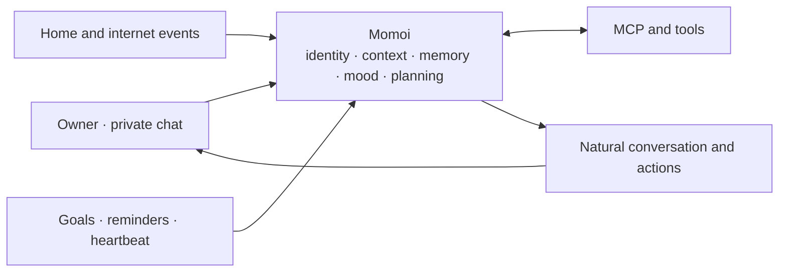

# Momoi

EN | [中文](./README.zh-CN.md)

> A persistent personal AI companion for private chat — with memory, agency, mood, and a life rhythm of her own.

Momoi is a headless, single-owner AI agent that lives in private chat through NapCat/QQ or Tencent Weixin iLink. She can talk naturally, remember shared context, use tools, manage long-running tasks, react to events from your home and services, and decide when it is genuinely worth starting a conversation.

The goal is not to build another question-and-answer bot. The goal is to create one continuous person who can stay with you, understand what is happening, and get things done.

> Momoi is currently designed for trusted personal deployment and real-world testing. It is not a public or multi-user bot.

## Why Momoi

Most chatbots are stateless request handlers with a personality prompt attached. Momoi is designed differently:

- **One continuous identity.** Personality, relationship, memory, mood, current activity, and unfinished threads carry across conversations and restarts.
- **Context before response.** Momoi recalls what matters to the current moment instead of blindly sending the entire chat history to the model.
- **Agency, not turn-taking.** She can acknowledge a task, use tools, send useful progress, and continue until the work is complete or genuinely blocked.
- **Autonomy with restraint.** Goals, reminders, and heartbeats let her act over time without turning every timer into an unwanted notification.
- **One life across every channel.** QQ messages, home events, webhooks, scheduled work, and proactive thoughts all reach the same Momoi.
- **Honest execution.** She only claims an external action succeeded after receiving a confirming result.

## Product design



Momoi can be reached in four ways:

| Entry | Purpose |
| --- | --- |
| Owner message | Conversation, questions, corrections, and immediate tasks |
| Webhook event | Events from Home Assistant, Jellyfin, cameras, or other services |
| Goal | Work that must continue later or repeat with fresh reasoning and tools |
| Heartbeat | A low-priority autonomous Turn to explore, make artifacts, continue her own work, and decide whether to speak |

They share the same identity and relevant context. A webhook notification should sound like the person you were just talking to, not a separate automation bot.

## Core experience

### Natural private conversation

Momoi follows the rhythm of private chat instead of treating every message as an isolated request. Consecutive thoughts, corrections, and extra details can become one coherent conversation. Replies stay natural to the moment, common chat media keeps its meaning, longer work can surface useful progress, and silence remains valid when the exchange is already complete.

### Context that survives

Momoi carries recent conversation, shared history, stable preferences, ongoing commitments, mood, and activity across ordinary and autonomous moments. Older material returns when it is relevant, while durable memory stays grounded in what the owner actually said.

### Agentic task execution

Simple conversation stays simple. When a request needs action, Momoi can use connected tools and services, share meaningful progress, verify the result, and preserve work that must continue later. She keeps going until the task is complete, genuinely blocked, or stopped by the owner.

### Mood, activity, and expression

Momoi's personality, mood, activity, and relationship continue over time and naturally influence her tone without changing facts or task discipline. Optional image reactions add expression only when they fit the moment.

### Proactive without being needy

Momoi separates different kinds of future behavior:

| Mechanism | Best for | Behavior |
| --- | --- | --- |
| Reminder | “Remind me to stretch in one hour” | Delivers known content at the requested time |
| Goal | “Every morning, check the weather and give me a riding recommendation” | Wakes up, gathers fresh information, reasons, and continues the task |
| Heartbeat | Momoi's own activity and initiative | May use allowed tools, create her own Goal, share a useful result, or remain silent |
| Reflection | Form durable learning each day | Reviews the day that just ended without sending a message |
| Webhook | An external event happened | Handles the predefined event workflow in Momoi's normal voice |

Goal and Heartbeat notifications respect quiet hours, cooldowns, and pending owner messages. Silence is a valid decision; Heartbeat is not a scheduled “Are you there?” generator.

## What Momoi can do today

- Hold one continuous private conversation across QQ and Weixin
- Carry relevant context, memories, preferences, and commitments over time
- Use connected tools and services to complete real tasks
- Manage one-time reminders and work that continues or repeats
- Respond naturally to events from the home and other services
- Exchange chat media and use optional image reactions
- Maintain mood, activity, reflection, and bounded initiative
- Stop work or recover safely when an external result is uncertain

## Getting started

### Requirements

- Python 3.12 or newer
- [uv](https://docs.astral.sh/uv/)
- A working NapCat WebSocket connection, a Weixin account that can scan the iLink login QR code, or both
- An Anthropic Messages-compatible or OpenAI Chat Completions-compatible LLM endpoint

### Install the CLI

From the repository root:

```bash
uv tool install .
momoi --version
```

### Create a workspace

Still in the repository root, copy the starter workspace once:

```bash
mkdir -p ~/.momoi
cp -R config.example/. ~/.momoi/
```

Edit `~/.momoi/config.json` and set:

- Your LLM API format, endpoint, key, and model
- Your enabled channels and which one should be primary
- Your local timezone

### Run

```bash
momoi run
```

For Weixin, authenticate once before the first run:

```bash
momoi channel login weixin
```

Then start Momoi and send a private message from either owner account. Replies stay on the channel where the conversation started; proactive messages use the configured primary channel.

Start the Web dashboard alongside the daemon to inspect conversations, daily reflections, image reactions, and goals, and to edit memories, emotions, and goals:

Set a write token in `config.json` first:

```json
{
  "dashboard": {
    "token": "replace-with-a-long-random-secret"
  }
}
```

```bash
momoi run --dashboard
```

Open `http://127.0.0.1:8788` by default. Use `--dashboard-host` and
`--dashboard-port` to change the listener. Enter `dashboard.token` on the page
to receive a one-year JWT; all `/api/*` routes require that Bearer JWT (emotion
image assets at `/api/emotions/{slug}/asset` stay public for `` tags).
`--dashboard` requires the token to be configured. Do not expose the port
directly to the public Internet.

Pass `--workspace` before any command to use another workspace:

```bash
momoi --workspace /path/to/workspace run
```

## Personalize Momoi

Edit `~/.momoi/prompts/SOUL.md` to define Momoi's identity, relationship, values, interests, and natural speaking style.

Add image reactions with a description of when they fit:

```bash
momoi emotion add \
  --slug very-happy-dance \
  --path /path/to/dance.gif \
  --desc "Dance when genuinely delighted or celebrating"

momoi emotion list
momoi emotion del --slug very-happy-dance
```

## Connect tools with MCP

Place a standard `mcp.json` in the workspace to connect MCP servers.

This is the intended way to add Home Assistant, search, media management, or other domain-specific capabilities. Momoi stays focused on being the agent; mature external services remain external plugins.

## Receive external events

Enable webhooks in `config.json`, choose a reachable bind address, and set a token. The included `event-message` workflow turns an event into a natural message using Momoi's current context.

```bash
curl -X POST http://127.0.0.1:8787/webhooks/event-message \
  -H "Authorization: Bearer $MOMOI_WEBHOOK_TOKEN" \
  -H "Content-Type: application/json" \
  --data '{"event_prompt":"The washing machine has finished. Remind the owner to collect the laundry."}'
```

The example workspace also includes a neutral `url-check-event` workflow that demonstrates a validated command step followed by a natural notification.

## Manage persistent goals

Momoi can create goals during conversation. They can also be inspected and managed from the CLI:

```bash
momoi goal add \
  --title "Daily weather" \
  --success "Send useful weather and riding advice every morning" \
  --action "Check the weather for the owner's area" \
  --daily 07:30

momoi goal list
momoi goal list --all
momoi goal del <goal-id-or-prefix> --reason "No longer needed"
```

Use `--at` for a future one-time review or `--every-seconds` for a recurring interval.

## CLI commands

`--workspace /path/to/workspace` may be placed before any command.

| Command | Purpose |
| --- | --- |
| `momoi run [--dashboard] [--dashboard-host <host>] [--dashboard-port <port>]` | Start the daemon and optionally its Web dashboard (`dashboard.token` issues a 1-year JWT for `/api/*`) |
| `momoi --version` | Print the installed version |
| `momoi channel login <name>` | Authenticate a configured channel when it needs login |
| `momoi emotion add --slug <slug> --path <file> --desc <text>` | Add or update an image reaction asset |
| `momoi emotion list` | List image reaction assets |
| `momoi emotion del --slug <slug>` | Delete an image reaction asset |
| `momoi goal add --title <title> --success <text> --action <text> [--at <time> \| --every-seconds <seconds> \| --daily HH:MM]` | Create a persistent goal |
| `momoi goal list [--all]` | List active or all goals |
| `momoi goal del <goal-id-or-prefix> [--reason <text>]` | Cancel a goal |

## Owner controls

| Chat command | Purpose |
| --- | --- |
| `/stop` | Cancel the current task |
| `/heartbeat` | Trigger one autonomous heartbeat immediately |
| `/reflect` | Trigger one daily reflection for the current local day |
| `/resolve <id> <result>` | Close an uncertain external action after checking the real result |
| `/resume <id> <current state>` | Continue an uncertain external action from the confirmed state |

When `/resolve` or `/resume` is needed, Momoi sends a recovery message that includes the short `<id>` and the command form to use. Copy that command and replace only the result or current-state text. She will not repeat the uncertain action just because the process restarted.

## Current scope

- One trusted owner across one or more private-chat channels
- No group-chat or multi-user isolation
- Designed for a trusted personal environment
- Connected tools receive the real access granted to them

Protect the workspace, API keys, webhook/dashboard tokens, and connected MCP services.

## Development

```bash
uv run python -m unittest discover -s tests -v
uvx ruff check src tests
```

## Documentation

- [Configuration and capability access](./docs/CONFIG.md)
- [Webhook workflows](./docs/WORKFLOW.md)

Momoi is not defined by a specific model, smart-home platform, or message provider. She is the continuity between identity, context, memory, action, and time.
