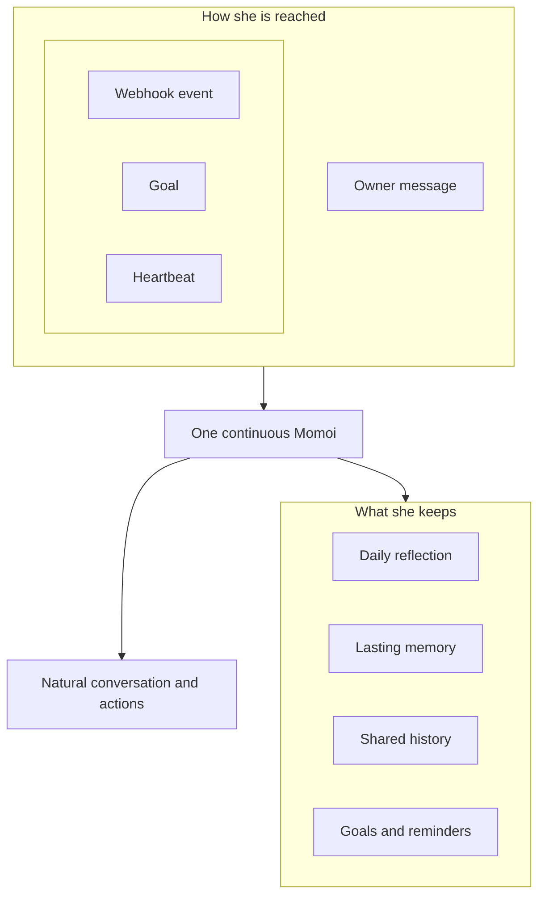
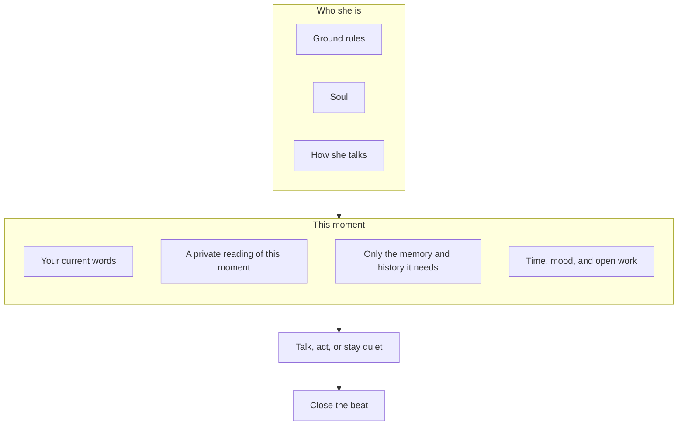

# Momoi

EN | [中文](./README.zh-CN.md)

> A persistent personal AI companion for private chat — with memory, agency, mood, and a life rhythm of her own.

Momoi is a headless, single-owner AI agent that lives in private chat through NapCat/QQ or Tencent Weixin iLink. She can talk naturally, remember shared context, use tools, manage long-running tasks, react to external events, and decide when it is genuinely worth starting a conversation.

The goal is not to build another question-and-answer bot. The goal is to create one continuous person who can stay with you, understand what is happening, and get things done.

> Momoi is currently designed for trusted personal deployment and real-world testing. It is not a public or multi-user bot.

## Why Momoi

Most chatbots are stateless request handlers with a personality prompt attached. Momoi is designed differently:

- **One continuous identity.** Personality, relationship, memory, mood, current activity, and unfinished threads carry across conversations and restarts.
- **Context before response.** She first understands what this moment is about, then brings back the shared history that matters — not the entire chat log.
- **Agency, not turn-taking.** She can acknowledge a task, use tools, send useful progress, and continue until the work is complete or genuinely blocked.
- **Autonomy with restraint.** Goals, reminders, and heartbeats let her act over time without turning every timer into an unwanted notification.
- **One life across every channel.** QQ messages, webhooks, scheduled work, and proactive thoughts all reach the same Momoi.
- **Honest execution.** She only claims an external action succeeded after receiving a confirming result.

## Product design



Momoi can be reached in four ways:

| Entry | Purpose |
| --- | --- |
| Owner message | Conversation, questions, corrections, and immediate tasks |
| Webhook event | Events from other services |
| Goal | Work that must continue later or repeat with fresh reasoning and tools |
| Heartbeat | A low-priority autonomous Turn to explore, make artifacts, continue her own work, and decide whether to speak |

They share the same identity and relevant context. Conversation, daily reflection, and memory stay with her. A webhook notification should sound like the person you were just talking to, not a separate automation bot.

### How a moment works

Momoi does not turn the latest message into a reply in one shot. The important part is what she is given before she speaks.



**Who she is stays in front of every moment.** The same ground rules, Soul, and speaking style sit there every time. They say who she is, how she talks, and what may count as evidence. Personality cannot override those rules, and recalled memory cannot rewrite who she is.

**This moment is assembled, not dumped.** Recent conversation is already with her. She first privately understands what this moment is about, then brings back only the older memory and shared history it needs. Your current words are the only current intent. Everything else — older chat, shared history, preferences, goals, daily notes, mood — is context she may use, not a new instruction. Your newest correction wins over older memory. What she learned on her own sits lower than what you actually said.

**Speaking and closing stay separate.** She may send a message, finish the work, or stay quiet, then settle the beat — her mood, what she is doing, and whether she is still waiting. Goals and heartbeats follow the same shape: the same person, a freshly assembled moment, then a decision to speak or not.

## Core experience

### Natural private conversation

Momoi follows the rhythm of private chat instead of treating every message as an isolated request. Consecutive thoughts, corrections, and extra details can become one coherent conversation. Replies stay natural to the moment, common chat media keeps its meaning, longer work can surface useful progress, and silence remains valid when the exchange is already complete. If she asked something and is still waiting, she may follow up briefly a few times, then let the wait cool.

### Context that survives

Momoi carries recent conversation, shared history, stable preferences, ongoing commitments, mood, and activity across ordinary and autonomous moments. Shared experiences settle into lasting threads and come back only when they matter. Durable memory stays grounded in what the owner actually said.

### Agentic task execution

Simple conversation stays simple. When a request needs action, Momoi can use connected tools and services, share meaningful progress, verify the result, and preserve work that must continue later. She keeps going until the task is complete, genuinely blocked, or stopped by the owner.

### Mood, activity, and expression

Momoi's personality, mood, activity, and relationship continue over time and naturally influence her tone without changing facts or task discipline. Optional image reactions add expression only when they fit the moment.

### Proactive without being needy

Momoi separates different kinds of future behavior:

| Mechanism | Best for | Behavior |
| --- | --- | --- |
| Reminder | “Remind me to stretch in one hour” | Delivers known content at the requested time |
| Goal | “Every morning, check the weather and give me a riding recommendation” | Wakes up, gathers fresh information, reasons, and continues the task |
| Heartbeat | Momoi's own activity and initiative | May use allowed tools, create her own Goal, share a useful result, or remain silent |
| Reflection | Form durable learning each day | Reviews the day that just ended, keeps what should last, and does not send a message |
| Webhook | An external event happened | Handles the event in Momoi's normal voice, or stays silent when it would add nothing |

Goal and Heartbeat notifications respect quiet hours, cooldowns, and pending owner messages. Silence is a valid decision; Heartbeat is not a scheduled “Are you there?” generator.

## What Momoi can do today

- Hold one continuous private conversation across QQ and Weixin
- Carry relevant context, memories, preferences, and commitments over time
- Use connected tools and services to complete real tasks
- Manage one-time reminders and work that continues or repeats
- Respond naturally to external events, or stay quiet when they add nothing
- Exchange chat media and use optional image reactions
- Maintain mood, activity, reflection, and bounded initiative
- Stop work or recover safely when an external result is uncertain
- Browse and tidy conversations, reflections, memories, reactions, reminders, goals, and thinking in a local Web dashboard

## Getting started

### Requirements

- Python 3.12 or newer
- [uv](https://docs.astral.sh/uv/)
- A working NapCat WebSocket connection, a Weixin account that can scan the iLink login QR code, or both
- An Anthropic Messages-compatible or OpenAI Chat Completions-compatible LLM endpoint

### Install the CLI

From the repository root:

```bash
uv tool install .
momoi --version
```

### Create a workspace

Still in the repository root, copy the starter workspace once:

```bash
mkdir -p ~/.momoi
cp -R config.example/. ~/.momoi/
```

Edit `~/.momoi/config.json` and set:

- Your LLM API format, endpoint, key, and model
- Your enabled channels and which one should be primary
- Your local timezone

### Run

```bash
momoi run
```

For Weixin, authenticate once before the first run:

```bash
momoi channel login weixin
```

Then start Momoi and send a private message from either owner account. Replies stay on the channel where the conversation started; proactive messages use the configured primary channel.

### Web dashboard

When you want to see what Momoi has been chatting about, remembering, or working on, open the Web dashboard alongside her. It is less a control panel and more a small window into her records: conversations, daily reflections, memories, image reactions, reminders, goals, and how she thought through a moment. From there you can also edit memories, manage reactions, and adjust goals or reminders that are still in progress.

Put an access passphrase in `config.json` first:

```json
{
  "dashboard": {
    "token": "replace-with-a-long-random-secret"
  }
}
```

Then start Momoi with the dashboard:

```bash
momoi run --dashboard
```

Open `http://127.0.0.1:8788` by default and enter the passphrase on the page. Use `--dashboard-host` and `--dashboard-port` if you need a different listener. The passphrase is required whenever the dashboard is enabled. Keep it on localhost or a trusted network — do not expose the port directly to the public Internet.

Pass `--workspace` before any command to use another workspace:

```bash
momoi --workspace /path/to/workspace run
```

To keep her running on a machine, use [Deploy](#deploy).

## Deploy

The published image is `ricterz/momoi` (`linux/amd64` and `linux/arm64`). She still needs one private-chat channel and an LLM.

### What you need

- Docker
- A NapCat container, if you want QQ
- A Weixin account that can scan the iLink login QR code, if you want Weixin
- An Anthropic Messages-compatible or OpenAI Chat Completions-compatible LLM endpoint

One channel is enough. Both can run at the same time.

### Connect NapCat

Start NapCat, then sign in with the owner QQ:

```bash
docker run -d --name napcat \
  -e NAPCAT_UID="$(id -u)" \
  -e NAPCAT_GID="$(id -g)" \
  -p 3001:3001 \
  -p 6099:6099 \
  -v napcat-qq:/app/.config/QQ \
  --restart unless-stopped \
  mlikiowa/napcat-docker:latest
```

Open `http://127.0.0.1:6099/webui`. The first-login token is in `docker logs napcat`. Scan the QQ QR code, then turn on the OneBot WebSocket. Only that QQ is treated as the owner.

### Run Momoi

```bash
docker run -d --name momoi --restart unless-stopped \
  --add-host=host.docker.internal:host-gateway \
  -e TZ=Asia/Shanghai \
  -e MOMOI_LLM_BASE_URL=https://api.example.com \
  -e MOMOI_LLM_API_KEY=replace-me \
  -e MOMOI_LLM_MODEL=model-name \
  -e MOMOI_OWNER_QQ=your-qq-number \
  -v "$HOME/.momoi:/home/momoi/.momoi" \
  -p 8787:8787 -p 8788:8788 \
  ricterz/momoi:0.2.1
```

The first start creates `~/.momoi` from the example workspace, points NapCat at `ws://host.docker.internal:3001`, binds webhooks on `0.0.0.0:8787`, and prints the dashboard and webhook tokens in `docker logs momoi`. Open `http://127.0.0.1:8788`. Send a private message from the owner QQ. Replies stay on the channel where the conversation started; proactive messages use `primary`.

Other services POST to `http://<host>:8787/webhooks/<workflow>` with `Authorization: Bearer <webhook-token>`. Keep that port on a trusted network.

To run NapCat and Momoi together from this repository:

```bash
export MOMOI_LLM_BASE_URL=https://api.example.com
export MOMOI_LLM_API_KEY=replace-me
export MOMOI_LLM_MODEL=model-name
export MOMOI_OWNER_QQ=your-qq-number
docker compose up -d
```

Compose uses `ws://napcat:3001` automatically.

### Sign in to Weixin

Scan the iLink QR code in the same workspace, then set `MOMOI_PRIMARY=weixin` on the next start:

```bash
docker run --rm -it \
  -v "$HOME/.momoi:/home/momoi/.momoi" \
  ricterz/momoi:0.2.1 channel login weixin
```

The login stays in the workspace. You can omit `MOMOI_OWNER_QQ` if you only use Weixin.

### Build from source

```bash
docker build -t momoi .
```

Then use the same `docker run` as above, replacing `ricterz/momoi:0.2.1` with `momoi`. The container home is `/home/momoi`, so keep the `~/.momoi` volume.

## Personalize Momoi

Edit `~/.momoi/prompts/SOUL.md` to define Momoi's identity, relationship, values, interests, and natural speaking style.

Edit `~/.momoi/prompts/HEARTBEAT.md` if you want to shape how she spends her own time — what she may explore, make, or leave quiet.

Add image reactions with a description of when they fit:

```bash
momoi emotion add \
  --slug very-happy-dance \
  --path /path/to/dance.gif \
  --desc "Dance when genuinely delighted or celebrating"

momoi emotion list
momoi emotion del --slug very-happy-dance
```

## Connect tools with MCP

Place a standard `mcp.json` in the workspace to connect MCP servers.

This is the intended way to add search or other domain-specific capabilities. Momoi stays focused on being the agent; mature external services remain external plugins.

## Receive external events

Enable webhooks in `config.json`, choose a reachable bind address, and set a token. The included `event-message` workflow turns an event into a natural message using Momoi's current context. If the event would add nothing to the current conversation, she can finish silently.

```bash
curl -X POST http://127.0.0.1:8787/webhooks/event-message \
  -H "Authorization: Bearer $MOMOI_WEBHOOK_TOKEN" \
  -H "Content-Type: application/json" \
  --data '{"event_prompt":"The watched page has a new update. Tell the owner what changed."}'
```

The example workspace also includes a neutral `url-check-event` workflow that demonstrates a validated command step followed by a natural notification.

## Owner controls

| Chat command | Purpose |
| --- | --- |
| `/stop` | Cancel the current task |
| `/heartbeat` | Trigger one autonomous heartbeat immediately |
| `/reflect` | Trigger one daily reflection for the current local day |
| `/resolve <id> <result>` | Close an uncertain external action after checking the real result |
| `/resume <id> <current state>` | Continue an uncertain external action from the confirmed state |

When `/resolve` or `/resume` is needed, Momoi sends a recovery message that includes the short `<id>` and the command form to use. Copy that command and replace only the result or current-state text. She will not repeat the uncertain action just because the process restarted.

## Documentation

- [Configuration and capability access](./docs/CONFIG.md)
- [Webhook workflows](./docs/WORKFLOW.md)

Momoi is not defined by a specific model or message provider. She is the continuity between identity, context, memory, action, and time.
