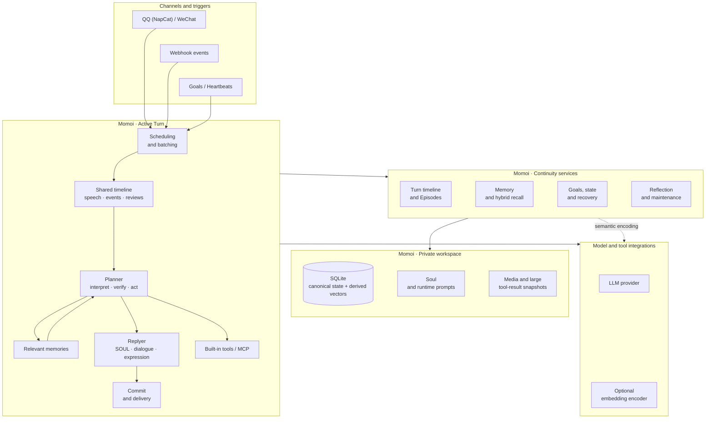

# Momoi

EN | [中文](./README.zh-CN.md)

> A persistent, single-owner personal agent that lives in private chat.

Momoi brings conversation, memory, tools, scheduled work, external events, mood,
and autonomous time into one continuous runtime. It currently connects through
QQ (NapCat) and WeChat, uses Anthropic Messages-compatible or OpenAI
Chat Completions-compatible models, and can extend its abilities through MCP.

Momoi's focus is not merely giving an LLM a character. `SOUL.md` defines who
Momoi is; the runtime makes that identity continuous by preserving the causal
timeline around it: what the owner said, what Momoi did, which results were
confirmed, what remains unfinished, and which parts of the past matter now.

> Momoi is built for trusted personal deployment and one authenticated owner.
> It is not a public or multi-user bot.


## What Momoi is designed to preserve

- **One identity across time and entry points.** Owner messages, Goals,
  Heartbeats, and Webhooks enter the same runtime and share the same history,
  relationship, state, and delivery rules.
- **Context selected by the acting Momoi.** Momoi retrieves relevant history when
  needed and preserves topic summaries and relationships in the background.

- **Memory with provenance and authority.** Recent conversation, confirmed
  owner facts, shared Episodes, and lower-confidence reflection learning have
  different lifetimes and are never treated as interchangeable.
- **Agent work with visible delivery.** Momoi can call built-in or MCP tools,
  send multiple chat bubbles, report meaningful progress, verify external
  results, and continue until work finishes, is stopped, or is genuinely blocked.
- **Time as part of the agent.** Goals support one-time, interval, and
  multiple-times-per-day schedules. Heartbeats provide bounded initiative;
  Reflection and Episode maintenance happen quietly in the background.
- **A recoverable private record.** Turns, messages, tool calls, delivery state,
  memories, Episodes, Goals, mood, and thinking records live in the local
  workspace. Uncertain external effects are not silently repeated after restart.

## Architecture

Every trigger becomes a Turn. Active workflows project one shared native
transcript, assemble scoped evidence, run the appropriate agent, then commit
state and delivery. Maintenance work uses the same database but stays outside
the latency-sensitive response path.


```mermaid
flowchart TB
  subgraph triggers["Channels and triggers"]
    direction LR
    chat["QQ (NapCat) / WeChat"]
    webhook["Webhook events"]
    clock["Goals / Heartbeats"]
    chat ~~~ webhook ~~~ clock
  end

  subgraph active["Momoi · Active Turn"]
    direction LR
    intake["Scheduling<br/>and batching"]
    transcript["Shared timeline<br/>speech · events · reviews"]
    context["Relevant memories"]
    agent["Planner<br/>interpret · verify · act"]
    replyer["Replyer<br/>SOUL · dialogue · expression"]
    delivery["Commit<br/>and delivery"]
    intake --> transcript --> agent
    agent --> context --> agent
    agent --> tools
    agent --> replyer --> delivery
  end

  subgraph continuity["Momoi · Continuity services"]
    direction LR
    timeline["Turn timeline<br/>and Episodes"]
    memory["Memory<br/>and hybrid recall"]
    time["Goals, state<br/>and recovery"]
    upkeep["Reflection<br/>and maintenance"]
    timeline ~~~ memory ~~~ time ~~~ upkeep
  end

  subgraph workspace["Momoi · Private workspace"]
    direction LR
    sqlite[("SQLite<br/>canonical state + derived vectors")]
    prompts["Soul<br/>and runtime prompts"]
    files["Media and large<br/>tool-result snapshots"]
    sqlite ~~~ prompts ~~~ files
  end

  subgraph external["Model and tool integrations"]
    direction LR
    llm["LLM provider"]
    tools["Built-in tools / MCP"]
    embedding["Optional<br/>embedding encoder"]
    llm ~~~ tools ~~~ embedding
  end

  chat --> intake
  webhook --> intake
  clock --> intake
  active --> continuity
  continuity --> workspace
  active --> external
  continuity -. "semantic encoding" .-> external
```

Conversation, continuity services and the private workspace work together to
preserve context over time. History, memories and task state are stored locally
in SQLite.

### Conversation and action

Planner understands the current conversation, retrieves relevant memories, and
uses tools to carry out work. Replyer turns its response intent and supporting
context into natural speech, guided by SOUL and the recent dialogue.

Chat, scheduled tasks, autonomous activity and external events share a continuous
history. New messages can interrupt ongoing work, and autonomous activity may
finish without sending a message.

## Memory

Momoi keeps recent context, owner-confirmed facts, shared topics and daily
reflections separate. It retrieves relevant history with keyword search and
optional semantic search, including original conversation evidence.

Memory changes are reviewed in the background using owner-provided evidence.
Topic summaries and relationships preserve continuity, while workflow-specific
memories guide scheduled tasks and external events. Reflection remains supporting
context and does not override confirmed facts.

## Capabilities

| Area | Current behavior |
| --- | --- |
| Private chat | One owner across QQ (NapCat) and WeChat; replies return to the originating channel and proactive messages use the configured primary channel |
| Conversation | Message batching, quoted/forwarded content, media handling, natural multi-bubble delivery, optional image reactions, and valid silence |
| Context | Native shared transcript, on-demand recall, background Episode archiving and relationships, runtime re-search, and bounded model input |
| Tools | Built-in file/HTTP tools plus dynamically discovered MCP servers and per-server tool allowlists |
| Long-running work | Tool loops, progress messages, interruption, execution limits, large-result snapshots, and recovery for uncertain external effects |
| Time and initiative | Persistent Goals, multiple daily trigger times, Heartbeats, quiet hours, and interruption by new owner messages |
| Memory maintenance | Daily Reflection, confirmed-memory reconciliation, Episode annealing, incremental semantic indexing, and keyword fallback |
| Observability | Local dashboard for conversations, recall decisions and evidence, reflections, memories, Goals, image reactions, token usage, and per-Turn thinking records |
| External events | Authenticated Webhooks with YAML workflows and predefined command executors |

## Deployment

### Windows desktop

Download the installer from [GitHub Releases](https://github.com/RicterZ/Momoi/releases).
The release workflow builds and tests the installer before attaching it. The
app includes a local backend, default prompts and six emotion assets; configure
your model and message channel through the first-run Dashboard guide.

### Docker Compose

The published `docker-compose.yml` starts Momoi. No model keys,
channel configuration, or existing workspace files are required. Install Docker
with Compose v2, then start:

```bash
docker compose -f docker-compose.yml up -d
docker compose -f docker-compose.yml logs momoi
```

Open `http://127.0.0.1:8788` and sign in with the Dashboard token from the startup
logs. Use Settings to connect a model, edit prompts, enable message channels,
and sign in to Weixin by scanning its QR code.

For QQ, deploy NapCat separately and enter its reachable OneBot WebSocket URL
and the owner QQ in Momoi's Settings. Optional services can be started with:

```bash
docker compose -f docker-compose.yml --profile embedding up -d
```

Configure the embedding service in Settings if you want semantic recall.

The workspace is persisted in `~/.momoi` by default and initialized by `momoi run`;
existing files are preserved. Only dashboard port 8788 is published by default.
Webhook deployment requires an explicit port mapping and webhook configuration.
See
[Configuration](./docs/CONFIG.md) for deployment options.

### Run from source

Requirements:

- Python 3.12 or newer
- [uv](https://docs.astral.sh/uv/)
- an Anthropic Messages-compatible or OpenAI Chat Completions-compatible LLM
  endpoint

From the repository root:

```bash
uv tool install .
momoi run
```

Open `http://127.0.0.1:8788`, sign in with the token printed at startup, and
complete setup in Settings.

To use another workspace, place `--workspace` before the command:

```bash
momoi --workspace /path/to/workspace run
```

To build the current checkout as a container, use the source Compose file:

```bash
docker compose -f compose.yaml up -d --build
```

It shares the published stack's defaults and builds both Momoi and the encoder.
Always specify `-f`: without it, Docker
Compose prefers `compose.yaml` over `docker-compose.yml`.

## Semantic recall

Enable semantic memory in Settings and select a compatible embedding endpoint,
model and vector dimension. Docker Compose can start a private embedding service
with `--profile embedding`. When running Momoi on the host, use an endpoint
reachable from the host.

Momoi builds the index in the background and activates it when coverage is complete.
Keyword recall remains available during indexing. See
[Configuration](./docs/CONFIG.md#embedding-recall) for index management and advanced options.

## Personalize and connect

### Identity and initiative

- Edit `~/.momoi/prompts/SOUL.md` for identity, relationship, values, interests,
  and natural voice.
- Edit `~/.momoi/prompts/PLANNER.md` for the shared agent’s interpretation,
  recall, tool use and response intent. `{{SOUL}}` includes the current identity.
- Edit `~/.momoi/prompts/REPLYER.md` for natural expression in text and voice.
- Edit `~/.momoi/prompts/HEARTBEAT.md` to shape what Momoi may explore, create,
  continue, share, or leave quiet during autonomous time.
- Add optional image reactions with `momoi emotion add`; descriptions tell
  Replyer when each image fits.

### External API services

LLM, TTS, embedding and account balance use capability interfaces, registered
adapters and a shared composition/lifecycle layer. Service endpoints and credentials
live in `providers.yaml`; `config.json` references that file. A service can bind to
multiple supported capabilities. Balance queries are independent of local token
accounting. Add adapters through registered Python plugins.
See [Provider configuration and extension](./docs/PROVIDERS.md).

### Tools

Momoi provides built-in tools and supports stdio or remote MCP servers configured
in the workspace's `mcp.json`. Tools are discovered and loaded as needed.
Provide a clear description for each service so Momoi can find the right capability.

Replies support text, voice, images, files and optional image reactions. Voice
requires a configured TTS service and a compatible message channel.

### Dashboard

Open `http://127.0.0.1:8788`. The dashboard can inspect conversations,
Planner/Replyer decision flows, per-request tokens, cache usage, latency and
estimated costs, recall evidence, reflections, memories, Goals,
image reactions, usage, and thinking records; it can also edit memories, Goals,
reaction assets, and prompt files. Enter the generated token from startup output,
then configure providers and channels in Settings, including Weixin QR login.
Configuration changes reload the business runtime without closing the dashboard.
Use `momoi run --no-dashboard` for headless operation. Existing workspaces need
`dashboard.token` or `MOMOI_DASHBOARD_TOKEN`. Keep the dashboard on localhost or a trusted network.

### Webhooks

Enable `webhooks`, set a bearer token, and use the included `event-message`
workflow to turn an external event into a context-aware Momoi Turn:

```bash
curl -X POST http://127.0.0.1:8787/webhooks/event-message \
  -H "Authorization: Bearer $MOMOI_WEBHOOK_TOKEN" \
  -H "Content-Type: application/json" \
  --data '{"event_prompt":"The watched page changed. Explain what is new if it matters."}'
```

Webhook Turns receive the same native shared transcript and memory as Momoi's
other active workflows, but they may finish silently when the event adds
nothing useful.

## Owner controls

| Chat command | Purpose |
| --- | --- |
| `/stop` | Cancel the active task |
| `/compact` | Compact the active conversation context while preserving history |
| `/heartbeat` | Trigger one Heartbeat immediately |
| `/reflect` | Run Reflection for the current local day |
| `/tidy` | Run confirmed-memory maintenance |
| `/resolve <id> <result>` | Record the verified result of an uncertain external action |
| `/resume <id> <current state>` | Continue uncertain work from a verified current state |

`/compact` reduces the active conversation context while preserving stored history.

Momoi includes CLI management for Goals, image reactions, channels, and semantic
index status. Run `momoi --help` or a subcommand's `--help` for the current
surface.

## Documentation

- [Configuration reference](./docs/CONFIG.md)
- [Webhook workflow reference](./docs/WORKFLOW.md)

Momoi is licensed under the [MIT License](./LICENSE).
