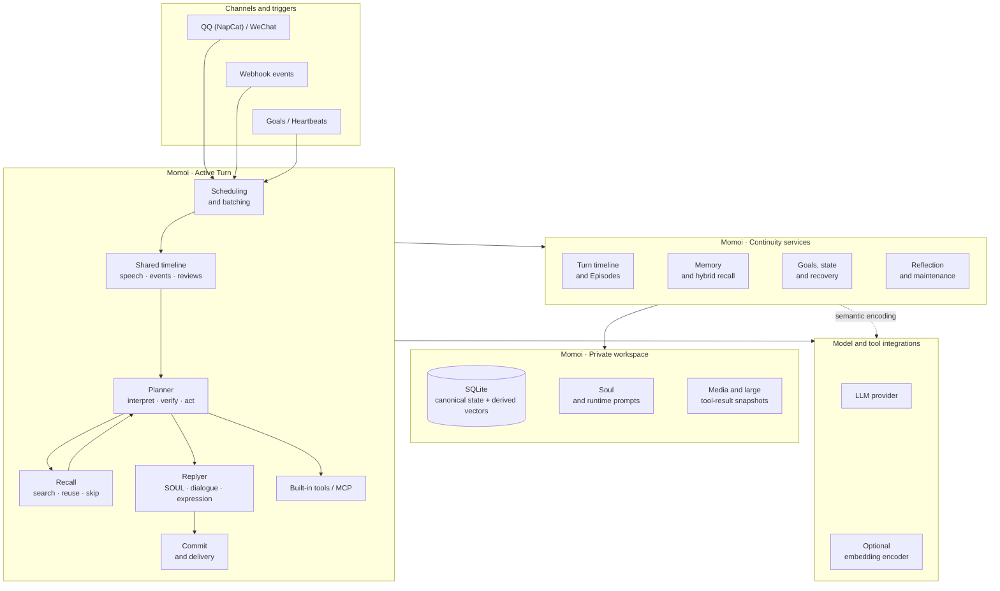
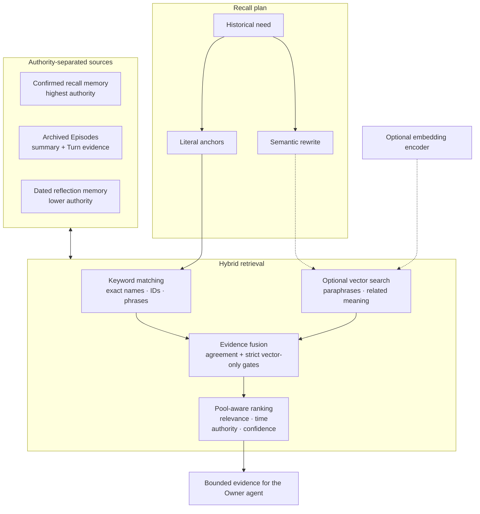

# Momoi

EN | [中文](./README.zh-CN.md)

> A persistent, single-owner personal agent that lives in private chat.

Momoi brings conversation, memory, tools, scheduled work, external events, mood,
and autonomous time into one continuous runtime. It currently connects through
QQ (NapCat) and WeChat, uses Anthropic Messages-compatible or OpenAI
Chat Completions-compatible models, and can extend its abilities through MCP.

Momoi's focus is not merely giving an LLM a character. `SOUL.md` defines who
Momoi is; the runtime makes that identity continuous by preserving the causal
timeline around it: what the owner said, what Momoi did, which results were
confirmed, what remains unfinished, and which parts of the past matter now.

> Momoi is built for trusted personal deployment and one authenticated owner.
> It is not a public or multi-user bot.


## What Momoi is designed to preserve

- **One identity across time and entry points.** Owner messages, Goals,
  Heartbeats, and Webhooks enter the same runtime and share the same history,
  relationship, state, and delivery rules.
- **Context selected by the acting Momoi.** Planner uses `recall` when current
  context needs historical evidence, searching or reusing an existing scope.
  Retrieval is not a mandatory opening action. Background workflows independently
  assign Turns to Episodes, summarize them, and build topic relationships.

- **Memory with provenance and authority.** Recent conversation, confirmed
  owner facts, shared Episodes, and lower-confidence reflection learning have
  different lifetimes and are never treated as interchangeable.
- **Agent work with visible delivery.** Momoi can call built-in or MCP tools,
  send multiple chat bubbles, report meaningful progress, verify external
  results, and continue until work finishes, is stopped, or is genuinely blocked.
- **Time as part of the agent.** Goals support one-time, interval, and
  multiple-times-per-day schedules. Heartbeats provide bounded initiative;
  Reflection and Episode maintenance happen quietly in the background.
- **A recoverable private record.** Turns, messages, tool calls, delivery state,
  memories, Episodes, Goals, mood, and thinking records live in the local
  workspace. Uncertain external effects are not silently repeated after restart.

## Architecture

Every trigger becomes a Turn. Active workflows project one shared native
transcript, assemble scoped evidence, run the appropriate agent, then commit
state and delivery. Maintenance work uses the same database but stays outside
the latency-sensitive response path.


```mermaid
flowchart TB
  subgraph triggers["Channels and triggers"]
    direction LR
    chat["QQ (NapCat) / WeChat"]
    webhook["Webhook events"]
    clock["Goals / Heartbeats"]
    chat ~~~ webhook ~~~ clock
  end

  subgraph active["Momoi · Active Turn"]
    direction LR
    intake["Scheduling<br/>and batching"]
    transcript["Shared timeline<br/>speech · events · reviews"]
    context["Recall<br/>search · reuse · skip"]
    agent["Planner<br/>interpret · verify · act"]
    replyer["Replyer<br/>SOUL · dialogue · expression"]
    delivery["Commit<br/>and delivery"]
    intake --> transcript --> agent
    agent --> context --> agent
    agent --> tools
    agent --> replyer --> delivery
  end

  subgraph continuity["Momoi · Continuity services"]
    direction LR
    timeline["Turn timeline<br/>and Episodes"]
    memory["Memory<br/>and hybrid recall"]
    time["Goals, state<br/>and recovery"]
    upkeep["Reflection<br/>and maintenance"]
    timeline ~~~ memory ~~~ time ~~~ upkeep
  end

  subgraph workspace["Momoi · Private workspace"]
    direction LR
    sqlite[("SQLite<br/>canonical state + derived vectors")]
    prompts["Soul<br/>and runtime prompts"]
    files["Media and large<br/>tool-result snapshots"]
    sqlite ~~~ prompts ~~~ files
  end

  subgraph external["Model and tool integrations"]
    direction LR
    llm["LLM provider"]
    tools["Built-in tools / MCP"]
    embedding["Optional<br/>embedding encoder"]
    llm ~~~ tools ~~~ embedding
  end

  chat --> intake
  webhook --> intake
  clock --> intake
  active --> continuity
  continuity --> workspace
  active --> external
  continuity -. "semantic encoding" .-> external
```

The three Momoi layers form the persistent runtime: an active Turn uses
continuity services rather than carrying all history directly in the prompt. The
embedding service is an encoder, not a second memory database:
canonical text and derived vectors remain in Momoi's SQLite database, while an
in-process snapshot performs vector search.

### What happens in an owner Turn

1. Incoming messages are batched while preserving their timeline and attachments.
2. Planner receives SOUL, the operating rules, memory and state, and a shared
   native transcript of prior messages, tool calls and results.
3. Planner interprets the input, recalls history when needed, discovers tools,
   and performs work. Plain assistant text records its current judgment; it does
   not send a message, including when it contains `<bubble>` tags.
4. To speak, Planner calls `reply` with an intent, necessary references and
   `mode="text"` or `mode="voice"`. Replyer receives SOUL, expression rules,
   actual channel dialogue and the current target, then generates the utterance.
   It has no tools. The delivery layer validates and durably queues the result.
5. The Turn commits history, memory-operation requests, task changes, mood,
   tool evidence and any pending follow-up. Background topic workflows then
   assign Turns to Episodes, summarize them and optionally build relationships.

### Shared timeline and cache reuse

Owner, Goal, Heartbeat, Webhook, Plan and current-state maintenance use the shared
Planner transcript and stable system/tool prefix; the harness enforces stage
permissions. Native assistant/tool exchanges preserve what was actually done.
Historical large results keep bounded excerpts, truncation markers and references
for deeper reads; `recall` results retain their special reuse behavior.

Confirmed always-on memory is frozen in the first user message for a compaction
cycle. Additions, replacements and deletions appear as transcript updates that
explicitly override stale prefix facts; the next compact rebuilds the baseline.
Domain memories are injected into the matching workflow's latest input and are
excluded from general memory prefixes and ordinary recall.

Replyer has one persisted dialogue window per channel: it starts with 12 messages,
appends until 48, then rotates to the latest 12. Text and voice share the same
system and history prefix, including the emotion catalog; only the latest request
specifies the output mode. Voice outputs spoken text without emotion markers.

New owner messages can interrupt ongoing work or delivery and cancel a pending
reply-followup. Autonomous Turns may finish silently. Delivery status remains
separate from generation or tool acceptance.

## Memory architecture

Momoi does not use one undifferentiated “memory” bucket. The layers below answer
different questions and carry different authority.

| Layer | Source of truth | How it enters context | Lifecycle |
| --- | --- | --- | --- |
| Working context | Shared speech/event/review timeline, current input, mood, activity, active Goals, and unresolved work | Included directly by chronology and current relevance | Moves with the live conversation; it is not automatically promoted to long-term fact |
| Confirmed memory | Facts, preferences, relationships, routines, and reusable methods grounded in authenticated owner messages | `always` facts enter the stable prefix; `recall` facts are retrieved by topic; `scoped` facts enter their workflow domain | New owner corrections can replace, narrow, expire, or retire older facts |
| Episodes | Concrete shared experiences backed by the original Turns and messages | Compacted history uses Episode summaries; recall returns relevant summaries, original messages and tool execution evidence | Open conversation is grouped by subject, then archived and refreshed as the subject develops |
| Reflection memory | Dated impressions, methods, tool-use lessons, and relationship learning produced by daily reflection | Recalled separately with lower confidence and an explicit stale-information warning | May be revised or become inapplicable; it never outranks current evidence or confirmed memory |

Confirmed-memory activation controls placement, not importance:

| Activation | Use it for | Retrieval behavior |
| --- | --- | --- |
| `always` | Standing interpersonal preferences and constraints that should affect ordinary conversation | Included without a topic query |
| `scoped` | Instructions specific to a Goal, Heartbeat or Webhook | Injected only into the matching workflow; excluded from ordinary recall |
| `recall` | People, device playbooks, game rules, shared methods, and facts useful only when their subject returns | Retrieved only when the current Turn asks for related history |

An Episode is a concrete experience, not a permanent category. It keeps a
compact account for broad continuity and retains the original Turn/message
evidence for exact wording, corrections, decisions, and unfinished promises.
Reflection learning remains a separate, lower-trust layer; it is not silently
promoted into an owner-confirmed fact.

### Writing and reviewing memory

Foreground tools use `memory_operation(type, content, evidence, target_id?)` with
`add`, `replace`, or `forget`. Evidence must quote an authenticated owner message;
optional `target_id` must identify memory already shown in the Turn. For example:

```json
{"type":"replace","content":"The owner now prefers tea","evidence":"I prefer tea now"}
```

Acceptance records an intent, not an effective memory change. A successful source
Turn commits requests into a durable queue; conversations without requests do not
start this review. The runtime attaches injected and recalled memory snapshots,
`memory_search` results, conversation context, and owner evidence. Foreground tools
make no nested LLM call and require no repeated memory list or extra search.

The dispatcher runs private `memory_operation` Turns on the shared agent worker,
in submission order including retries, without waiting for daily maintenance.
Each Turn uses the standard LLM, journal, and tool loop with a dedicated
system prompt. Only `memory_operation_search` and `memory_operation_finish` are
available. Review decides writes, replacements/merges, forgetting, no change, or
insufficient evidence; optional search can find active memories across activations.
The reviewer assigns kind, activation, and the applicable domain from owner evidence. Temporary state is maintained separately.

`memory_operation_finish` atomically applies the complete decision batch and ends
the Turn. Invalid decisions return tool errors for correction without partial
writes. `defer` completes review without a memory change or automatic retry of the
same evidence. Execution failures retry after five minutes, blocking subsequent
memory requests from overtaking them; each attempt has a separate Turn ID.
Ordinary owner messages wait for an active review to finish. Explicit `/stop`,
shutdown cancellation, and process restart preserve unfinished work for recovery.
Snapshot checks still protect against concurrent Dashboard edits.

`always` memory uses a stable baseline for each compaction cycle; accepted changes
are appended to the transcript before the baseline is rebuilt. Retrieved and
scoped memory do not use this baseline-update mechanism. `memory_search` is
available through tool discovery; `/tidy` continues to handle global maintenance.

### Recall and optional semantic search

When historical context is needed, Planner calls `recall` and submits the smallest
complete historical scope as a semantic query plus literal anchors such as
names, titles, IDs, or exact phrases. It may reuse an earlier scope only when
the displayed queries already cover the current need. The retrieval layer then
evaluates both kinds of evidence.


```mermaid
flowchart TB
  subgraph request["Recall plan"]
    direction LR
    need["Historical need"]
    rewrite["Semantic rewrite"]
    anchors["Literal anchors"]
    need --> rewrite
    need --> anchors
  end

  subgraph retrieval["Hybrid retrieval"]
    direction LR
    keyword["Keyword matching<br/>exact names · IDs · phrases"]
    vector["Optional vector search<br/>paraphrases · related meaning"]
    fusion["Evidence fusion<br/>agreement + strict vector-only gates"]
    ranking["Pool-aware ranking<br/>relevance · time<br/>authority · confidence"]
    keyword --> fusion
    vector --> fusion --> ranking
  end

  subgraph pools["Authority-separated sources"]
    direction LR
    confirmed["Confirmed recall memory<br/>highest authority"]
    episodes["Archived Episodes<br/>summary + Turn evidence"]
    reflection["Dated reflection memory<br/>lower authority"]
  end

  selected["Bounded evidence for the Owner agent"]
  encoder["Optional embedding encoder"]

  anchors --> keyword
  rewrite -.-> vector
  pools <--> retrieval
  encoder -.-> vector
  ranking --> selected
```

The two retrieval channels have complementary jobs:

- Keyword evidence protects exact entities, titles, IDs, dates, tool names, and
  parameters.
- Vector evidence finds paraphrases and related experiences expressed with
  different wording.
- Agreement between independent keyword and vector evidence strengthens a
  candidate. Vector-only candidates must cross a stricter, corpus-specific
  threshold.
- Confirmed memory, reflection memory, and Episodes are ranked and limited
  separately. Authority is not erased by semantic similarity.
- If the initial context is still insufficient, the acting agent can call
  `memory_search`, `episode_search`, and `episode_read` during the Turn.

Semantic search is optional and disabled by default. Without it—or while the
embedding service is unavailable or an index is still building—Momoi continues
using keyword recall. Vectors are rebuildable derivatives, never the source of
truth.

Only searchable long-term material is embedded:

- active confirmed memories with `activation: "recall"`;
- reflection memories;
- completed, archived Episode summaries and Episode-linked Turn chunks.

Always-on memories and temporary state, live recent Turns, Goals, mood/activity, thinking
records, artifacts, and raw tool results are not placed in the semantic index.
Source changes are recorded transactionally, then materialized and encoded in
small background batches. New or changed material becomes searchable
incrementally without blocking owner conversation.

## Capabilities

| Area | Current behavior |
| --- | --- |
| Private chat | One owner across QQ (NapCat) and WeChat; replies return to the originating channel and proactive messages use the configured primary channel |
| Conversation | Message batching, quoted/forwarded content, media handling, natural multi-bubble delivery, optional image reactions, and valid silence |
| Context | Native shared transcript, on-demand recall, background Episode archiving and relationships, runtime re-search, and bounded model input |
| Tools | Built-in file/HTTP tools plus dynamically discovered MCP servers and per-server tool allowlists |
| Long-running work | Tool loops, progress messages, interruption, execution limits, large-result snapshots, and recovery for uncertain external effects |
| Time and initiative | Persistent Goals, multiple daily trigger times, Heartbeats, quiet hours, and interruption by new owner messages |
| Memory maintenance | Daily Reflection, confirmed-memory reconciliation, Episode annealing, incremental semantic indexing, and keyword fallback |
| Observability | Local dashboard for conversations, recall decisions and evidence, reflections, memories, Goals, image reactions, token usage, and per-Turn thinking records |
| External events | Authenticated Webhooks with YAML workflows and predefined command executors |

## Deployment

### Windows desktop

Download the installer from [GitHub Releases](https://github.com/RicterZ/Momoi/releases).
The release workflow builds and tests the installer before attaching it. The
app includes a local backend, default prompts and six emotion assets; configure
your model and message channel through the first-run Dashboard guide.

### Docker Compose

The published `docker-compose.yml` starts Momoi and its private embedding service. No model keys,
channel configuration, or existing workspace files are required. Install Docker
with Compose v2, then start:

```bash
docker compose -f docker-compose.yml up -d
docker compose -f docker-compose.yml logs momoi
```

Open `http://127.0.0.1:8788` and sign in with the Dashboard token from the startup
logs. Use Settings to connect a model, edit prompts, enable message channels,
and sign in to Weixin by scanning its QR code.

For QQ, deploy NapCat separately and enter its reachable OneBot WebSocket URL
and the owner QQ in Momoi's Settings. On first startup, Compose enables semantic
memory with `http://embedding:8002/v1/embeddings`, model `BAAI/bge-small-zh-v1.5`,
512 dimensions, and calibration profile `bge-small-zh-v1.5-momoi-v1`.
Momoi includes these defaults and copies them into a new workspace's
`providers.yaml`. No additional startup arguments or configuration mounts are needed.
These are saved settings: you can change the provider or disable semantic memory
in the Dashboard. Restarting preserves your changes. Existing workspaces are
not migrated; configure or enable embedding in Settings if needed.

The workspace is persisted in `~/.momoi` by default and initialized by `momoi run`;
existing files are preserved. Only dashboard port 8788 is published by default.
Webhook deployment requires an explicit port mapping and webhook configuration.
See
[Configuration](./docs/CONFIG.md) for deployment options.

### Run from source

Requirements:

- Python 3.12 or newer
- [uv](https://docs.astral.sh/uv/)
- an Anthropic Messages-compatible or OpenAI Chat Completions-compatible LLM
  endpoint

From the repository root:

```bash
uv tool install .
momoi run
```

Open `http://127.0.0.1:8788`, sign in with the token printed at startup, and
complete setup in Settings.

To use another workspace, place `--workspace` before the command:

```bash
momoi --workspace /path/to/workspace run
```

To build the current checkout as a container, use the source Compose file:

```bash
docker compose -f compose.yaml up -d --build
```

It shares the published stack's defaults and builds both Momoi and the encoder.
Always specify `-f`: without it, Docker
Compose prefers `compose.yaml` over `docker-compose.yml`.

## Semantic recall

New workspaces have semantic memory configured and enabled by
default. To use another provider, select a compatible embedding endpoint, model,
and vector dimension in Settings. A Momoi process running on the host needs
an endpoint reachable from the host; update the default Docker address in Settings
or disable semantic memory when no encoder is available.

Momoi builds the index in the background and activates it when coverage is complete.
Keyword recall remains available during indexing. See
[Configuration](./docs/CONFIG.md#embedding-recall) for index management and advanced options.

## Personalize and connect

### Identity and initiative

- Edit `~/.momoi/prompts/SOUL.md` for identity, relationship, values, interests,
  and natural voice.
- Edit `~/.momoi/prompts/PLANNER.md` for the shared agent’s interpretation,
  recall, tool use and response intent. `{{SOUL}}` includes the current identity.
- Edit `~/.momoi/prompts/REPLYER.md` for expression. Replyer receives SOUL,
  recent delivered channel dialogue (a persisted window starts with the latest
  12 messages, appends until 48, then rotates back to the latest 12),
  the current input and Planner’s intent/reference; it has no tools. Its actual
  speech returns to Planner as the `reply` result and follows normal delivery.
  Replyer thinking defaults to `low` and is configurable in the dashboard.
- Edit `~/.momoi/prompts/HEARTBEAT.md` to shape what Momoi may explore, create,
  continue, share, or leave quiet during autonomous time.
- Add optional image reactions with `momoi emotion add`; descriptions tell
  Replyer when each image fits.

### Chat decision flow

Dashboard thinking details link each Planner request to its `reply` intent,
reference, nested Replyer request and recorded tool outcome. Internal assistant
text, provider reasoning, generated speech and actual outbox delivery are shown
separately. Running turns refresh automatically; missing historical fields stay
marked as unavailable. These records never enter the model transcript.

Full request/response dumps require `logging.level=TRACE`. Each dump includes
stage, turn/request IDs and parent dispatch context. Dumps stay on disk for
offline debugging; the dashboard displays reasoning and decisions, without
loading full requests or responses. Decision records remain available at other log levels.

### External API services

LLM, TTS, embedding and account balance use capability interfaces, registered
adapters and a shared composition/lifecycle layer. Service endpoints and credentials
live in `providers.yaml`; `config.json` references that file. A service can bind to
multiple supported capabilities. Balance queries are independent of local token
accounting. Add adapters through registered Python plugins.
See [Provider configuration and extension](./docs/PROVIDERS.md).

### Tools

Configure stdio or remote MCP servers in workspace `mcp.json`, with a useful
`description` for each service. The stable system index contains service/group
names and descriptions, not every tool's full schema.

1. `tool_search` finds candidate tool names and descriptions.
2. `tool_enable({"tools": ["exact_tool_name", "another_tool"]})` loads their schemas.
3. Call the loaded tools; stage permissions still apply.

Low-frequency built-ins follow the same flow: `thinking_search`, `thinking_read`,
`episode_relations`, `episode_search`, `memory_search`, `write_file`, `apply_patch`,
`makedirs`, `move_file` and `delete_file`. Available file tools depend on the Bash
setting. Loaded tools remain available across shared Turns and restarts until
manual or automatic compaction resets the enabled set.

User-facing speech goes through `reply`; `send_bubbles` and `send_voice` are not
model-facing tools. The description exposes configured voice channels. Text
Replyer selects standalone `emotion://slug` bubbles from the catalog; image/file
attachments can be supplied through `reply.attachments` and are passed through
by delivery. Voice generation uses TTS and returns an error for text fallback
when unavailable or unsuccessful.

### Dashboard

Open `http://127.0.0.1:8788`. The dashboard can inspect conversations,
Planner/Replyer decision flows, per-request tokens, cache usage, latency and
estimated costs, recall evidence, reflections, memories, Goals,
image reactions, usage, and thinking records; it can also edit memories, Goals,
reaction assets, and prompt files. Enter the generated token from startup output,
then configure providers and channels in Settings, including Weixin QR login.
Configuration changes reload the business runtime without closing the dashboard.
Use `momoi run --no-dashboard` for headless operation. Existing workspaces need
`dashboard.token` or `MOMOI_DASHBOARD_TOKEN`. Keep the dashboard on localhost or a trusted network.

### Webhooks

Enable `webhooks`, set a bearer token, and use the included `event-message`
workflow to turn an external event into a context-aware Momoi Turn:

```bash
curl -X POST http://127.0.0.1:8787/webhooks/event-message \
  -H "Authorization: Bearer $MOMOI_WEBHOOK_TOKEN" \
  -H "Content-Type: application/json" \
  --data '{"event_prompt":"The watched page changed. Explain what is new if it matters."}'
```

Webhook Turns receive the same native shared transcript and memory as Momoi's
other active workflows, but they may finish silently when the event adds
nothing useful.

### Completing a Goal review

A Goal review uses one sequence: work → optional `reply` →
`goal_review` → `end_turn({})`. The review tool stages the result and task changes;
they commit when the Turn finishes. `active`, `waiting` and `blocked` keep the Goal; `done` and
`cancelled` close it. The runtime supplies the current Goal ID. For example:

```json
{"status": "done", "result": "Downloaded and verified the file"}
```

Continuing requires `next_action` and a future `next_review_at`; recurring active
Goals may reuse their schedule. Waiting requires `waiting_for` and a future review;
blocked requires `blocked_reason`. `reply` uses the normal
delivery path immediately, independently of Goal completion. Delivery and
`end_turn` may share one response, with `end_turn` last; failed delivery prevents
completion. Invalid outcomes return tool errors for correction.

Plain assistant text and `<bubble>` tags do not send messages. Use `reply` for
speech and the current workflow's finish tool for completion. `end_turn` accepts
`mood` and `reply_wait` for conversation stages, or `{}` after `goal_review` for
Goals. Heartbeats report activity, result, `next_check_minutes` and `reason`
through `heartbeat_activity` before ending. Before a Heartbeat sends discovered
content, it must successfully recall that specific content to check prior sharing.
Normal conversations retain `goal_update`, `goal_finish` and `goal_cancel` for
task management.

## Owner controls

| Chat command | Purpose |
| --- | --- |
| `/stop` | Cancel the active task |
| `/compact` | Shrink the transcript window to `transcript_turns_min` for the next context build |
| `/heartbeat` | Trigger one Heartbeat immediately |
| `/reflect` | Run Reflection for the current local day |
| `/tidy` | Run confirmed-memory maintenance |
| `/resolve <id> <result>` | Record the verified result of an uncertain external action |
| `/resume <id> <current state>` | Continue uncertain work from a verified current state |

`/compact` uses the existing transcript window compaction and persists the reduced
window across restarts. It preserves stored history, does not call the model or
interrupt the active Turn, and resumes normal window growth as new Turns complete.

Momoi includes CLI management for Goals, image reactions, channels, and semantic
index status. Run `momoi --help` or a subcommand's `--help` for the current
surface.

## Documentation

- [Configuration reference](./docs/CONFIG.md)
- [Webhook workflow reference](./docs/WORKFLOW.md)

Momoi is licensed under the [MIT License](./LICENSE).
