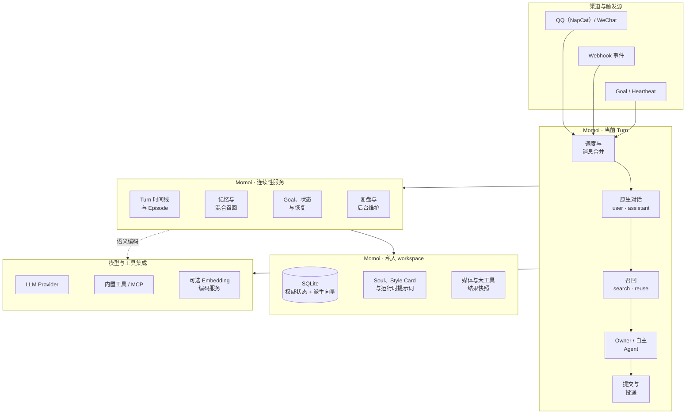
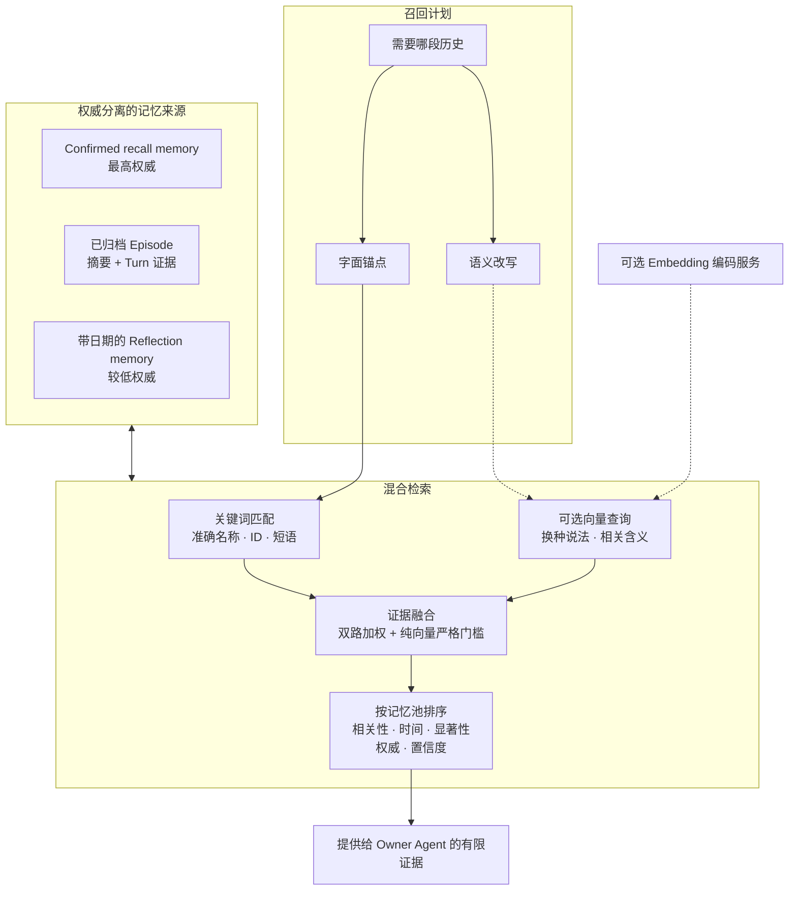

# Momoi

[EN](./README.md) | 中文

> 一个常驻在私聊中的、只属于一位主人的个人 Agent。

Momoi 把对话、记忆、工具、定时工作、外部事件、情绪和自主时间放进同一个持续运行的
系统。目前可通过 QQ（NapCat）、WeChat 交流，支持兼容 Anthropic Messages 或
OpenAI Chat Completions 的模型，并可通过 MCP 扩展能力。

Momoi 的重点不只是给 LLM 加一个角色。`SOUL.md` 定义 Momoi 是谁；运行时则保存围绕
这个身份的因果时间线，让她真正连续起来：主人说过什么、Momoi 做过什么、哪些结果已经
确认、哪些事情仍未完成，以及此刻应当想起哪部分过去。

> Momoi 面向可信的个人环境和唯一经过认证的主人，不是公开或多用户机器人。

## Momoi 想保留下来的东西

- **跨时间、跨入口的同一个身份。** 主人消息、Goal、Heartbeat 和 Webhook 都进入同一
  运行时，共享历史、关系、状态与投递规则。
- **由正在行动的 Momoi 选择上下文。** 每个 Owner Turn 都必须先调用 `recall`；
  Momoi 自己决定搜索新 scope 或复用已有 scope，运行时负责检索记忆并绑定 Episode。
- **有来源、有权威差异的记忆。** 近期对话、主人确认的事实、共同 Episode 和低置信度
  的复盘学习拥有不同生命周期，不会被当成同一种证据。
- **真正执行并明确投递。** Momoi 可以调用内置工具或 MCP、发送多条聊天气泡、汇报有
  意义的进度、核实外部结果，并持续工作到完成、被停止或确实受阻。
- **把时间纳入 Agent。** Goal 支持单次、间隔和每日多个时间点；Heartbeat 提供有边界
  的主动性，Reflection 与 Episode 维护则在后台安静运行。
- **可恢复的私人记录。** Turn、消息、工具调用、投递状态、记忆、Episode、Goal、
  情绪和思考记录都保存在本地 workspace。结果不确定的外部操作不会在重启后被悄悄重做。

## 架构

每个触发都会形成一个 Turn。活跃工作流共享同一份原生 transcript，并组装各自的作用域
证据，再运行对应 Agent，最后提交状态与投递。维护任务使用同一数据库，但不阻塞对响应
时间敏感的对话主链。



Momoi 的三层共同构成持续运行的系统：当前 Turn 通过连续性服务按需取得过去，而不是把全部历史
直接塞进提示词。Embedding 服务只是编码器，并不是
第二个记忆数据库：权威文本和派生向量仍保存在 Momoi 的 SQLite 中，由进程内快照完成
向量检索。

### 一个 Owner Turn 怎样运行

1. 入站消息按时间线合并成一个连贯批次。
2. 最近已送达的主人与 Momoi 发言以原生 `user` / `assistant` 消息进入请求；运行时状态
   和记忆仍是明确标记的数据，主人此刻的话始终是唯一的当前主人权限。
3. Owner 模型先调用 `recall`，搜索新的历史 scope 或复用明确覆盖当前需求的旧 scope，
   并独立选择 Episode 归属。运行时执行相同的关键词与可选向量检索，返回有上限的证据。
4. 同一个模型应用 Momoi 的 Soul 与 Style Card，按需使用工具，并通过渠道投递协议发送
   主人可见的气泡。
5. Turn 把消息、记忆与 Goal 变更、情绪与活动、工具证据、投递状态和待处理追问一起提交
   为可恢复记录。

Owner、Goal、Heartbeat 和 Webhook Turn 的权限与目的不同，但都位于同一条时间线上。
自主 Turn 或外部事件 Turn 可以合法地选择沉默。

## 记忆架构

Momoi 不把所有内容塞进一个笼统的“记忆”桶。每一层回答不同问题，也拥有不同权威。

| 层级 | 事实来源 | 怎样进入上下文 | 生命周期 |
| --- | --- | --- | --- |
| 工作上下文 | 原生近期 user/assistant 消息、当前输入、情绪、活动、进行中的 Goal 和未完成工作 | 按时间线与当前相关性直接带入 | 随正在进行的对话移动，不会自动晋升为长期事实 |
| Confirmed memory | 来自已认证主人消息的事实、偏好、关系、习惯和可复用方法 | `always` 持续可见；`recent` 在有限时间内可见；`recall` 按话题检索 | 主人的新更正可以替换、收窄、过期或退役旧事实 |
| Episode | 有原始 Turn 与消息作为证据的具体共同经历 | 近期 Episode 直接可见；更早的 Episode 通过摘要或原始 Turn 证据召回 | 开放对话按真实主题归组，随后归档，并在话题继续发展时更新 |
| Reflection memory | 每日复盘产生的、带日期的体会、方法、工具经验和关系学习 | 独立召回，置信度更低，并明确提示可能过时 | 可以被修订或失去适用性，永远不能压过当前证据或 Confirmed memory |

Confirmed memory 的 activation 决定事实放在哪里，而不是它有多重要：

| Activation | 适合的内容 | 召回方式 |
| --- | --- | --- |
| `always` | 即使话题无关也应影响日常交流的长期关系偏好与约束 | 无需话题查询，持续带入 |
| `recent` | 今晚计划、当前快递、临时位置等有时间边界的情境 | 在 TTL 或近期有效窗口结束前带入 |
| `recall` | 人物、设备操作手册、游戏规则、共同方法，以及只在相关话题回来时有用的事实 | 只有当前 Turn 需要相关历史时才检索 |

Episode 是一次具体经历，而不是一个永久分类。它用紧凑摘要维持宽泛连续性，同时保留
原始 Turn 和消息证据，以便找回准确措辞、更正、决定和未完成承诺。复盘学习始终是独立
的低权威层，不会被静默晋升为主人确认的事实。

### 召回与可选语义检索

每个 Owner Turn 都先调用 `recall`。正在行动的模型把最小完整历史 scope 写成语义查询，
并给出姓名、标题、ID 或准确短语等字面锚点；只有旧查询明确覆盖当前需求时才能复用。
检索层随后分别评估两类证据。



两条检索通道负责不同的事情：

- 关键词证据保护实体、标题、ID、日期、工具名和参数等精确信息。
- 向量证据寻找措辞不同的同义表达与相关经历。
- 同一个候选被关键词和向量独立命中时会得到加权；只有向量命中的候选必须跨过更严格、
  按语料池校准的门槛。
- Confirmed memory、Reflection memory 和 Episode 分开排序、分开限额；语义相似度不能
  抹平权威差异。
- 如果首轮上下文仍不够，行动中的 Agent 可以继续调用 `memory_search`、
  `episode_search` 和 `episode_read`。

语义检索是可选功能，默认关闭。未启用、Embedding 服务不可用或索引仍在构建时，Momoi
继续使用关键词召回。向量始终是可重建的派生数据，不是事实来源。

只有需要检索的长期材料会建立向量：

- `activation: "recall"` 的有效 Confirmed memory；
- Reflection memory；
- 已完成归档的 Episode 摘要和 Episode 所属 Turn 分块。

Always/Recent memory、正在进行的近期 Turn、Goal、情绪与活动、思考记录、artifact 和原始
工具结果不会进入语义索引。源数据变化会先在事务中登记，再由后台以小批次物化和编码；
新增或变化的材料会增量变得可检索，不阻塞主人对话。

## 当前能力

| 领域 | 当前行为 |
| --- | --- |
| 私聊渠道 | 一个主人可以同时使用 QQ（NapCat）与 WeChat；回复返回发起对话的渠道，主动消息发往配置的 primary |
| 对话 | 消息合并、引用与转发、媒体处理、自然的多气泡投递、可选图片反应，以及合法沉默 |
| 上下文 | 原生共享对话、Owner 强制 search/reuse 召回、Episode 路由、运行时二次搜索和有上限的模型输入 |
| 工具 | 内置文件/HTTP 工具、动态发现的 MCP Server，以及按 Server 配置的工具白名单 |
| 长任务 | 工具循环、进度消息、中断、token/时间预算、大结果快照和不确定外部操作恢复 |
| 时间与主动性 | 持久 Goal、每日多个触发时间、Heartbeat、静默时段和新主人消息打断 |
| 记忆维护 | 每日 Reflection、Confirmed memory 整理、Episode annealing、增量语义索引和关键词降级 |
| 可观测性 | 本地 Dashboard 可查看对话、每个 Turn 的召回决策与证据、复盘、记忆、Goal、图片反应、token 用量和思考记录 |
| 外部事件 | 带认证的 Webhook、YAML 工作流和预定义命令执行器 |

## 快速开始

### Docker Compose

`docker-compose.yml` 中的发布栈会运行 Momoi、NapCat 和私有 Embedding 服务。Embedding
容器会一起启动，但只有在 `providers.yaml` 中启用 embedding binding 后才会参与语义召回。

设置 QQ 主人并启动发布栈：

```bash
export MOMOI_OWNER_QQ=your-qq-number
docker compose -f docker-compose.yml up -d
```

首次启动时，镜像会在未设置 `MOMOI_WORKSPACE` 时创建 `$HOME/.momoi`，生成 Dashboard
与 Webhook token，并写入 Momoi 容器日志：

```bash
docker compose -f docker-compose.yml logs momoi
```

QQ 用户打开 `http://127.0.0.1:6099/webui`，从 `docker logs napcat` 获取 NapCat 登录
token，完成登录并启用 OneBot WebSocket。Dashboard 默认位于
`http://127.0.0.1:8788`。编辑 workspace 中的 `providers.yaml` 配置模型连接，修改后重启。

WeChat 渠道只需在同一 workspace 中认证一次（`weixin` 是内部渠道标识）：

```bash
docker compose -f docker-compose.yml run --rm momoi channel login weixin
```

如果希望主动消息发送到 WeChat，下次 `up` 时设置 `MOMOI_PRIMARY=weixin`。只启用一个渠道
即可，也可以让两个渠道同时在线。

### 从源码运行

需要：

- Python 3.12 或更高版本
- [uv](https://docs.astral.sh/uv/)
- 至少一个已经配置好的私聊渠道
- 兼容 Anthropic Messages 或 OpenAI Chat Completions 的 LLM 端点

在仓库根目录执行：

```bash
uv tool install .
mkdir -p ~/.momoi
cp -R config.example/. ~/.momoi/
```

在 `~/.momoi/config.json` 配置启用渠道、primary 和本地时区；在
`~/.momoi/providers.yaml` 配置 LLM 端点、凭据和模型，然后运行：

```bash
momoi run
```

使用其他 workspace 时，`--workspace` 必须放在子命令前：

```bash
momoi --workspace /path/to/workspace run
```

面向源码开发的 `compose.yaml` 会从当前 checkout 构建 Momoi 与 Embedding 镜像，并使用
已经配置好的 workspace：

```bash
docker compose -f compose.yaml up -d --build
```

## 启用语义召回

语义召回依赖单独运行的 OpenAI-compatible Embedding 端点。发布版 Docker Compose 已经
包含私有的 `momoi-embedding` 服务，且不会把端口发布到宿主机；如果 Momoi 直接运行在
宿主机上，需要提供另一个可达的兼容端点。

将以下内容合并到 `providers.yaml` 的 `services` 和 `bindings` 中：

```yaml
services:
  vectors:
    adapter: openai
    base_url: http://embedding:8002/v1
bindings:
  embedding:
    service: vectors
    enabled: true
    options:
      model: BAAI/bge-small-zh-v1.5
      dimensions: 512
      calibration_profile: bge-small-zh-v1.5-momoi-v1
      query_timeout_seconds: 5
      document_timeout_seconds: 30
      document_batch_size: 8
```

Momoi 重启后会核对已有来源、在后台构建索引，并在覆盖完整时原子激活。整个过程中关键词
召回仍然可用。从源码安装时，用下面的命令查看健康状态和进度：

```bash
momoi embedding status
```

使用发布版 Docker Compose 时，在容器内运行同一个 CLI：

```bash
docker compose -f docker-compose.yml exec momoi momoi embedding status
```

需要受控的离线迁移时，`momoi embedding build --wait` 会准备 building space，
`momoi embedding activate` 会在校验后切换过去。模型、维度和 calibration profile
必须使用受支持且相互匹配的一组值。完整选项见
[配置参考](./docs/CONFIG.zh-CN.md#embedding-召回)。

## 个性化与连接

### 身份与主动性

- 编辑 `~/.momoi/prompts/SOUL.md`，定义身份、关系、价值观、兴趣和自然说话方式。
- 编辑 `~/.momoi/prompts/HEARTBEAT.md`，决定 Momoi 在自主时间可以探索、创作、继续、
  分享什么，以及什么时候保持安静。
- 使用 `momoi emotion add` 添加可选图片反应；描述会告诉 Agent 每张图适合什么情境。

### 外部 API 服务

LLM、ASR、TTS、embedding 和账户余额通过能力接口、注册式适配器与统一的服务组装层接入。
端点、凭据和服务参数放在 `providers.yaml`，`config.json` 只引用该文件。
同一服务可绑定多项能力；余额查询与本地 token 统计独立。
通过 Python 插件注册新适配器，无需修改业务代码。
详见 [Provider 配置与扩展](./docs/PROVIDERS.zh-CN.md)。

### 工具

在 workspace 中放置 `mcp.json`，即可连接 stdio 或远程 MCP Server。Momoi 会在运行时
发现 schema、按配置暴露工具，并区分只读工具与可能产生外部影响的工具。

### Dashboard

在 `config.json` 中设置 `dashboard.token`，然后运行：

```bash
momoi run --dashboard
```

打开 `http://127.0.0.1:8788`。Dashboard 可以查看对话、每个 Turn 的召回 scope 与选中
证据、复盘、记忆、Goal、图片反应、用量和思考记录，也可以编辑记忆、Goal、图片反应与提示词文件。
Provider 配置在 `providers.yaml` 修改，重启生效。
请只在本机或可信网络中开放。

### Webhook

启用 `webhooks` 并设置 Bearer token 后，可以使用自带的 `event-message` 工作流，把
外部事件转成拥有当前上下文的 Momoi Turn：

```bash
curl -X POST http://127.0.0.1:8787/webhooks/event-message \
  -H "Authorization: Bearer $MOMOI_WEBHOOK_TOKEN" \
  -H "Content-Type: application/json" \
  --data '{"event_prompt":"The watched page changed. Explain what is new if it matters."}'
```

Webhook Turn 与其他 Momoi 工作流共享同一份原生对话和记忆；如果事件没有增加有用信息，
也可以安静结束。

### Goal 如何收尾

Goal 自主执行只需「工作 → 可选 `send_bubbles` / `send_voice` → `end_turn`」。
`end_turn` 的 `goal` 对象同时记录结果、更新任务状态并结束本轮：`active`、`waiting`、
`blocked` 保留 Goal，`done`、`cancelled` 关闭 Goal。模型无需提供 Goal ID。
例如完成任务时调用：

```json
{"goal": {"status": "done", "result": "文件已下载并校验"}}
```

继续执行需要 `next_action` 和未来的 `next_review_at`，周期 Goal 可以沿用 schedule；
等待需要 `waiting_for` 和未来检查时间；阻塞需要 `blocked_reason`。
`send_bubbles` / `send_voice` 调用后立即进入通用发送流程，不等待 Goal 收尾。
收尾校验失败会返回工具错误并留在本轮修正。
其他 Turn 必须省略 `goal` 或传 `null`，harness 会拒绝越界参数。
普通对话仍可通过 `goal_update`、`goal_finish`、`goal_cancel` 管理任务；这些工具不用于 Goal 自主收尾。

## 主人控制

| 聊天命令 | 用途 |
| --- | --- |
| `/stop` | 取消当前任务 |
| `/heartbeat` | 立即触发一次 Heartbeat |
| `/reflect` | 复盘当前本地自然日 |
| `/tidy` | 运行 Confirmed memory 维护 |
| `/resolve <id> <result>` | 记录一次不确定外部操作经过核实的真实结果 |
| `/resume <id> <current state>` | 从经过核实的当前状态继续不确定工作 |

Momoi 还提供 Goal、图片反应、渠道和语义索引状态的 CLI 管理命令。使用
`momoi --help` 或子命令的 `--help` 查看当前命令面。

## 文档

- [配置参考](./docs/CONFIG.zh-CN.md)
- [Webhook 工作流参考](./docs/WORKFLOW.zh-CN.md)

Momoi 使用 [MIT License](./LICENSE)。
