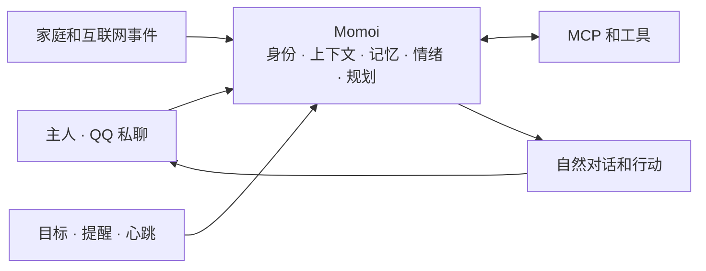

# Momoi

[EN](./README.md) | 中文

> 一个常驻在 QQ 里的个人 AI 伙伴——拥有记忆、主动性、情绪和自己的生活节奏。

Momoi 是一个无界面、单用户的 AI Agent，常驻在 QQ 私聊中。她可以自然地交谈、记住你们共有的上下文、调用工具、管理长期任务、响应家庭和各种服务中的事件，也会自己判断什么时候值得主动找你聊聊。

这个项目不是想再做一个问答机器人，而是想塑造一个连续存在的人：她可以长期陪伴你，理解正在发生的事，也能真正把事情做完。

> Momoi 目前面向可信的个人环境部署和真实使用测试，不是公开或多用户机器人。

## 为什么做 Momoi

大多数聊天机器人只是附带人格提示词的无状态请求处理器。Momoi 从一开始就选择了不同的方向：

- **一个连续的身份。** 人格、关系、记忆、情绪、当前活动和未完成的话题都会跨越对话和重启延续。
- **先理解上下文，再回答。** Momoi 会回忆当下真正相关的内容，而不是把全部聊天记录无脑塞给模型。
- **能做事，不只是一问一答。** 她可以确认任务、调用工具、发送有价值的进度，并持续工作，直到完成或真正遇到阻碍。
- **有分寸的主动性。** 目标、提醒和心跳机制让她能在时间轴上行动，又不会把每一个定时器都变成烦人的通知。
- **所有渠道共用同一段生活。** QQ 消息、家庭事件、Webhook、定时工作和主动思考都会进入同一个 Momoi。
- **诚实地执行。** 只有收到确认结果后，她才会声称某个外部操作已经成功。

## 产品设计



可以通过四种方式触达 Momoi：

| 入口 | 用途 |
| --- | --- |
| 主人消息 | 对话、提问、修正和立即执行的任务 |
| Webhook 事件 | 来自 Home Assistant、Jellyfin、摄像头或其他服务的事件 |
| 目标 | 需要稍后继续，或定期使用新信息和工具执行的工作 |
| 心跳 | Momoi 选择当前活动、并判断是否要开口的低优先级时刻 |

它们共享同一身份和相关上下文。Webhook 通知应该听起来像刚刚还在和你聊天的那个人，而不是另一个自动化机器人。

## 核心体验

### 自然的 QQ 对话

Momoi 会把连续发来的消息当作一个不断完善的想法。如果你在她开始处理前又发来修正或补充，它们会一起成为同一个请求。

回复会自然地适应私聊：

- 默认只发一条消息。
- 较长的回复可以拆成几个自然的气泡。
- 第一个气泡立即发送，后续消息保持类人的节奏。
- 文本、图片、引用、合并转发、卡片、文件、视频和语音都能保留原有的消息含义。
- 支持图像的模型可以理解对话中的图片。
- 处理长任务时，可以及时发送有价值的进度。

### 可以延续的上下文

Momoi 会组合多种上下文，而不是只依赖固定数量的消息：

- 保留原始形式的近期对话
- 当前话题和尚未解决的事项
- 可搜索的早期对话片段
- 持久的事实、偏好、习惯和关系记忆
- 正在进行的目标和待执行的提醒
- 当前情绪和活动

只会召回与当下有关的旧内容。这让长期使用既不会失忆，也不会变成不断膨胀的上下文炸弹。

持久记忆必须以主人真正说过的内容为依据。当两个值冲突时，Momoi 会请求确认，而不是悄悄改写历史。

### Agent 式任务执行

简单对话保持简单。真正的任务可以调用记忆搜索、HTTP、文件、MCP 服务器和其他已连接的能力。

一个较长的任务可以自然地按照以下方式展开：

1. Momoi 先确认自己要做什么。
2. 她进行搜索、阅读、调用工具或控制已连接的服务。
3. 真正有值得说的进度时，她会及时告诉你。
4. 她会验证结果。
5. 她返回有用的结论，并保留稍后必须继续的事项。

她会继续工作，直到任务完成、真正受阻，或被主人停止。

### 情绪、活动与表达

Momoi 有持久的情绪和活动状态。事件可以改变这些状态，时间会让它们逐渐平复，最终自然地影响语气和表达，但不会改变事实或工作纪律。

她的人格存在 `SOUL.md` 中。情绪素材库则提供庆祝、害羞、恶作剧等含有语义描述的可选图片反应。她会自己判断一个反应是否真的能给当下增色，而不是每条回复都带上一张图。

### 主动，但不粘人

Momoi 把不同类型的未来行为分开处理：

| 机制 | 适合的事 | 行为 |
| --- | --- | --- |
| 提醒 | “一小时后提醒我拉伸” | 在指定时间传达已知内容 |
| 目标 | “每天早上查天气，然后给我骑行建议” | 醒来、获取新信息、进行推理并继续完成任务 |
| 心跳 | Momoi 自己的活动和主动性 | 可以开始一段有关联的对话，也可以保持沉默 |
| Webhook | 外部事件已经发生 | 以 Momoi 平常的语气执行预先定义的事件工作流 |

目标和心跳通知会遵守静默时段、冷却时间、每日限额和待处理的主人消息。沉默也是有效决定；心跳不是定时发送“你在吗？”的机器。

## Momoi 现在可以做什么

- 与一位可信主人进行自然的私聊
- 记住稳定的偏好、关系、习惯和共有事实
- 在当前上下文模糊时搜索较早的记忆和对话片段
- 使用通用 MCP 服务器，包括 Home Assistant 集成
- 获取公网和私有网络的 HTTP 资源
- 读取、写入和修改文件
- 创建单次和循环提醒
- 创建并持续执行可持久目标
- 接收来自 Home Assistant、Jellyfin、摄像头和其他服务的事件工作流
- 发送文本、富 QQ 消息和受管理的图片反应
- 跨对话保持情绪和活动状态
- 通过受限心跳机制主动说话
- 使用 `/stop` 停止正在进行的工作
- 在外部操作结果不确定时安全恢复

## 开始使用

### 需求

- Python 3.12 或更高版本
- [uv](https://docs.astral.sh/uv/)
- 可用的 NapCat WebSocket 连接
- 兼容 Anthropic Messages 或 OpenAI Chat Completions 的 LLM 端点

### 安装 CLI

在仓库根目录执行：

```bash
uv tool install .
momoi --version
```

之后可以在任何目录使用 `momoi` 命令。

### 创建 workspace

仍在仓库根目录，复制一次初始 workspace：

```bash
mkdir -p ~/.momoi
cp -R config.example/. ~/.momoi/
```

编辑 `~/.momoi/config.json` 并设置：

- LLM API 格式、端点、密钥和模型
- NapCat WebSocket URL
- 唯一主人的 QQ 号
- 本地时区

### 运行

```bash
momoi run
```

日志出现 `NapCat connected` 后，使用配置的主人账号发送 QQ 私聊消息。

使用其他 workspace：

```bash
momoi --workspace /path/to/workspace run
```

## 个性化 Momoi

编辑 `~/.momoi/prompts/SOUL.md`，定义 Momoi 的身份、关系、价值观、兴趣和自然说话方式。

添加图片反应，并描述它适合在什么时候使用：

```bash
momoi emotion add \
  --slug very-happy-dance \
  --path /path/to/dance.gif \
  --desc "Dance when genuinely delighted or celebrating"

momoi emotion list
momoi emotion del --slug very-happy-dance
```

导入的素材会由 workspace 管理，之后移动原始文件也不会受影响。

## 通过 MCP 连接工具

在 workspace 中放置标准 `mcp.json` 以连接 MCP 服务器。

这是添加 Home Assistant、搜索、媒体管理或其他领域能力的推荐方式。Momoi 专注于成为 Agent；成熟的外部服务仍作为外部插件存在。

## 接收外部事件

在 `config.json` 中启用 Webhook，选择可达的绑定地址并设置 token。自带的 `event-message` 工作流会使用 Momoi 的当前上下文，把一个事件变成自然消息。

```bash
curl -X POST http://127.0.0.1:8787/webhooks/event-message \
  -H "Authorization: Bearer $MOMOI_WEBHOOK_TOKEN" \
  -H "Content-Type: application/json" \
  --data '{"event_prompt":"The washing machine has finished. Remind the owner to collect the laundry."}'
```

示例 workspace 还包含一个中性的 `url-check-event` 工作流，演示如何先执行经验证的命令步骤，再发送自然通知。

## 管理持久目标

Momoi 可以在对话中创建目标，也可以通过 CLI 查看和管理：

```bash
momoi goal add \
  --title "Daily weather" \
  --success "Send useful weather and riding advice every morning" \
  --action "Check the weather for the owner's area" \
  --daily 07:30

momoi goal list
momoi goal list --all
momoi goal del <goal-id-or-prefix> --reason "No longer needed"
```

使用 `--at` 设置未来的单次检查，或使用 `--every-seconds` 设置循环间隔。

## 主人控制

在 QQ 中发送 `/stop` 可取消当前任务。Momoi 会停止工作，并理解是主人中断了她。

如果某个外部操作已经发出，但结果变得不确定，Momoi 会先请主人确认真实状态，然后再继续。她不会只因进程重启就重复执行操作。

## 当前范围

- 仅支持一位可信主人和 QQ 私聊
- 不支持群聊或多用户隔离
- 没有 TUI 或 Web 管理界面
- 面向可信的个人环境设计
- 已连接工具会获得实际授予它们的访问权限

请保护好 workspace、API 密钥、Webhook token 和已连接的 MCP 服务。

## 开发

```bash
uv run python -m unittest discover -s tests -v
uvx ruff check src tests
```

## 文档

- [配置与能力访问](./docs/CONFIG.zh-CN.md)
- [Webhook 工作流](./docs/WORKFLOW.zh-CN.md)

Momoi 不由某个特定模型、智能家居平台或消息服务定义。她是身份、上下文、记忆、行动与时间之间的连续性。
