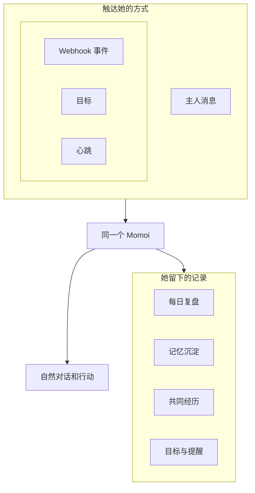
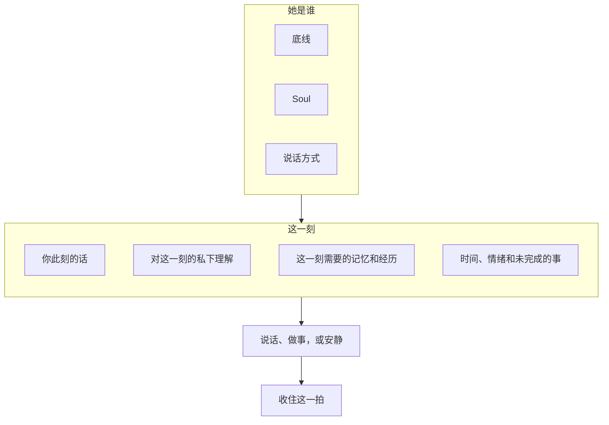

# Momoi

[EN](./README.md) | 中文

> 一个常驻在私聊里的个人 AI 伙伴——拥有记忆、主动性、情绪和自己的生活节奏。

Momoi 是一个无界面、单用户的 AI Agent，通过 NapCat/QQ 或腾讯微信 iLink 常驻在私聊中。她可以自然地交谈、记住你们共有的上下文、调用工具、管理长期任务、响应外部事件，也会自己判断什么时候值得主动找你聊聊。

这个项目不是想再做一个问答机器人，而是想塑造一个连续存在的人：她可以长期陪伴你，理解正在发生的事，也能真正把事情做完。

> Momoi 目前面向可信的个人环境部署和真实使用测试，不是公开或多用户机器人。

## 为什么做 Momoi

大多数聊天机器人只是附带人格提示词的无状态请求处理器。Momoi 从一开始就选择了不同的方向：

- **一个连续的身份。** 人格、关系、记忆、情绪、当前活动和未完成的话题都会跨越对话和重启延续。
- **先理解上下文，再回答。** 她会先弄清这一刻在说什么，再唤回真正相关的共同经历，而不是把全部聊天记录无脑塞给模型。
- **能做事，不只是一问一答。** 她可以确认任务、调用工具、发送有价值的进度，并持续工作，直到完成或真正遇到阻碍。
- **有分寸的主动性。** 目标、提醒和心跳机制让她能在时间轴上行动，又不会把每一个定时器都变成烦人的通知。
- **所有渠道共用同一段生活。** QQ 消息、Webhook、定时工作和主动思考都会进入同一个 Momoi。
- **诚实地执行。** 只有收到确认结果后，她才会声称某个外部操作已经成功。

## 产品设计



可以通过四种方式触达 Momoi：

| 入口 | 用途 |
| --- | --- |
| 主人消息 | 对话、提问、修正和立即执行的任务 |
| Webhook 事件 | 来自其他服务的事件 |
| 目标 | 需要稍后继续，或定期使用新信息和工具执行的工作 |
| 心跳 | Momoi 探索、生成产物、继续自己的工作并判断是否开口的低优先级自主回合 |

它们共享同一身份和相关上下文。对话、每日复盘和记忆都会留下来。Webhook 通知应该听起来像刚刚还在和你聊天的那个人，而不是另一个自动化机器人。

### 一个瞬间怎样发生

Momoi 不会把刚收到的话直接拿去生成回复。真正重要的是：开口之前，她被给予了什么。



**每一次都先放上「她是谁」。** 同一套底线、Soul 和说话方式会待在每个瞬间前面。它们说明她是谁、怎么说话、什么可以当作证据。人格不能压过底线，召回的记忆也不能改写她是谁。

**「这一刻」是拼出来的，不是把全部记录倒进去。** 近期对话已经在她手里。她会先私下弄清这一刻在说什么，再唤回这一刻真正需要的记忆和共同经历。你此刻的话才是当前意图；更早的对话、共同经历、偏好、目标和每日笔记只是她可以使用的上下文，不是新的指令。你最新的更正压过旧记忆。她自己学会的东西，低于你真正说过的话。

**说话和收尾是分开的。** 她可以先发消息、把事情做完，或选择不说；最后再放下这一拍——情绪、她在做什么，以及是不是还在等你。目标和心跳也是同样的形状：同一个人，一个新拼出来的瞬间，然后才决定要不要开口。

## 核心体验

### 自然的私聊对话

Momoi 会顺着私聊的节奏交流，而不是把每条消息都当作孤立请求。连续的想法、修正和补充可以自然合并成一段完整对话；常见聊天媒体会保留原意，较长的工作会在值得说时给出进度，一段交流已经结束时也可以安静下来。如果她问过你、还在等你回，她可能会轻轻跟一两句，然后把等待放下。

### 可以延续的上下文

Momoi 会让近期对话、共有经历、稳定偏好、持续中的约定、情绪和活动自然延续到普通交流与自主时刻。一段段共同经历会沉淀下来，只在与当下有关时回来；持久记忆也始终以主人真正说过的话为依据。

### Agent 式任务执行

简单对话保持简单。需要行动时，Momoi 可以使用已连接的工具和服务，报告有意义的进度、验证结果，并保留稍后必须继续的工作。她会持续处理，直到任务完成、真正受阻，或被主人停止。

### 情绪、活动与表达

Momoi 的人格、情绪、活动和关系会随时间延续，并自然影响语气，但不会改变事实或工作纪律。可选的图片反应只在适合当下时增添表达。

### 主动，但不粘人

Momoi 把不同类型的未来行为分开处理：

| 机制 | 适合的事 | 行为 |
| --- | --- | --- |
| 提醒 | “一小时后提醒我拉伸” | 在指定时间传达已知内容 |
| 目标 | “每天早上查天气，然后给我骑行建议” | 醒来、获取新信息、进行推理并继续完成任务 |
| 心跳 | Momoi 自己的活动和主动性 | 可以使用允许的工具、创建自己的 Goal、分享有用结果，也可以保持沉默 |
| 复盘 | 每天形成长期学习 | 回顾刚结束的一天，留下值得长期记住的东西，不主动发送消息 |
| Webhook | 外部事件已经发生 | 以 Momoi 平常的语气处理事件；如果没有值得说的，也可以保持沉默 |

目标和心跳通知会遵守静默时段、冷却时间和待处理的主人消息。沉默也是有效决定；心跳不是定时发送“你在吗？”的机器。

## Momoi 现在可以做什么

- 在 QQ 与微信中维持同一个连续的私聊
- 让相关上下文、记忆、偏好和约定随时间延续
- 使用已连接的工具和服务完成真实任务
- 管理单次提醒，以及需要继续或重复执行的工作
- 自然响应外部事件；没有值得说的也可以安静
- 收发聊天媒体，并使用可选的图片反应
- 保持情绪、活动、复盘和有边界的主动性
- 停止工作，或在外部结果不确定时安全恢复
- 用本机 Web 看板查看和整理聊天、复盘、记忆、表情、提醒、任务和思考记录

## 开始使用

### 需求

- Python 3.12 或更高版本
- [uv](https://docs.astral.sh/uv/)
- 可用的 NapCat WebSocket 连接、可扫描 iLink 登录二维码的微信账号，或两者同时使用
- 兼容 Anthropic Messages 或 OpenAI Chat Completions 的 LLM 端点

### 安装 CLI

在仓库根目录执行：

```bash
uv tool install .
momoi --version
```

### 创建 workspace

仍在仓库根目录，复制一次初始 workspace：

```bash
mkdir -p ~/.momoi
cp -R config.example/. ~/.momoi/
```

编辑 `~/.momoi/config.json` 并设置：

- LLM API 格式、端点、密钥和模型
- 启用的渠道，以及其中哪个作为 primary
- 本地时区

### 运行

```bash
momoi run
```

微信渠道首次运行前需要扫码登录一次：

```bash
momoi channel login weixin
```

然后启动 Momoi，从任一主人账号发送私聊消息。回复留在发起对话的渠道，主动消息发送到配置的 primary。

### Web 看板

想在浏览器里看看 Momoi 最近在聊什么、记得什么、在忙什么时，可以顺手打开 Web 看板。它不是另一个控制台，更像她生活记录的一面小窗：聊天、每日复盘、记忆、表情包、提醒、任务，以及她当时是怎么想的，都能在这里翻看；需要时也可以改记忆、管表情、调整进行中的 Goals 和提醒。

先在 `config.json` 里放一张通行证：

```json
{
  "dashboard": {
    "token": "replace-with-a-long-random-secret"
  }
}
```

然后带看板一起启动：

```bash
momoi run --dashboard
```

默认打开 `http://127.0.0.1:8788`，在页面上输入通行证即可进入。可用 `--dashboard-host` 和 `--dashboard-port` 改监听地址。启用看板时必须配置这张通行证；它只适合本机或可信网络，请不要直接暴露到公网。

`--workspace` 可以放在任意命令前，用来指定其他 workspace：

```bash
momoi --workspace /path/to/workspace run
```

## 个性化 Momoi

编辑 `~/.momoi/prompts/SOUL.md`，定义 Momoi 的身份、关系、价值观、兴趣和自然说话方式。

如果想影响她自己的时间怎么过，可以编辑 `~/.momoi/prompts/HEARTBEAT.md`：她可以探索什么、做什么、什么时候安静下来。

添加图片反应，并描述它适合在什么时候使用：

```bash
momoi emotion add \
  --slug very-happy-dance \
  --path /path/to/dance.gif \
  --desc "Dance when genuinely delighted or celebrating"

momoi emotion list
momoi emotion del --slug very-happy-dance
```

## 通过 MCP 连接工具

在 workspace 中放置标准 `mcp.json` 以连接 MCP 服务器。

这是添加搜索或其他领域能力的推荐方式。Momoi 专注于成为 Agent；成熟的外部服务仍作为外部插件存在。

## 接收外部事件

在 `config.json` 中启用 Webhook，选择可达的绑定地址并设置 token。自带的 `event-message` 工作流会使用 Momoi 的当前上下文，把一个事件变成自然消息。如果这件事对当前对话没有新意，她也可以安静结束。

```bash
curl -X POST http://127.0.0.1:8787/webhooks/event-message \
  -H "Authorization: Bearer $MOMOI_WEBHOOK_TOKEN" \
  -H "Content-Type: application/json" \
  --data '{"event_prompt":"The watched page has a new update. Tell the owner what changed."}'
```

示例 workspace 还包含一个中性的 `url-check-event` 工作流，演示如何先执行经验证的命令步骤，再发送自然通知。

## 主人控制

| 聊天命令 | 用途 |
| --- | --- |
| `/stop` | 取消当前任务 |
| `/heartbeat` | 立即触发一次自主心跳 |
| `/reflect` | 立即复盘当前本地自然日 |
| `/resolve <id> <result>` | 确认真实结果后，关闭一次不确定的外部操作 |
| `/resume <id> <current state>` | 从确认后的状态继续一次不确定的外部操作 |

需要 `/resolve` 或 `/resume` 时，Momoi 会发送一条恢复提示，里面带有短 `<id>` 和可使用的命令形式。照着那条命令发送，只替换结果或当前状态文本即可。她不会只因进程重启就重复执行不确定的操作。

## 文档

- [配置与能力访问](./docs/CONFIG.zh-CN.md)
- [Webhook 工作流](./docs/WORKFLOW.zh-CN.md)

Momoi 不由某个特定模型或消息服务定义。她是身份、上下文、记忆、行动与时间之间的连续性。
