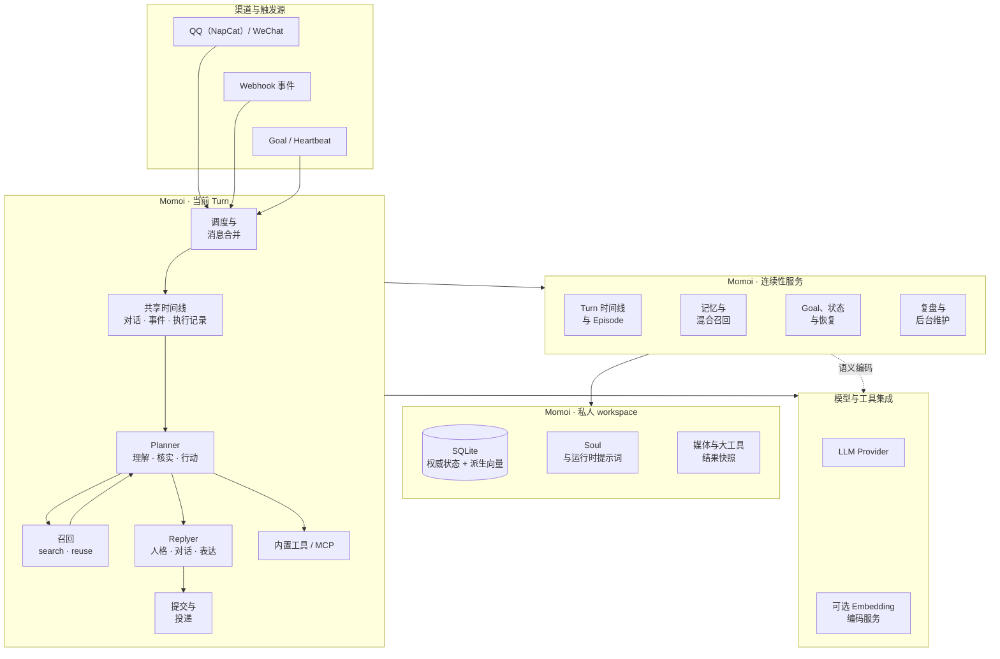
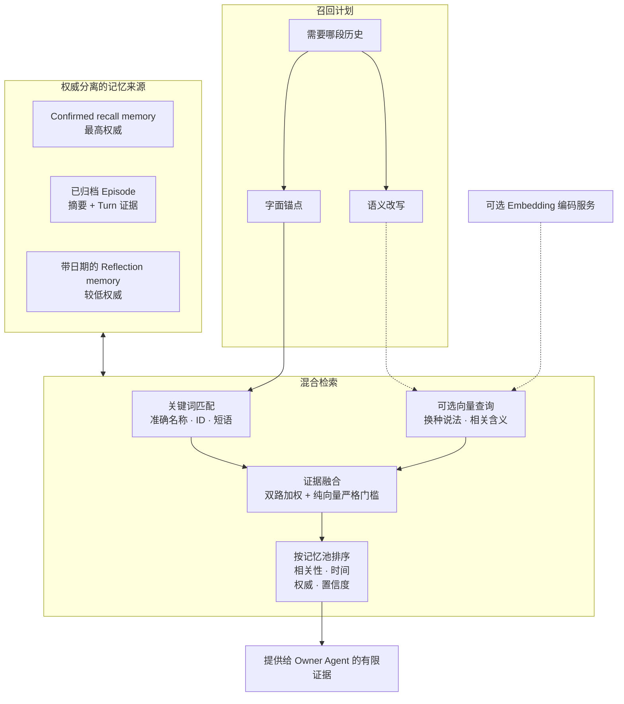

# Momoi

[EN](./README.md) | 中文

> 一个常驻在私聊中的、只属于一位主人的个人 Agent。

Momoi 把对话、记忆、工具、定时工作、外部事件、情绪和自主时间放进同一个持续运行的
系统。目前可通过 QQ（NapCat）、WeChat 交流，支持兼容 Anthropic Messages 或
OpenAI Chat Completions 的模型，并可通过 MCP 扩展能力。

Momoi 的重点不只是给 LLM 加一个角色。`SOUL.md` 定义 Momoi 是谁；运行时则保存围绕
这个身份的因果时间线，让她真正连续起来：主人说过什么、Momoi 做过什么、哪些结果已经
确认、哪些事情仍未完成，以及此刻应当想起哪部分过去。

> Momoi 面向可信的个人环境和唯一经过认证的主人，不是公开或多用户机器人。

## Momoi 想保留下来的东西

- **跨时间、跨入口的同一个身份。** 主人消息、Goal、Heartbeat 和 Webhook 都进入同一
  运行时，共享历史、关系、状态与投递规则。
- **由正在行动的 Momoi 选择上下文。** Planner 在当前上下文缺少历史依据时调用
  `recall`，搜索或复用已覆盖需求的 scope；不再强制每轮开场检索。
  Turn 的话题归属、摘要与话题关联由后台工作流分别处理。
- **有来源、有权威差异的记忆。** 近期对话、主人确认的事实、共同 Episode 和低置信度
  的复盘学习拥有不同生命周期，不会被当成同一种证据。
- **真正执行并明确投递。** Momoi 可以调用内置工具或 MCP、发送多条聊天气泡、汇报有
  意义的进度、核实外部结果，并持续工作到完成、被停止或确实受阻。
- **把时间纳入 Agent。** Goal 支持单次、间隔和每日多个时间点；Heartbeat 提供有边界
  的主动性，Reflection 与 Episode 维护则在后台安静运行。
- **可恢复的私人记录。** Turn、消息、工具调用、投递状态、记忆、Episode、Goal、
  情绪和思考记录都保存在本地 workspace。结果不确定的外部操作不会在重启后被悄悄重做。

## 架构

每个触发都会形成一个 Turn。活跃工作流共享同一份原生 transcript，并组装各自的作用域
证据，再运行对应 Agent，最后提交状态与投递。维护任务使用同一数据库，但不阻塞对响应
时间敏感的对话主链。


```mermaid
flowchart TB
  subgraph triggers["渠道与触发源"]
    direction LR
    chat["QQ（NapCat）/ WeChat"]
    webhook["Webhook 事件"]
    clock["Goal / Heartbeat"]
    chat ~~~ webhook ~~~ clock
  end

  subgraph active["Momoi · 当前 Turn"]
    direction LR
    intake["调度与<br/>消息合并"]
    transcript["共享时间线<br/>对话 · 事件 · 执行记录"]
    context["召回<br/>search · reuse"]
    agent["Planner<br/>理解 · 核实 · 行动"]
    replyer["Replyer<br/>人格 · 对话 · 表达"]
    delivery["提交与<br/>投递"]
    intake --> transcript --> agent
    agent --> context --> agent
    agent --> tools
    agent --> replyer --> delivery
  end

  subgraph continuity["Momoi · 连续性服务"]
    direction LR
    timeline["Turn 时间线<br/>与 Episode"]
    memory["记忆与<br/>混合召回"]
    time["Goal、状态<br/>与恢复"]
    upkeep["复盘与<br/>后台维护"]
    timeline ~~~ memory ~~~ time ~~~ upkeep
  end

  subgraph workspace["Momoi · 私人 workspace"]
    direction LR
    sqlite[("SQLite<br/>权威状态 + 派生向量")]
    prompts["Soul<br/>与运行时提示词"]
    files["媒体与大工具<br/>结果快照"]
    sqlite ~~~ prompts ~~~ files
  end

  subgraph external["模型与工具集成"]
    direction LR
    llm["LLM Provider"]
    tools["内置工具 / MCP"]
    embedding["可选 Embedding<br/>编码服务"]
    llm ~~~ tools ~~~ embedding
  end

  chat --> intake
  webhook --> intake
  clock --> intake
  active --> continuity
  continuity --> workspace
  active --> external
  continuity -. "语义编码" .-> external
```

Momoi 的三层共同构成持续运行的系统：当前 Turn 通过连续性服务按需取得过去，而不是把全部历史
直接塞进提示词。Embedding 服务只是编码器，并不是
第二个记忆数据库：权威文本和派生向量仍保存在 Momoi 的 SQLite 中，由进程内快照完成
向量检索。

### 一个 Owner Turn 怎样运行

1. 入站消息按时间线合并，保留消息与附件的对应关系。
2. Planner 接收 SOUL、运行规则、记忆与状态，以及历史消息、工具调用和结果组成的共享原生 transcript。
3. Planner 理解当前输入，按需 recall、发现工具并执行工作。普通 assistant text 记录当前判断，
   不直接投递；即使包含 `<bubble>` 标签也不会发送。
4. 需要发言时，Planner 调用 `reply`，传递回应意图、必要依据和 `mode=text` 或 `mode=voice`。
   Replyer 结合 SOUL、表达规则、当前渠道真实对话和目标消息生成发言，不带工具。
   发送层校验结果并持久化进入 outbox，再进行延迟和网络投递。
5. Turn 提交对话、记忆操作请求、任务变更、情绪、工具证据和续话等待。
   后台随后执行 Turn → Episode 归档、摘要以及可选的话题关联建设。

### 共享时间线与缓存复用

Owner、Goal、Heartbeat、Webhook、Plan 与当前状态维护复用 Planner transcript 和稳定的
system/tools 前缀，由 harness 限制各阶段调用权限。原生 assistant/tool 往来保留真实操作；
历史大结果裁剪为短片段、截断标记和读取引用，必要时可继续读取，recall 结果保留独立复用规则。

长期 `always` 记忆在一个 compact 周期内保持第一条 user 消息的基线稳定；新增、修改与删除
先追加到 transcript，明确覆盖旧前缀中的事实，下一次 compact 再更新基线。
领域记忆注入匹配工作流的最新输入，不进入全局记忆前缀，也不参加普通 recall。

Replyer 每个渠道使用持久化历史窗口：从最近 12 条开始，追加到 48 条后轮动回最近 12 条。
文字和语音共用相同 system 与历史前缀，包括表情目录，仅最新请求指定输出模式。
文字可选表情，语音只输出适合朗读的内容。

主人新消息可以打断工作或投递，并取消等待中的 reply-followup。自主工作流可以安静结束；
生成、提交发送和实际送达分别记录，不把工具接受当成已送达。

## 记忆架构

Momoi 不把所有内容塞进一个笼统的“记忆”桶。每一层回答不同问题，也拥有不同权威。

| 层级 | 事实来源 | 怎样进入上下文 | 生命周期 |
| --- | --- | --- | --- |
| 工作上下文 | 共享对话、事件和执行记录时间线，当前输入、情绪、活动、进行中的 Goal 和未完成工作 | 按时间线与当前相关性直接带入 | 随正在进行的对话移动，不会自动晋升为长期事实 |
| Confirmed memory | 来自已认证主人消息的事实、偏好、关系、习惯和可复用方法 | `always` 进入稳定前缀；`recall` 按话题检索；`scoped` 只进入对应领域 | 主人的新更正可以替换、收窄、过期或退役旧事实 |
| Episode | 有原始 Turn 与消息作为证据的具体共同经历 | 压缩历史保留话题摘要；recall 返回相关摘要、原文及工具执行证据 | 开放对话按真实主题归组，随后归档，并在话题继续发展时更新 |
| Reflection memory | 每日复盘产生的、带日期的体会、方法、工具经验和关系学习 | 独立召回，置信度更低，并明确提示可能过时 | 可以被修订或失去适用性，永远不能压过当前证据或 Confirmed memory |

Confirmed memory 的 activation 决定事实放在哪里，而不是它有多重要：

| Activation | 适合的内容 | 召回方式 |
| --- | --- | --- |
| `always` | 即使话题无关也应影响日常交流的长期关系偏好与约束 | 无需话题查询，持续带入 |
| `scoped` | 特定 Goal、Heartbeat 或 Webhook 的专属事实与规则 | 仅注入匹配工作流，不参加普通 recall |
| `recall` | 人物、设备操作手册、游戏规则、共同方法，以及只在相关话题回来时有用的事实 | 只有当前 Turn 需要相关历史时才检索 |

Episode 是一次具体经历，而不是一个永久分类。它用紧凑摘要维持宽泛连续性，同时保留
原始 Turn 和消息证据，以便找回准确措辞、更正、决定和未完成承诺。复盘学习始终是独立
的低权威层，不会被静默晋升为主人确认的事实。

### 记忆写入与整理

前台统一调用 `memory_operation(type, content, evidence, target_id?)`，其中 `type` 是
`add`、`replace` 或 `forget`。`evidence` 必须是当前已认证主人消息中的原话；`target_id`
仅可引用本轮已展示的记忆 ID，不知道时可以省略。例如：

```json
{"type":"replace","content":"主人现在更喜欢喝茶","evidence":"以后我更喜欢喝茶了"}
```

工具成功表示请求已接收；源 Turn 成功提交后，请求才进入持久化队列，尚未成为有效记忆。
前台不嵌套调用 LLM，也不用重复输出旧记忆或为了维护再检索一次。运行时自动附带本轮
注入、`recall` 和 `memory_search` 展示的记忆快照、相关对话和主人证据。没有记忆操作
的对话不会触发这项后台工作。

Dispatcher 使用同一 agent worker，按提交顺序串行执行 `memory_operation` Turn，
不等待每日 `/tidy`。它复用标准 Turn 的 LLM、工具循环和日志，采用独立系统提示词，
只开放 `memory_operation_search` 和 `memory_operation_finish`。后台基于当前记录判断
新增、替换/合并、删除、不变或证据不足；必要时查询其他 activation 的有效记忆。
分类、activation 和适用领域由后台决定；临时状态另由状态维护工作流处理。

`memory_operation_finish` 一次提交整批决定并结束 Turn；验证失败返回 tool error，模型
可修正，数据库不会部分生效。`defer` 记录证据不足并结束本次审查，不自动重试相同证据。
运行失败则保留队列，5 分钟后重试，后续记忆请求不能越过前项。每次尝试有独立 Turn ID。
普通新消息等待正在执行的记忆 Turn 完成；`/stop`、停机取消或进程重启后可以恢复任务。
提交前仍检查记忆快照，避免覆盖 Dashboard 等入口的并发编辑。

`always` 基线在 compact 周期内稳定；已接受的记忆变动先进入 transcript，再于 compact 时
重建基线。recall 记忆和领域记忆不走这一机制。`memory_search` 可以通过工具发现加载，
每日 `/tidy` 继续负责全局维护。

### 召回与可选语义检索

需要历史依据时，Planner 调用 `recall`，把最小完整历史 scope 写成语义查询，
并给出姓名、标题、ID 或准确短语等字面锚点；只有旧查询明确覆盖当前需求时才能复用。
检索层随后分别评估两类证据。


```mermaid
flowchart TB
  subgraph request["召回计划"]
    direction LR
    need["需要哪段历史"]
    rewrite["语义改写"]
    anchors["字面锚点"]
    need --> rewrite
    need --> anchors
  end

  subgraph retrieval["混合检索"]
    direction LR
    keyword["关键词匹配<br/>准确名称 · ID · 短语"]
    vector["可选向量查询<br/>换种说法 · 相关含义"]
    fusion["证据融合<br/>双路加权 + 纯向量严格门槛"]
    ranking["按记忆池排序<br/>相关性 · 时间<br/>权威 · 置信度"]
    keyword --> fusion
    vector --> fusion --> ranking
  end

  subgraph pools["权威分离的记忆来源"]
    direction LR
    confirmed["Confirmed recall memory<br/>最高权威"]
    episodes["已归档 Episode<br/>摘要 + Turn 证据"]
    reflection["带日期的 Reflection memory<br/>较低权威"]
  end

  selected["提供给 Owner Agent 的有限证据"]
  encoder["可选 Embedding 编码服务"]

  anchors --> keyword
  rewrite -.-> vector
  pools <--> retrieval
  encoder -.-> vector
  ranking --> selected
```

两条检索通道负责不同的事情：

- 关键词证据保护实体、标题、ID、日期、工具名和参数等精确信息。
- 向量证据寻找措辞不同的同义表达与相关经历。
- 同一个候选被关键词和向量独立命中时会得到加权；只有向量命中的候选必须跨过更严格、
  按语料池校准的门槛。
- Confirmed memory、Reflection memory 和 Episode 分开排序、分开限额；语义相似度不能
  抹平权威差异。
- 如果首轮上下文仍不够，行动中的 Agent 可以继续调用 `memory_search`、
  `episode_search` 和 `episode_read`。

语义检索是可选功能，默认关闭。未启用、Embedding 服务不可用或索引仍在构建时，Momoi
继续使用关键词召回。向量始终是可重建的派生数据，不是事实来源。

只有需要检索的长期材料会建立向量：

- `activation: "recall"` 的有效 Confirmed memory；
- Reflection memory；
- 已完成归档的 Episode 摘要和 Episode 所属 Turn 分块。

Always memory 与临时状态、正在进行的近期 Turn、Goal、情绪与活动、思考记录、artifact 和原始
工具结果不会进入语义索引。源数据变化会先在事务中登记，再由后台以小批次物化和编码；
新增或变化的材料会增量变得可检索，不阻塞主人对话。

## 当前能力

| 领域 | 当前行为 |
| --- | --- |
| 私聊渠道 | 一个主人可以同时使用 QQ（NapCat）与 WeChat；回复返回发起对话的渠道，主动消息发往配置的 primary |
| 对话 | 消息合并、引用与转发、媒体处理、自然的多气泡投递、可选图片反应，以及合法沉默 |
| 上下文 | 原生共享对话、按需 recall、后台话题归档与关联、运行时二次搜索和有上限的模型输入 |
| 工具 | 内置文件/HTTP 工具、动态发现的 MCP Server，以及按 Server 配置的工具白名单 |
| 长任务 | 工具循环、进度消息、中断、执行次数限制、大结果快照和不确定外部操作恢复 |
| 时间与主动性 | 持久 Goal、每日多个触发时间、Heartbeat、静默时段和新主人消息打断 |
| 记忆维护 | 每日 Reflection、Confirmed memory 整理、Episode annealing、增量语义索引和关键词降级 |
| 可观测性 | 本地 Dashboard 可查看对话、每个 Turn 的召回决策与证据、复盘、记忆、Goal、图片反应、token 用量和思考记录 |
| 外部事件 | 带认证的 Webhook、YAML 工作流和预定义命令执行器 |

## 快速开始

### Windows 桌面版

从 [GitHub Releases](https://github.com/RicterZ/Momoi/releases) 下载安装包。
发布工作流完成构建和测试后自动附加安装包。桌面版包含本地后端、默认人格提示词和六张表情；
首次启动后通过 Dashboard 引导配置模型及消息渠道。

### Docker Compose

`docker-compose.yml` 默认只启动 Momoi，不需要提前填写模型密钥、渠道或准备配置文件。
安装 Docker 与 Compose v2 后启动：

```bash
docker compose -f docker-compose.yml up -d
docker compose -f docker-compose.yml logs momoi
```

打开 `http://127.0.0.1:8788`，使用启动日志中的 Dashboard token 登录。
在设置页连接模型、编辑提示词、启用消息渠道，并完成微信扫码登录。

需要时再启动可选服务：

```bash
docker compose -f docker-compose.yml --profile embedding up -d
```

QQ 用户单独部署 NapCat，在 Momoi 设置页填写可访问的 OneBot WebSocket 地址和主人 QQ。
私有 Embedding 地址填写
`http://embedding:8002/v1/embeddings`。启动容器后仍需在设置页启用对应功能；微信不依赖该服务。

工作区默认持久化在 `~/.momoi`，由 `momoi run` 初始化，已有文件不覆盖。
默认只发布 dashboard 的 8788 端口；使用 Webhook 时另行添加端口映射并配置功能。
部署选项见[配置参考](./docs/CONFIG.zh-CN.md)。

### 从源码运行

需要：

- Python 3.12 或更高版本
- [uv](https://docs.astral.sh/uv/)
- 兼容 Anthropic Messages 或 OpenAI Chat Completions 的 LLM 端点

在仓库根目录执行：

```bash
uv tool install .
momoi run
```

打开 `http://127.0.0.1:8788`，使用启动输出中的口令登录，在设置页完成配置。

使用其他 workspace 时，`--workspace` 必须放在子命令前：

```bash
momoi --workspace /path/to/workspace run
```

需要从当前源码构建容器时，使用源码版 Compose：

```bash
docker compose -f compose.yaml up -d --build
```

它复用发布栈的默认设置；需要本地编码器时，在 `up` 前添加 `--profile embedding`。
请明确指定 `-f`：不指定时，Docker Compose 会优先使用 `compose.yaml`，而非 `docker-compose.yml`。

## 语义召回

在设置页启用语义记忆，选择兼容的 Embedding 接口、模型和向量维度。
Docker Compose 通过 `--profile embedding` 按需启动私有 Embedding 服务。
直接在宿主机运行 Momoi 时，需使用宿主机可达的接口。

Momoi 会在后台构建索引，覆盖完整后自动激活，期间关键词召回仍然可用。
索引管理与高级选项见[配置参考](./docs/CONFIG.zh-CN.md#embedding-召回)。

## 个性化与连接

### 身份与主动性

- 编辑 `~/.momoi/prompts/SOUL.md`，定义身份、关系、价值观、兴趣和自然说话方式。
- 编辑 `~/.momoi/prompts/PLANNER.md`，指导理解、检索、行动及回应意图；`{{SOUL}}` 引入当前人格。
- 编辑 `~/.momoi/prompts/REPLYER.md`，指导实际发言，文字气泡与语音共用这份表达规则。
- 编辑 `~/.momoi/prompts/HEARTBEAT.md`，决定 Momoi 在自主时间可以探索、创作、继续、
  分享什么，以及什么时候保持安静。
- 使用 `momoi emotion add` 添加可选图片反应；描述会告诉 Replyer 每张图适合什么情境，具体选择与排列由 Replyer 完成。

### 外部 API 服务

LLM、TTS、embedding 和账户余额通过能力接口、注册式适配器与统一的服务组装层接入。
端点、凭据和服务参数放在 `providers.yaml`，`config.json` 只引用该文件。
同一服务可绑定多项能力；余额查询与本地 token 统计独立。
通过 Python 插件注册新适配器，无需修改业务代码。
详见 [Provider 配置与扩展](./docs/PROVIDERS.zh-CN.md)。

### 工具

在 workspace 的 `mcp.json` 配置 stdio 或远程 MCP Server，为服务填写准确的 `description`。
稳定 system 索引只包含服务/能力组名称和描述，不展开所有工具参数。

1. `tool_search` 返回候选工具名称与描述。
2. `tool_enable({"tools": ["exact_tool_name", "another_tool"]})` 批量加载完整 schema。
3. 调用已加载工具，仍遵守当前阶段权限。

低频内置工具采用同一流程：`thinking_search`、`thinking_read`、`episode_relations`、
`episode_search`、`memory_search`，以及 `write_file`、`apply_patch`、`makedirs`、
`move_file`、`delete_file`。可用文件工具受 Bash 开关影响。
加载集合跨共享 Turn 和进程重启保留，手动或自动 compact 时回收。

面向用户的发言统一通过 `reply`，模型不再看到 `send_bubbles` / `send_voice`。
工具描述明确列出支持语音的渠道；文字 Replyer 从目录选择独立的 `emotion://slug` 气泡。
图片、文件等通过 `reply.attachments` 原样投递；语音调用 TTS，不可用或失败时返回错误，
供 Planner 决定改用文字。

### Dashboard

打开 `http://127.0.0.1:8788`。Dashboard 可以查看 Planner/Replyer 决策流、逐请求 token、缓存命中、延迟和费用估算，以及对话、每个 Turn 的召回 scope 与选中
证据、复盘、记忆、Goal、图片反应、用量和思考记录，也可以编辑记忆、Goal、图片反应与提示词文件。
首次使用启动输出中的口令登录，然后在设置页配置 Provider、启用消息渠道并完成微信扫码登录。
保存配置会自动重建业务实例，dashboard 保持可用。纯后台运行使用 `momoi run --no-dashboard`。
已有工作区需设置 `dashboard.token` 或 `MOMOI_DASHBOARD_TOKEN`。
请只在本机或可信网络中开放。

### Webhook

启用 `webhooks` 并设置 Bearer token 后，可以使用自带的 `event-message` 工作流，把
外部事件转成拥有当前上下文的 Momoi Turn：

```bash
curl -X POST http://127.0.0.1:8787/webhooks/event-message \
  -H "Authorization: Bearer $MOMOI_WEBHOOK_TOKEN" \
  -H "Content-Type: application/json" \
  --data '{"event_prompt":"The watched page changed. Explain what is new if it matters."}'
```

Webhook Turn 与其他 Momoi 工作流共享同一份原生对话和记忆；如果事件没有增加有用信息，
也可以安静结束。

### Goal 如何收尾

Goal 自主执行遵循「工作 → 可选 `reply` → `goal_review` → `end_turn({})`」。
`goal_review` 记录结果及任务变更，Turn 成功结束后提交；`active`、`waiting`、`blocked`
保留 Goal，`done`、`cancelled` 关闭 Goal。运行时提供当前 Goal ID。例如：

```json
{"status": "done", "result": "文件已下载并校验"}
```

继续执行需要 `next_action` 和未来的 `next_review_at`，周期 Goal 可沿用 schedule；
等待需要 `waiting_for` 和未来检查时间，阻塞需要 `blocked_reason`。
`reply` 立即进入发送流程，不等待 Goal 收尾；发送与结束可以同批调用，结束工具最后执行，
发送失败不能报告成功。普通对话通过 `goal_update`、`goal_finish`、`goal_cancel` 管理任务。

普通 assistant text 不会发送。对话阶段 `end_turn` 接收 `mood`、`reply_wait`；
Goal 在 `goal_review` 后以 `{}` 结束。Heartbeat 先通过 `heartbeat_activity` 记录活动、结果与
下次检查计划；发现具体内容后，在发送前成功 recall 该内容，核实是否已经分享过。

## 主人控制

| 聊天命令 | 用途 |
| --- | --- |
| `/stop` | 取消当前任务 |
| `/compact` | 压缩共享 transcript 窗口并回收已加载工具，保留数据库原始历史 |
| `/heartbeat` | 立即触发一次 Heartbeat |
| `/reflect` | 复盘当前本地自然日 |
| `/tidy` | 运行 Confirmed memory 维护 |
| `/resolve <id> <result>` | 记录一次不确定外部操作经过核实的真实结果 |
| `/resume <id> <current state>` | 从经过核实的当前状态继续不确定工作 |

Momoi 还提供 Goal、图片反应、渠道和语义索引状态的 CLI 管理命令。使用
`momoi --help` 或子命令的 `--help` 查看当前命令面。

## 文档

- [配置参考](./docs/CONFIG.zh-CN.md)
- [Webhook 工作流参考](./docs/WORKFLOW.zh-CN.md)

Momoi 使用 [MIT License](./LICENSE)。
