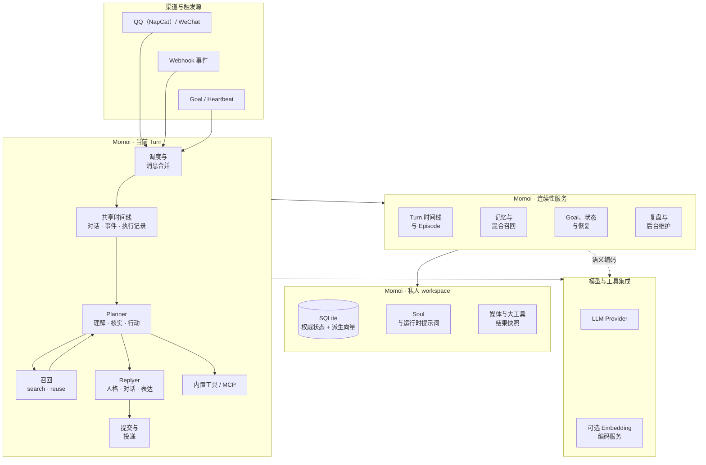

# Momoi

[EN](./README.md) | 中文

> 一个常驻在私聊中的、只属于一位主人的个人 Agent。

Momoi 把对话、记忆、工具、定时工作、外部事件、情绪和自主时间放进同一个持续运行的
系统。目前可通过 QQ（NapCat）、WeChat 交流，支持兼容 Anthropic Messages 或
OpenAI Chat Completions 的模型，并可通过 MCP 扩展能力。

Momoi 的重点不只是给 LLM 加一个角色。`SOUL.md` 定义 Momoi 是谁；运行时则保存围绕
这个身份的因果时间线，让她真正连续起来：主人说过什么、Momoi 做过什么、哪些结果已经
确认、哪些事情仍未完成，以及此刻应当想起哪部分过去。

> Momoi 面向可信的个人环境和唯一经过认证的主人，不是公开或多用户机器人。

## Momoi 想保留下来的东西

- **跨时间、跨入口的同一个身份。** 主人消息、Goal、Heartbeat 和 Webhook 都进入同一
  运行时，共享历史、关系、状态与投递规则。
- **按需选择上下文。** Momoi 在需要时检索相关历史，并在后台整理话题摘要与关联。
- **有来源、有权威差异的记忆。** 近期对话、主人确认的事实、共同 Episode 和低置信度
  的复盘学习拥有不同生命周期，不会被当成同一种证据。
- **真正执行并明确投递。** Momoi 可以调用内置工具或 MCP、发送多条聊天气泡、汇报有
  意义的进度、核实外部结果，并持续工作到完成、被停止或确实受阻。
- **把时间纳入 Agent。** Goal 支持单次、间隔和每日多个时间点；Heartbeat 提供有边界
  的主动性，Reflection 与 Episode 维护则在后台安静运行。
- **可恢复的私人记录。** Turn、消息、工具调用、投递状态、记忆、Episode、Goal、
  情绪和思考记录都保存在本地 workspace。结果不确定的外部操作不会在重启后被悄悄重做。

## 架构

每个触发都会形成一个 Turn。活跃工作流共享同一份原生 transcript，并组装各自的作用域
证据，再运行对应 Agent，最后提交状态与投递。维护任务使用同一数据库，但不阻塞对响应
时间敏感的对话主链。


```mermaid
flowchart TB
  subgraph triggers["渠道与触发源"]
    direction LR
    chat["QQ（NapCat）/ WeChat"]
    webhook["Webhook 事件"]
    clock["Goal / Heartbeat"]
    chat ~~~ webhook ~~~ clock
  end

  subgraph active["Momoi · 当前 Turn"]
    direction LR
    intake["调度与<br/>消息合并"]
    transcript["共享时间线<br/>对话 · 事件 · 执行记录"]
    context["召回<br/>search · reuse"]
    agent["Planner<br/>理解 · 核实 · 行动"]
    replyer["Replyer<br/>人格 · 对话 · 表达"]
    delivery["提交与<br/>投递"]
    intake --> transcript --> agent
    agent --> context --> agent
    agent --> tools
    agent --> replyer --> delivery
  end

  subgraph continuity["Momoi · 连续性服务"]
    direction LR
    timeline["Turn 时间线<br/>与 Episode"]
    memory["记忆与<br/>混合召回"]
    time["Goal、状态<br/>与恢复"]
    upkeep["复盘与<br/>后台维护"]
    timeline ~~~ memory ~~~ time ~~~ upkeep
  end

  subgraph workspace["Momoi · 私人 workspace"]
    direction LR
    sqlite[("SQLite<br/>权威状态 + 派生向量")]
    prompts["Soul<br/>与运行时提示词"]
    files["媒体与大工具<br/>结果快照"]
    sqlite ~~~ prompts ~~~ files
  end

  subgraph external["模型与工具集成"]
    direction LR
    llm["LLM Provider"]
    tools["内置工具 / MCP"]
    embedding["可选 Embedding<br/>编码服务"]
    llm ~~~ tools ~~~ embedding
  end

  chat --> intake
  webhook --> intake
  clock --> intake
  active --> continuity
  continuity --> workspace
  active --> external
  continuity -. "语义编码" .-> external
```

对话、连续性服务与私有工作区共同维持长期上下文。历史、记忆与任务状态保存在本地 SQLite 中。

### 对话与行动

Planner 理解当前对话、检索相关记忆，并调用工具完成工作。Replyer 根据回应意图、
必要依据、SOUL 与近期对话，生成自然的发言。

聊天、定时任务、自主活动与外部事件共享连续的历史。新消息可以打断正在进行的工作，
自主活动也可以安静结束。

## 记忆

Momoi 区分近期上下文、主人确认的事实、共同话题与每日复盘。它通过关键词和可选的
语义检索召回相关历史，并保留原始对话证据。

记忆变动在后台依据主人提供的证据进行审查。话题摘要与关联帮助维持长期连续性，
领域记忆为定时任务和外部事件提供专属规则。复盘作为辅助参考，不覆盖已确认的事实。

## 当前能力

| 领域 | 当前行为 |
| --- | --- |
| 私聊渠道 | 一个主人可以同时使用 QQ（NapCat）与 WeChat；回复返回发起对话的渠道，主动消息发往配置的 primary |
| 对话 | 消息合并、引用与转发、媒体处理、自然的多气泡投递、可选图片反应，以及合法沉默 |
| 语音电话 | 通过 NapCat 进行实时 QQ 语音通话，支持语音识别、语音合成回复和打断，适配 Windows 与 Linux |
| 语音识别 | 可选腾讯云 ASR 或本地 Sherpa CPU 流式识别；Linux 镜像内置模型并在进程内识别，Windows 可按需安装本地模型组件 |
| 上下文 | 原生共享对话、按需 recall、后台话题归档与关联、运行时二次搜索和有上限的模型输入 |
| 工具 | 内置文件/HTTP 工具、动态发现的 MCP Server，以及按 Server 配置的工具白名单 |
| 长任务 | 工具循环、进度消息、中断、执行次数限制、大结果快照和不确定外部操作恢复 |
| 时间与主动性 | 持久 Goal、每日多个触发时间、Heartbeat、静默时段和新主人消息打断 |
| 记忆维护 | 每日 Reflection、Confirmed memory 整理、Episode annealing、增量语义索引和关键词降级 |
| 可观测性 | 本地 Dashboard 可查看对话、每个 Turn 的召回决策与证据、复盘、记忆、Goal、图片反应、token 用量和思考记录 |
| 外部事件 | 带认证的 Webhook、YAML 工作流和预定义命令执行器 |

## 快速开始

### Windows 桌面版

从 [GitHub Releases](https://github.com/RicterZ/Momoi/releases) 下载安装包。
发布工作流完成构建和测试后自动附加安装包。桌面版包含本地后端、默认人格提示词和六张表情；
首次启动后通过 Dashboard 引导配置模型及消息渠道。

### Docker Compose

`docker-compose.yml` 默认只启动 Momoi，不需要提前填写模型密钥、渠道或准备配置文件。
安装 Docker 与 Compose v2 后启动：

```bash
docker compose -f docker-compose.yml up -d
docker compose -f docker-compose.yml logs momoi
```

打开 `http://127.0.0.1:8788`，使用启动日志中的 Dashboard token 登录。
在设置页连接模型、编辑提示词、启用消息渠道，并完成微信扫码登录。

镜像已包含 BGE 模型，语义记忆默认在 Momoi 进程内编码，无需额外容器或端口。
QQ 用户单独部署 NapCat，在 Momoi 设置页填写可访问的 OneBot WebSocket 地址和主人 QQ。

工作区默认持久化在 `~/.momoi`，由 `momoi` 初始化，已有文件不覆盖。
默认只发布 dashboard 的 8788 端口；使用 Webhook 时另行添加端口映射并配置功能。
部署选项见[配置参考](./docs/CONFIG.zh-CN.md)。

### 从源码运行

需要：

- Python 3.12 或更高版本
- [uv](https://docs.astral.sh/uv/)
- 兼容 Anthropic Messages 或 OpenAI Chat Completions 的 LLM 端点

在仓库根目录执行：

```bash
uv tool install .
momoi
```

打开 `http://127.0.0.1:8788`，使用启动输出中的口令登录，在设置页完成配置。

使用其他 workspace 时，`--workspace` 必须放在子命令前：

```bash
momoi --workspace /path/to/workspace
```

需要从当前源码构建容器时，使用源码版 Compose：

```bash
uv run --locked python packaging/prepare_embedding.py
uv run --locked python packaging/prepare_asr.py
docker compose -f compose.yaml up -d --build
```

它复用发布栈的默认设置，BGE 模型随 Momoi 镜像一起构建。
请明确指定 `-f`：不指定时，Docker Compose 会优先使用 `compose.yaml`，而非 `docker-compose.yml`。

## 语义召回

默认使用进程内 BGE（512 维），Windows 客户端和 Linux 镜像共用同一编码实现。
客户端自动维护编码配置；Web 设置页仍可关闭语义记忆或切换远程 OpenAI 兼容接口。
旧的默认 `embedding:8002` 配置自动迁移为本地调用，自定义远程地址不变。
升级既有 Docker 部署时，可在确认新版本正常运行后删除旧的 Embedding 容器及其 `depends_on`。

从源码直接运行时，先准备一次离线模型：

```bash
uv run --locked python packaging/prepare_embedding.py
```

也可通过 `MOMOI_EMBEDDING_MODEL_PATH` 指定模型目录，运行时不会下载模型。

Momoi 会在后台构建索引，覆盖完整后自动激活，期间关键词召回仍然可用。
索引管理与高级选项见[配置参考](./docs/CONFIG.zh-CN.md#embedding-召回)。

## 个性化与连接

### 身份与主动性

- 编辑 `~/.momoi/prompts/SOUL.md`，定义身份、关系、价值观、兴趣和自然说话方式。
- 编辑 `~/.momoi/prompts/PLANNER.md`，指导理解、检索、行动及回应意图；`{{SOUL}}` 引入当前人格。
- 编辑 `~/.momoi/prompts/REPLYER.md`，指导实际发言，文字气泡与语音共用这份表达规则。
- 编辑 `~/.momoi/prompts/HEARTBEAT.md`，决定 Momoi 在自主时间可以探索、创作、继续、
  分享什么，以及什么时候保持安静。
- 使用 Dashboard 表情管理 添加可选图片反应；描述会告诉 Replyer 每张图适合什么情境，具体选择与排列由 Replyer 完成。

### 外部 API 服务

LLM、TTS、embedding 和账户余额通过能力接口、注册式适配器与统一的服务组装层接入。
端点、凭据和服务参数放在 `providers.yaml`，`config.json` 只引用该文件。
同一服务可绑定多项能力；余额查询与本地 token 统计独立。
通过 Python 插件注册新适配器，无需修改业务代码。
详见 [Provider 配置与扩展](./docs/PROVIDERS.zh-CN.md)。

### 工具

Momoi 提供内置工具，也支持在 workspace 的 `mcp.json` 中配置 stdio 或远程 MCP Server。
工具按需发现和加载；为每个服务填写清晰的描述，方便 Momoi 找到适合的能力。

回复支持文字、语音、图片、文件和可选表情。语音需要配置 TTS 服务，并使用支持语音的渠道。

### Dashboard

打开 `http://127.0.0.1:8788`。Dashboard 可以查看 Planner/Replyer 决策流、逐请求 token、缓存命中、延迟和费用估算，以及对话、召回证据、复盘、记忆、Goal、图片反应、用量和思考记录，也可以编辑记忆、Goal、图片反应与提示词文件。
首次使用启动输出中的口令登录，然后在设置页配置 Provider、启用消息渠道并完成微信扫码登录。
保存配置会自动重建业务实例，dashboard 保持可用。纯后台运行使用 `momoi --no-dashboard`。
已有工作区需设置 `dashboard.token` 或 `MOMOI_DASHBOARD_TOKEN`。
请只在本机或可信网络中开放。

### Webhook

启用 `webhooks` 并设置 Bearer token 后，可以使用自带的 `event-message` 工作流，把
外部事件转成拥有当前上下文的 Momoi Turn：

```bash
curl -X POST http://127.0.0.1:8787/webhooks/event-message \
  -H "Authorization: Bearer $MOMOI_WEBHOOK_TOKEN" \
  -H "Content-Type: application/json" \
  --data '{"event_prompt":"The watched page changed. Explain what is new if it matters."}'
```

Webhook Turn 与其他 Momoi 工作流共享同一份原生对话和记忆；如果事件没有增加有用信息，
也可以安静结束。

## 主人控制

| 聊天命令 | 用途 |
| --- | --- |
| `/stop` | 取消当前任务 |
| `/compact` | 压缩当前对话上下文，保留原始历史 |
| `/heartbeat` | 立即触发一次 Heartbeat |
| `/reflect` | 复盘当前本地自然日 |
| `/tidy` | 运行 Confirmed memory 维护 |
| `/resolve <id> <result>` | 记录一次不确定外部操作经过核实的真实结果 |
| `/resume <id> <current state>` | 从经过核实的当前状态继续不确定工作 |

Momoi 还提供 Goal、图片反应、渠道和语义索引状态的 CLI 管理命令。使用
`momoi --help` 或子命令的 `--help` 查看当前命令面。

## 文档

- [配置参考](./docs/CONFIG.zh-CN.md)
- [Webhook 工作流参考](./docs/WORKFLOW.zh-CN.md)

Momoi 使用 [MIT License](./LICENSE)。
