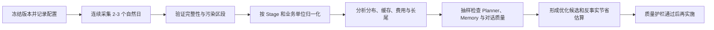

# Momoi 稳态 Token 用量分析计划

本文定义 Momoi 在开发基本稳定后连续采集 2–3 个完整自然日的数据，并据此评估请求放大、输入与输出 Token、缓存效率、费用结构及各核心设计的质量成本。

> 2026-08-16 是 Episode Anneal 存量迁移日；2026-08-17 多次修改提示词、Schema 和部署，造成上下文增长及缓存前缀失效。两天都不进入稳态基线。2026-08-18 17:07 CST 部署 Planner 6+6 缓存实验；当天部署前数据不进入新方案基线，部署后作为冷启动和滚动周期诊断。旧 LLM dump 已清理，`llm_usage` 记录仍保留。

## 目标和原则

最终分析需要回答：

1. 稳态每天会产生多少请求、输入、输出、缓存读取和费用；
2. Owner、Context Planner、Heartbeat、Episode Anneal 等设计分别占用多少资源；
3. 消耗来自合理的长上下文和深度推理，还是重复上下文、缓存失效、重试或无效后台工作；
4. 哪些优化不改变能力，哪些可能损害自然度、召回和记忆质量；
5. 优化后预计节省多少 Token、费用和延迟，质量风险是什么。

分析遵循以下原则：

- 不以单个开发日或迁移日代表日常使用；
- 不把 raw Token 等同于费用：缓存输入、未缓存输入和输出必须分开；
- 不因 Planner 输出较多就预设应降低 reasoning；
- 先优化缓存、重复表示、重复推理和调度，再讨论模型或 reasoning 强度；
- 同时报告总量、分布和业务归一化指标，避免平均值掩盖长尾；
- 每个成本优化建议必须有质量护栏和可回滚条件。

## 稳定采集窗口

首选窗口为：

- 部署诊断：2026-08-18 17:07 CST 起，只用于冷启动、Append 和换块行为；
- 第一天：2026-08-19 00:00–23:59 CST；
- 第二天：2026-08-20 00:00–23:59 CST；
- 第三天：2026-08-21 00:00–23:59 CST，可用于确认前两天不是偶然波动。

至少采集两个完整自然日；满足以下任一条件时延长到三天以上：

- 有部署、模型切换、提示词或 Tool Schema 修改；
- 发生批量迁移、回灌、重放或手动压力测试；
- Owner 活跃度与前一天差异很大；
- 某核心 Stage 样本不足；
- 关键归一化指标日间波动超过 20% 且无法由活动量解释。

### 稳定窗口约束

采集期应尽量保持：

- 相同 Git commit、镜像和配置；
- 相同模型、reasoning 设置、上下文预算及工具集合；
- 相同 Heartbeat、Reply Wait、Goal 和 Anneal 调度策略；
- 无存量迁移和人工批量任务；
- 不删除采集窗口内的 dump、thinking 或用量记录；
- 若必须部署，记录精确时间和变更项，将部署前后拆成不同区段，不混合计算缓存率。

## Planner 6+6 缓存实验

### 部署边界

- 代码：`00a6c5c`、`96a0162`、`994d3f6`；
- 容器创建时间：2026-08-18 17:07:47.973953 CST；
- 容器 ID：`de2891c6413e511426b9d29de5fa68ed4f4f4640e3d2fedffea9c2cbbcfaf230`；
- 旧 dump 清理：781 个，约 110.8 MiB，清理后为 0；
- 新数据起点：首个新 Planner dump 为 2026-08-18 17:08:57 CST。

今天的 `/api/usage?days=1` 同时包含部署前后调用，不作为实验聚合结果。实验分析必须以容器创建时间为下界，从调用级 `llm_usage` 和新 dump 精确切片。

### 方案

- Planner Base：6 个已完成可见 Turn；
- Append：最多 6 个新 Turn；
- 实际请求中的日志长度：6 → 7 → 8 → 9 → 10 → 11 → 6；
- Active：最新 6 个 Turn，通过 `active_recent_turn_ids` 标记；
- Planner Recent Token 上限：线上自动取 88K；
- 超过 Token 上限时提前丢弃旧 Base，当前 Append 块保持稳定增长；
- Goals 和 Reminders 保持在 Recent 日志前，状态不变时与 Append 前缀一起缓存；
- Episode candidates 和当前 Owner 消息保持在动态尾部；
- Planner 专用投影完整保留工具名称、参数、结果、成功/错误、时间和可见性。

较旧但仍在 Base 中、已经退出 Active 6 的 Turn 只用于明确引用、未完成工作、工具结果和纠错；不得仅因其存在而继续旧话题。

### 首轮验证

2026-08-18 17:08:57 CST 的首轮 Planner 请求：

- Prompt Token：26,177；
- Cache Read：0；
- Output Token：1,995；
- Recent Turns：9；
- Active Turns：6；
- Payload 顺序与 `active_recent_turn_ids` 提示词均已生效。

这是新 System Prompt、Tool Schema 和容器后的冷启动调用，必须单列，不能计入暖缓存平均值。

### 初始周期观测

| 时间（CST） | Recent / Active | Prompt | Cache Read | 缓存率 | 与前次间隔 | 说明 |
|---|---:|---:|---:|---:|---:|---|
| 17:08:57 | 9 / 6 | 26,177 | 0 | 0% | 冷启动 | 部署后首次请求 |
| 17:09:40 | 10 / 6 | 26,815 | 16,384 | 61.1% | 43秒 | Append命中 |
| 17:10:33 | 11 / 6 | 27,201 | 22,144 | 81.4% | 53秒 | Append继续增长 |
| 17:12:51 | 6 / 6 | 12,550 | 0 | 0% | 138秒 | 换块；Provider偶发全量Miss |
| 17:37:02 | 8 / 6 | 16,644 | 3,968 | 23.8% | 24分11秒 | 固定前缀命中 |
| 18:00:38 | 10 / 6 | 19,536 | 8,576 | 43.9% | 23分36秒 | 新Base的Append前缀命中 |
| 18:17:19 | 6 / 6 | 16,283 | 3,968 | 24.4% | 16分41秒 | 再次换块，固定前缀正常命中 |

上述请求的 System Prompt、Tool Schema、Goals、Reminders 和 Provider fingerprint 均一致。17:12:51 的0%不是固定前缀变化造成；后续两次长间隔调用仍分别命中3,968和8,576 Token，可将其视为Provider侧偶发Cache Miss。正常换块会丢失旧Recent块缓存，但应继续命中约3,968 Token固定前缀。

可见自主Turn也参与Recent分块，因此实际请求可能从8直接增长到10，而不要求每个计数都由Owner消息触发。现有数据已验证Append增长、Active 6和换块行为，但不能替代两个完整自然日的Token加权基线。

### 量化假设

在 Goals 没有变化、Provider 缓存未过期且形成完整循环时，预期：

- Context Planner Token 加权缓存率约 55%–65%；
- 未缓存输入较逐轮滑动下降约 35%–45%；
- Planner 输入费用下降约 30%–40%；
- Planner 总费用下降约 18%–25%；
- Raw 输入会上升，但主要增加为低价 Cache Read；
- reasoning、Episode候选和工具语义信息保持不变。

### 每轮检测项

对部署后的每个 Context Planner dump记录：

- Recent Turn 数和 Active Turn 数；
- Base/Append 位置及是否发生换块；
- Prompt、Cache Read、Uncached和Output Token；
- Token 加权缓存率；
- Goals/Reminders内容哈希是否变化；
- System Prompt和Tool Schema哈希；
- Planner校验失败、重试或降级；
- 当前消息是否错误续接已退出Active范围的旧话题；
- 对之前工具调用的名称、参数和结果是否仍可正确引用；
- Episode绑定、Recall Query和省略指代是否正确。

冷启动、Goals变化、Prompt/Schema变化、Provider缓存失效和6轮换块必须单独标记，不能与普通Append热调用混合解释。

### 验收条件

至少观察：

- 一个完整6+6循环；
- 一次正常换块；
- 两个完整自然日；
- 工具密集、普通聊天、旧话题干扰和明确跨轮引用样本。

量化验收：

- 暖调用缓存率符合循环位置的增长趋势；
- 完整循环Token加权缓存率不低于50%；
- Fresh Input和估算输入费用较旧滑动方案下降；
- Planner重试率、降级率不高于旧方案；
- P90输入不逼近160K预算，且88K Recent上限保留约30%输入空间。

质量验收：

- Active 6之外的背景Turn不导致无依据续旧话题；
- 明确引用较旧Base Turn时仍能正确解析；
- 工具名称、参数、结果和状态不丢失；
- Goal、Reminder、Episode和Memory召回无可见回归；
- Owner更正、“没接上”或重复解释的比例不增加。

## 需要准备的数据

### 每日 API 快照

每天接近 23:59 CST 保存一次认证后的：

```text
GET /api/usage?days=1
```

快照至少保留：

- 日期、时区、采集时间；
- Git commit、镜像 ID、启动时间；
- 模型及 Provider；
- `requests`；
- `input_tokens`；
- `uncached_tokens`；
- `cache_read_tokens`；
- `cache_write_tokens`；
- `output_tokens`；
- `cache_hit_rate`；
- `estimated_cost`；
- `models` 和 `stages` 明细。

当前 API 的 `stages` 是查询窗口聚合值。为避免跨日数据无法拆分，采集期优先保存每日 `days=1` 快照；后续可为 API 增加明确的 `date` 或 `[start, end)` 参数。

### 调用级数据

最终分析仅靠日聚合不够，还需要从 `llm_usage` 准备脱敏调用级数据：

- `created_at`；
- `turn_id`；
- `stage`；
- `model`；
- 输入、未缓存输入、缓存读取、缓存写入、输出；
- Provider 是否报告缓存；
- 调用序号和同 Turn round；
- 请求时延、成功或失败、是否重试；
- 对应提示词版本或哈希；
- 是否处于峰值价格时段。

调用级数据用于计算 P50、P75、P90、P95、P99，不能只看平均值。

### Turn 和业务事件数据

为建立正确分母，需要准备：

- Owner Turn 数和 Owner 消息数；
- 每个 Turn 的 LLM 调用数、工具调用数、总时长及终态；
- Context Plan 数、intent unit 数、recall query 数、Episode candidate 数；
- Heartbeat 触发数、静默数、联系 Owner 数、产生实际工作的数量；
- Episode Anneal 请求数、处理 Turn 数和各决策类型数量；
- Reply Wait 创建数、检查数、静默数、实际跟进数及 Owner 回应数；
- Goal 运行数、完成数、阻塞数及每个完成 Goal 的消耗；
- Webhook 事件数、静默数、通知数及外部动作数；
- 错误、协议修复、Provider 重试和取消调用数。

### 质量样本

Token 下降不能代替质量评估。采集期保留可抽样关联的：

- Context Plan 与最终 Owner 回复；
- 实际召回的 Episode、Memory、Goal 和 Reminder；
- Owner 更正、追问、重复解释或“没接上”的回合；
- Anneal 决策及后续是否被继续或纠正；
- Heartbeat 的实际联系和静默决定；
- `thinking` 与对应的请求指标；
- 稳定期 LLM dumps，分析完成前不删除。

所有导出不得包含 Token、密码、私有配置或无关消息正文。

## 指标定义

### Token 和费用

```text
raw_tokens = input_tokens + output_tokens
cache_hit_rate = cache_read_tokens / cache_reported_input_tokens
fresh_input_rate = uncached_tokens / input_tokens
input_output_ratio = input_tokens / output_tokens
```

费用按调用发生时间使用当时费率：

```text
cost =
  cache_read_tokens  × cache_read_rate
  + cache_write_tokens × cache_write_rate
  + uncached_tokens  × uncached_input_rate
  + output_tokens    × output_rate
```

必须同时报告：

- raw Token 占比；
- 未缓存输入占比；
- 输出占比；
- 实际费用占比；
- Provider 缓存上报覆盖率。

### 归一化指标

每日总量之外，按业务单位计算：

| 核心设计 | 主要分母 |
|---|---|
| Owner | 每个 Owner Turn、每条 Owner 消息 |
| Context Planner | 每个 Context Plan、每个 intent unit |
| Heartbeat | 每次触发、每次实际工作、每次 Owner 联系 |
| Heartbeat Planner | 每次规划及每次非空活动决定 |
| Episode Anneal | 每个请求、每个被处理 Turn、每个有效 Episode 决策 |
| Reply Wait | 每个等待、每次检查、每次实际跟进 |
| Goal | 每次运行、每个完成 Goal |
| Webhook | 每个事件、每个外部动作 |

核心指标包括：

- LLM 请求/业务单位；
- 输入、未缓存输入、输出和费用/业务单位；
- P50/P90/P99 Token；
- 首次调用与 Tool-result 后续调用的缓存率；
- 成功、静默、重试、阻塞和无动作比例。

## 按核心设计分析

### Owner 与 Context Planner

检测：

- Owner 输入是否随连续 Turn 单调增长；
- Context Plan 与 Owner 执行合计的调用放大率；
- 首次 Owner 调用与后续 Tool-result 调用的缓存差异；
- 动态上下文中是否重复注入同一 Conversation、Episode、Preference 或 Goal；
- Context Plan 已经解析的引用和意图是否被 Owner 模型重复推理；
- Prompt、Schema 或工具顺序变化是否造成前缀失效；
- 高 Token Turn 是否确实对应复杂任务。

质量护栏：

- 指代解析正确率；
- 有关旧经历的召回准确率；
- 不相关记忆注入率；
- Owner 更正或“没接上”比例；
- 回复自然度和连续性；
- 不因压缩而丢失必要事实、关系语气或未完成事项。

Context Planner 默认保留当前模型和 reasoning。优先验证：

- 稳定前缀和缓存；
- 动态上下文去重；
- 紧凑但信息等价的数据表示；
- Planner 结果能否替代 Owner 下游的重复上下文推理。

### Heartbeat 与 Heartbeat Planner

检测：

- 每日固定调度产生的请求和 raw Token；
- 无 Goal、无提醒、无状态变化时的空检查比例；
- Heartbeat 是否携带了超过自主判断所需的对话上下文；
- Planner 输出与活动复杂度是否匹配；
- 实际 Owner 联系率和有意义工作率。

不先降低 Heartbeat 频率。先判断是否能在进入完整 LLM 回合前用确定性状态门控，或者为 Heartbeat 提供更小但等价的上下文。

### Episode Anneal

检测：

- 每个被处理 Turn 的输入、输出和费用；
- reasoning/output 是否随 batch 大小增长；
- `ignore`、`defer`、`continue`、`new` 的比例；
- 低信息 Turn 是否被重复处理；
- 同一 Turn 的 re-anneal 次数；
- Episode 后续被使用、合并、纠正或废弃的比例。

Anneal 与实时 Context Planner 分开评估。它可以使用强 reasoning，但需要证明高输出对应更稳定、更有用的长期记忆，而不是迁移残留或重复解释。

### Reply Wait

检测：

- 每个等待平均检查次数；
- 第一次、第二次、第三次检查的静默率；
- 跟进后 Owner 实际回应率；
- 已经自然结束的对话是否仍然进入等待；
- 是否存在固定间隔造成的无效检查。

### Goal 与 Webhook

检测：

- 每个成功结果的请求和 Token；
- 外部工具等待期间是否重复推理；
- 失败重试是否放大调用；
- Webhook 无需通知时是否能在 LLM 前过滤；
- Goal 是否只在需要跨 Turn 持续工作时创建。

### Unknown Stage

稳定期目标为 `unknown=0`。每个无 Stage 调用都必须归因到：

- Provider 重试；
- 协议修复；
- 多模态或独立辅助调用；
- 遗漏的日志上下文；
- 其他明确工作流。

在完成归因前，不将 Unknown 与任何核心设计合并。

## 缓存专项分析

分别计算：

- 全局 Token 加权缓存率；
- 各 Stage 缓存率；
- 同 Turn 第一次调用与后续调用缓存率；
- 调用间隔区间对应的缓存率；
- 部署、模型切换、Prompt 哈希和 Schema 哈希变化前后的缓存率；
- `cache_reported=false` 的调用比例。

重点区分：

- 预期冷启动：跨 Turn 长间隔、独立 Planner；
- 可避免失效：稳定前缀变化、Tool Schema 顺序改变、动态内容插入前缀；
- 不值得优化：输入很小且费用占比很低的调用。

不直接以 Code Agent 的 95% 作为 Momoi 硬目标。Owner、Heartbeat 和独立 Planner 的生命周期不同，应分别建立基线。

## 污染判定与分段

以下事件必须写入分析日志：

- Git commit、镜像、模型、Prompt 或 Schema 变化；
- 容器重启和 Provider 切换；
- Anneal/Memory 迁移、批量回灌或重放；
- 人工压力测试和异常密集对话；
- Provider 故障、协议错误或重试风暴；
- 调度频率和上下文预算变化。

发生污染时：

1. 不删除用量记录；
2. 标记精确时间范围；
3. 将该范围作为开发/异常区段单独展示；
4. 不与稳定基线合并；
5. 若污染覆盖超过当天主要活跃期，则延长采集窗口。

## 分析流程



执行顺序：

1. 校验每天 API 快照与调用级汇总一致；
2. 校验所有调用都有 Stage、Model 和缓存上报状态；
3. 分别计算每日和合并窗口指标；
4. 比较 P50/P90/P99，而非只比较平均值；
5. 将 Token 变化拆为请求量、每请求上下文、缓存率和输出四部分；
6. 按业务单位判断请求是否合理；
7. 对 Top 费用 Stage 抽样关联 thinking 和质量结果；
8. 给每项优化计算 raw Token、未缓存输入、输出、费用和延迟的反事实节省；
9. 标注质量风险、验证方法和回滚条件。

## 最终分析准入条件

开始最终结论前至少满足：

- 两个完整且未被重大开发污染的自然日；
- 推荐三个自然日；
- 至少 50 个 Owner Turn 和 50 个 Context Plan；
- Heartbeat 覆盖完整昼夜；
- Episode Anneal 有足够的新 Turn 样本，而非存量迁移；
- 无无法解释的 Unknown 调用；
- API 汇总、调用级数据和 Turn 数能够对账；
- Prompt、模型、Schema 和调度版本有记录；
- 有足够质量样本判断优化是否损害召回和自然度。

样本不足时延长窗口，不用少量数据强行得出结论。

## 最终报告结构

最终报告应包括：

1. 采集窗口、版本、配置和污染说明；
2. 每日总量及日间稳定性；
3. 每个核心设计的请求、Token、缓存、费用和分布；
4. 每个业务单位的归一化成本；
5. 缓存失效和上下文增长诊断；
6. Planner、Memory 和自然对话质量抽样；
7. Top 消耗来源及其合理性；
8. 无质量损失优化；
9. 需要 A/B 或回放评测的风险优化；
10. 预计节省、实施优先级和回滚标准。

优化建议分为三类：

- **可直接优化**：埋点缺失、重复表示、稳定前缀、非高峰后台调度；
- **需验证优化**：上下文裁剪、调用合并、确定性前置门控；
- **质量敏感优化**：模型替换、reasoning 降级、强输出限制。

在稳定期数据和质量评测完成前，不对第三类做生产变更。
