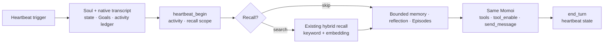

# Heartbeat Planner 收敛方案

状态：设计提案，尚未实施  
范围：仅替换已标记 deprecated 的 Heartbeat Planner；不改变 Heartbeat 的权限、投递保护、Goal 所有权或最终状态协议。

## 结论

删除独立 Heartbeat Planner 模型调用，把它保留的必要职责改成同一个 Momoi execution 的首个结构化动作 `heartbeat_begin`。

`heartbeat_begin` 只做两件事：

1. 选择本次 Heartbeat 要实际经历的活动；
2. 决定是否需要历史召回，并给出双通道查询。

它不输出 handoff、MCP 路由、执行步骤、完成条件或回复策略。后续工具结果会改变事实，执行中的 Momoi 应直接适应，而不是服从一份先验计划。

## 为什么不直接沿用现状

当前 Heartbeat Planner 是第二个模型视角：

- 输入自己的 compact Turn 投影，而 execution 读取 native transcript；
- 输出 `activity`、召回、context needs、MCP route、execution outline 和 uncertainty；
- execution 再用 Soul、Style Card 和真实工具结果重新做一次判断。

线上 24 次 Heartbeat Planner 调用的均值约为 7,597 input tokens、1,829 output tokens，其中 reasoning 约 1,352 tokens。大部分输出是随后会被 execution 重做的 handoff。

独立 Planner 还维护了第二套 history renderer、prompt、schema、parser、重试和测试。它不是权限边界：Heartbeat 的真正权限仍由 runtime envelope、允许工具集、contact window 和 commit 路径控制。

## 目标执行流



逻辑请求保持为：

```text
system      base contract + Soul + Style Card + heartbeat.md
user        slow-changing memory context
user/...    native shared transcript
user        autonomous heartbeat envelope + current state + Goals + ledgers
assistant   heartbeat_begin(...)
tool        selected recall evidence
assistant   current Heartbeat tool loop
assistant   end_turn(heartbeat=...)
```

Heartbeat trigger 仍然是 scoped runtime data，不是 owner 消息。下一次请求不会保留该 envelope；只有确认送达的 Heartbeat 气泡进入 shared transcript。

## `heartbeat_begin` 的最小语义

工具 schema 定义字段结构；system prompt 只定义以下不变量：

- 它是 Heartbeat execution 的第一个动作；
- activity 是本次真正要做或经历的事情，不是状态文案；
- `search` 只描述活动依赖但当前上下文未提供的历史；
- `skip` 只表示历史无法改变本次活动，而不是“没有值得做的事”；
- recall 只负责选择证据，不规划执行、措辞或是否联系 owner；
- owner contact 是 activity 之后的独立决定。

建议的逻辑字段只有：

```json
{
  "activity": "brief activity intent",
  "recall_mode": "search | skip",
  "recall_queries": [
    {"semantic": "historical evidence needed", "keywords": []}
  ]
}
```

不保留：

- `heartbeat_handoff.context`
- `heartbeat_handoff.mcp`
- `heartbeat_handoff.execution`
- `uncertainty`
- Planner `reason`

无法影响 harness 行为的解释性字段只会增加延迟和相互矛盾的机会。

## 复用现有能力

无需新检索实现。`heartbeat_begin` 可继续生成当前 `select_plan_recall_queries()` 已接受的 `activity.recall_queries` 形状，然后复用：

```text
select_plan_recall_queries
  -> SemanticRecallService.prepare
  -> build_plan_retrieval
  -> assemble_main_context
```

MCP 不再由 Planner 预载。Heartbeat 获得稳定的 resident tool surface 和经过 autonomy allowlist 过滤的 `tool_enable` groups；真实结果出现后再加载需要的能力。

## Harness 约束

- `heartbeat_turn=True` 时，首个动作必须是 `heartbeat_begin`；
- 其他首动作返回协议错误，沿用现有连续工具失败上限，不能静默绕过；
- 新 owner event 仍取消或压制未提交的可见 Heartbeat 输出；
- `heartbeat_begin` 成功后才允许工作工具和 `send_message`；
- `end_turn` 继续要求完整 heartbeat state；
- rest 仍可在 `heartbeat_begin` 结果后直接 `end_turn`，不要求工具或可见消息。

## 删除范围

切换后删除：

- `runtime/heartbeat_planner.py`
- `prompts/heartbeat_planner.md`
- `_plan_heartbeat_context`
- `render_heartbeat_planner_request`
- Planner 专用 recent-Turn projection/rendering
- `HEARTBEAT_PLAN_TOOL_SPEC`、parser、degraded plan
- `heartbeat_plan` context section及相应测试

保留：

- native transcript
- Heartbeat execution prompt
- heartbeat contact window 和 owner revision 防护
- hybrid recall
- recent topic/activity ledgers
- Goal ownership约束
- heartbeat `end_turn` state 和日 Episode 归档

## 验收

1. Heartbeat 只有一个 Momoi 模型视角，不再产生 `heartbeat_plan` stage。
2. activity selection、recall、工具执行和可见表达都位于同一 Turn。
3. search 情况与现有 hybrid recall 结果一致；skip 不触发检索。
4. rest 不产生无意义工具调用或 owner 消息。
5. MCP 工具只通过 allowlist 后的 `tool_enable` 暴露。
6. owner revision 变化时不发送过期 Heartbeat 气泡。
7. delivered Heartbeat 气泡进入后续 native transcript；静默活动只进入 ledger/state。
8. 与当前基线相比，移除一次独立 Planner 调用，且没有增加 unsupported claims 或重复联系。

## 实施边界

实施时作为一个 breaking commit 完成首工具、harness、prompt、旧 Planner 删除和测试迁移，避免长期保留两套 Heartbeat 决策路径。上线前只做离线 dump 对照和受控 Heartbeat 回放，不需要双轨生产模式。
