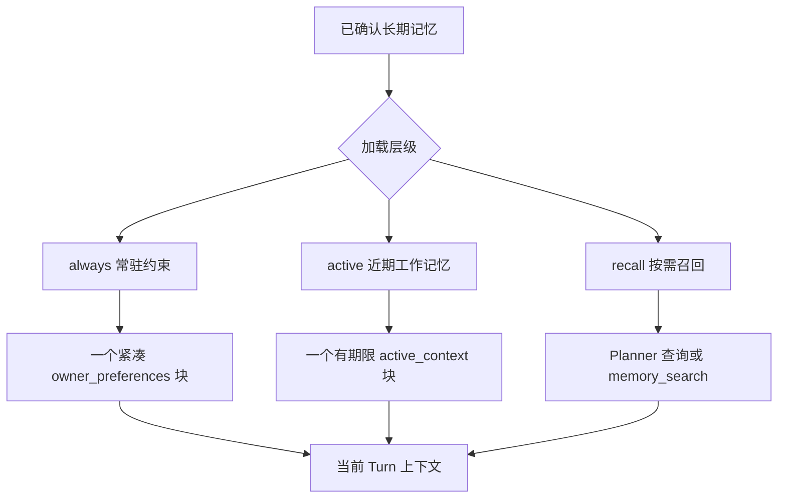

# 记忆与上下文分层设计

这份文档记录 Momoi 当前记忆系统暴露的问题，以及后续要实现的情绪状态和值、主人偏好和长期记忆分层方案。目标是让她持续记得真正重要的事，同时避免每个 Turn 都把整本记忆塞进上下文。

## 当前问题

### 偏好没有成为持续生效的约束

2026-08-07 的生产日志显示：

1. 老师在 23:06:58 明确说不喜欢波浪号。
2. 偏好已经成功写入 `preference.user.preference.no_tilde`。
3. 00:05:35 老师只发送“桃”时，Planner 将其判定为轻量社交消息，没有产生 recall query。
4. 00:06:00 的上下文因此没有包含这条偏好，回复再次使用了波浪号。
5. 老师指出遗忘后，系统才检索到该偏好；模型仍然复述了老师的话，并在复述中再次输出了波浪号。

这说明记忆本身没有丢失，丢失的是“每次表达都应遵守的偏好”这一层语义。当前系统把偏好当作普通检索资料，而不是稳定的交互约束。

### 记忆类别和加载时机混在一起

当前上下文装配会把 `profile`、`relationship`、`shared` 作为 core 记忆尝试注入，而 `preference` 主要依赖查询命中。这会产生反直觉结果：资产明细、门口通知规则等内容可能常驻，但“不使用波浪号”反而不在短消息 Turn 中。

记忆的“是什么”和“什么时候需要出现”必须拆成两个维度，不能用 `kind` 直接决定加载策略。

### 情绪 state 目前被固定 enum 限制

当前允许的情绪值为：

```text
cheerful, excited, calm, focused, tired, down, frustrated
```

协议 schema 和运行时 parser 都会校验这个集合。日志中模型尝试提交 `awkward` 时被拒绝，导致额外重试；后续改为 `frustrated` 才成功。

目前没有业务分支依赖这些固定字符串，固定 enum 对表达能力的限制大于它带来的收益。这是下一阶段要解决的问题，不与记忆分层混在同一个改动中。

## 设计原则

- 记忆可以长期保存，但不等于每次都注入。
- 影响每次表达的偏好必须每个相关 Turn 都可见，不能依赖模型临时决定是否搜索。
- 常驻内容必须是一段紧凑摘要，而不是一条记忆一条上下文消息。
- 事实类型和加载时机正交：同一种 `kind` 可以处于不同层级。
- 新记忆默认进入按需召回层，只有有证据的稳定约束才提升到常驻层。
- 任何层级都要有 token 上限、去重和冲突处理。
- 近期上下文已经包含的内容不应再次以记忆摘要重复注入。

## 三层上下文模型



### Always：每个表达 Turn 都注入

只放“忘记一次就会直接破坏交互”的稳定约束：

- 称呼、语言和明确的交流边界。
- 日常表达禁用的符号或格式，例如波浪号、句号、emoji。
- 会影响所有建议的安全、健康或饮食限制。
- 老师明确要求“以后一直如此”的交互偏好。

注入形式是单个紧凑块，例如：

```text
<owner_preferences>
老师的固定偏好：日常聊天不用波浪号、句号和 emoji；默认称呼老师。
</owner_preferences>
```

不注入记忆 id、证据原文、更新时间或重复解释。建议设置严格预算，优先保证这段摘要不会随时间增长失控。

“不喜欢吃菜”和“喜欢骑车”属于稳定偏好，但通常不改变每一轮表达，因此默认不进入 always；只有老师明确要求始终记住，或它已经成为安全/决策约束时才提升。

### Active：近期需要连续保持

放当前几天或当前事件周期内会反复影响对话的内容：

- 当前身体状态和恢复过程。
- 正在等待结果的旅行、会议、购票或工作事项。
- 尚未结束的对话线程和开放承诺。
- 最近刚发生、但还没有自然结束的纠正或决定。

Active 内容必须带有效期限或结束条件。它应由当前事件、开放 Episode、Goal 和最近对话共同产生；仅仅被搜索过一次不能让它永久活跃。注入时合并为单个摘要块，并排除近期原始消息已经明确表达的事实。

### Recall：长期保留、相关时取出

默认放在这一层：

- 兴趣和爱好，例如骑车、特定游戏或番剧。
- 饮食、购物和场景偏好，例如不喜欢吃菜。
- 资产、设备、家庭自动化实体和旧项目细节。
- 具体历史经历、旧对话和已结束的 Episode。

Planner 根据当前 intent 生成查询，必要时由模型调用 `memory_search` 或 `conversation_search`。召回结果只提供给当前相关 Turn，不改变记忆本身的层级。

## 偏好存储、去重与摘要

### 两个独立字段

长期记忆继续保留现有 `kind`，另增加独立的加载属性：

| 字段 | 示例 | 作用 |
| --- | --- | --- |
| `kind` | `preference`、`profile`、`shared` | 说明记忆内容类型 |
| `activation` | `always`、`active`、`recall` | 说明默认加载时机 |

`importance` 只用于排序，不直接决定常驻。重要的资产信息不应因此每次注入；不重要但明确的表达禁忌也不应因此被遗漏。

### 稳定槽位

偏好更新使用稳定语义槽位，而不是每次让模型随意起新 key：

```text
communication.punctuation.tilde
communication.punctuation.period
communication.emoji
food.vegetables
hobby.cycling
```

同一槽位只能有一个生效值。相同偏好只追加证据或更新时间；明确纠正才替换；无法判断的新旧值进入冲突状态，不并排注入。

现有重复语义（例如不同 key 表示“不使用句号”）需要一次迁移合并，之后由槽位约束阻止继续产生重复项。

### 一个摘要块，而不是消息炸弹

渲染器按层级读取生效记忆，去重后用短句和分号合并：

```text
老师的固定偏好：不用波浪号；日常聊天不用句号和 emoji；默认称呼老师。
```

模型看到的是一段有明确边界的上下文，而不是十几条带 id 的记忆记录。摘要只在记忆发生变更时重新生成或在 Turn 开始时轻量渲染，不创建新的记忆记录。

## 情绪 state 的后续设计

下一阶段开放 `state` 的表达范围，但仍保留边界：

- 接受短的、可读的状态标签，而不是固定七项 enum。
- 保留长度、字符和非空校验，拒绝整段叙事塞进 state。
- `intensity` 继续负责强弱，`cause` 继续负责可追溯原因。
- 不让 state 标签改变权限、事实判断或工具安全规则。
- 如未来需要统计或回落策略，再另外增加稳定的情绪维度，不把自由标签重新收紧成少数词。

开放 state 需要同步修改协议 schema、parser、测试和部署镜像；与记忆分层分开提交，便于单独验证。

## 实施顺序与验收标准

1. 增加 `activation` 和稳定槽位的存储/迁移规则，合并现有重复偏好。
2. 实现 always 偏好摘要块，并在 Owner、Heartbeat、Webhook 的统一上下文入口注入。
3. 实现 active 工作记忆的期限、结束条件和重复抑制。
4. 保持 recall 查询路径，用于未进入常驻或近期层的长期记忆。
5. 加入上下文预算和渲染去重测试，确认短社交 Turn 也能看到 always 偏好。
6. 单独开放 mood state，覆盖 schema、parser、重试和持久化测试。

验收至少包括：

- 老师说过“不用波浪号”后，下一条只有“桃”的消息也不会产生波浪号。
- “不喜欢吃菜”和“喜欢骑车”可在相关话题准确召回，但不会污染无关闲聊。
- 同一偏好不会因重复纠正或复盘产生两条同时生效的注入内容。
- 常驻摘要、近期摘要和召回结果各自受预算限制，不出现上下文炸弹。
- 任意合法短情绪标签都不会再因固定 enum 被无意义拒绝。
